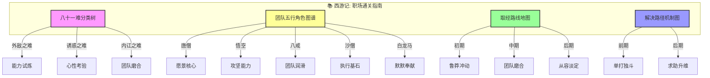
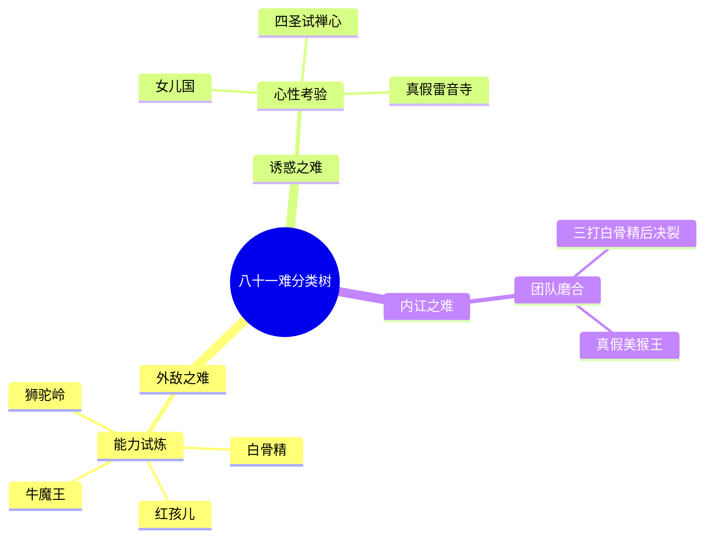
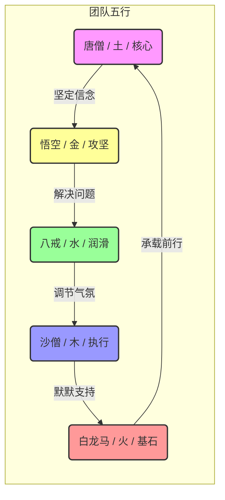
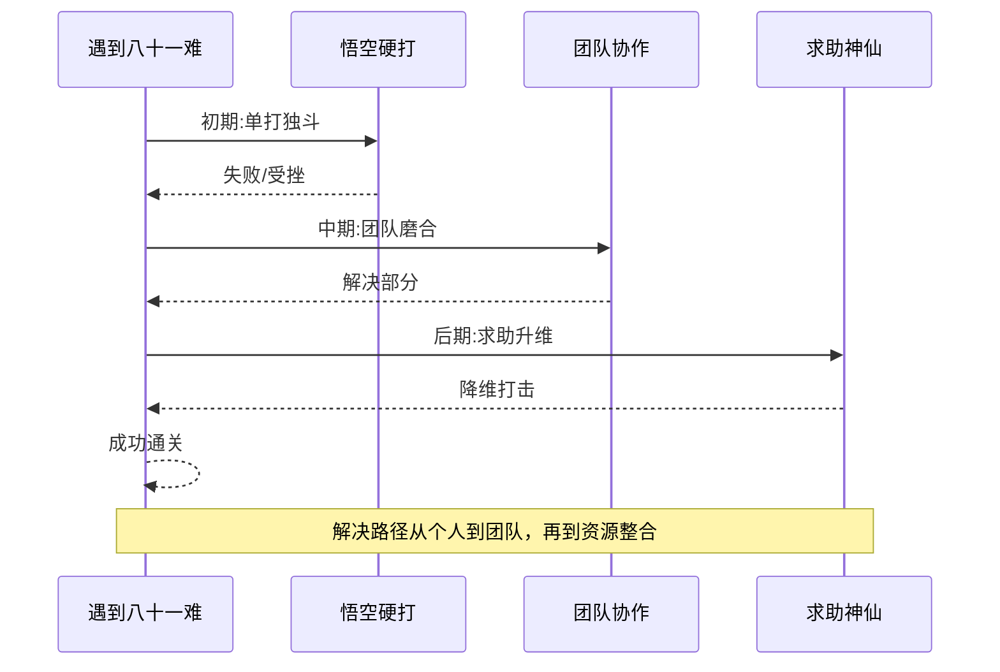
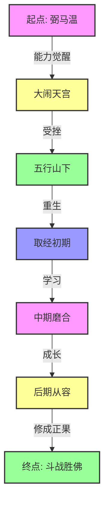

# 西游记：知识图谱与核心要素可视化

> **描述**: 本图谱基于《西游记》的核心内容，通过"八十一难分类树"、"团队五行角色图谱"、"取经路线地图"和"解决路径机制图"，系统展示《西游记》中的反脆弱成长、团队协作、心性修行与资源整合智慧。
> **适用场景**: 深度阅读、职场管理、逆商培养、心性修行、个人成长
> **风格建议**: 古典神话与现代职场元素结合，色彩鲜明，层次清晰。背景为取经路线图，前景为四个模块的详细图谱。

---

## 图谱总览



---

## 图谱模块一：八十一难分类树



---

## 图谱模块二：团队五行角色图谱



---

## 图谱模块三：解决路径机制图



---

## 图谱模块四：反脆弱成长曲线



---

## 核心关键词

```
八十一难, 反脆弱, 团队协作, 五行相生, 紧箍咒, 心性修行, 求助机制, 资源整合, 斗战胜佛, 职场通关
```

---

## 总结

通过这四个图谱，我们可以清晰地看到：
1.  **八十一难分类树**展示了磨难的多样性，外敌、诱惑、内讧分别对应能力、心性和团队的考验。
2.  **团队五行角色图谱**揭示了取经团队的完美配置，每个人都有自己的角色和不可替代的价值。
3.  **解决路径机制图**展现了从个人能力到团队协作，再到资源整合的成长轨迹。
4.  **反脆弱成长曲线**描绘了从"野性难驯"到"修成正果"的心性进化之路。

《西游记》不仅是一部神话故事，更是一部**职场通关指南**和**个人成长修炼手册**。
