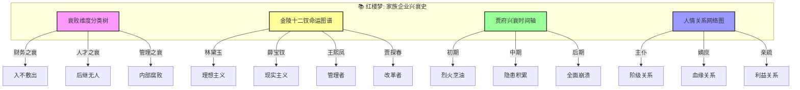
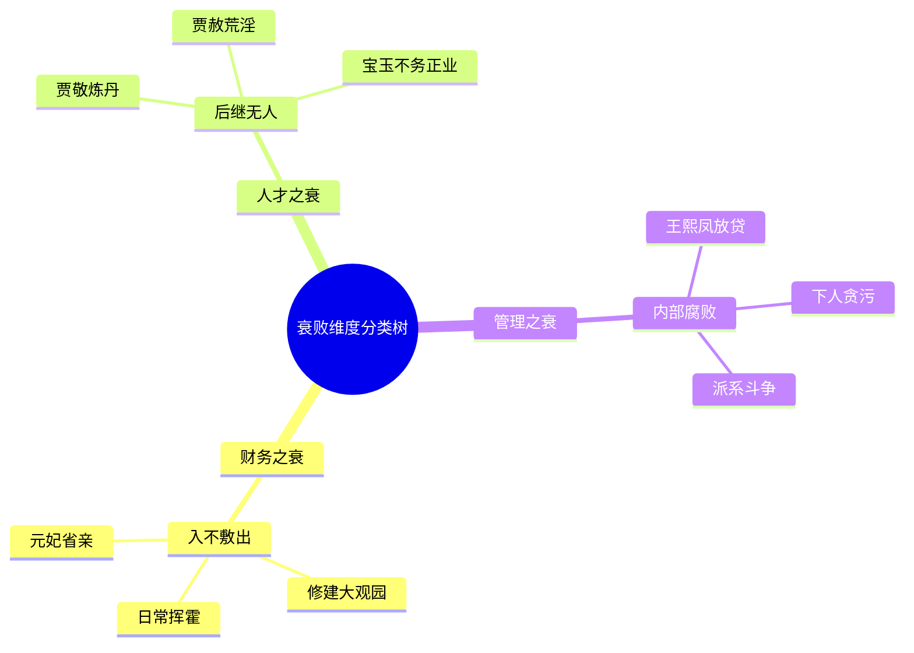
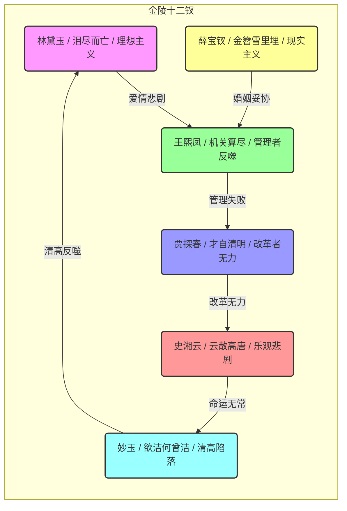
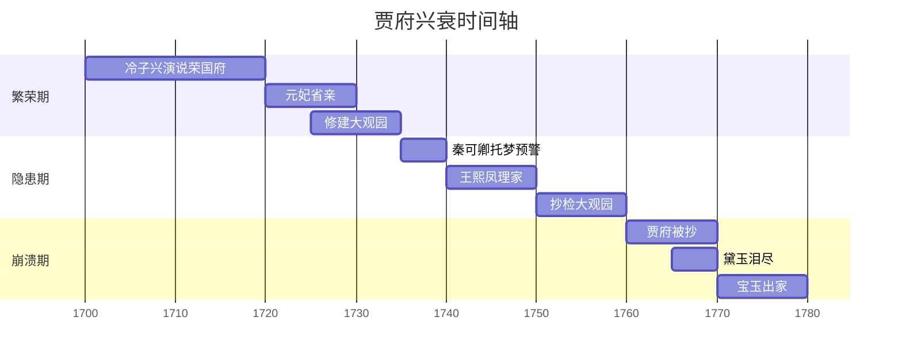
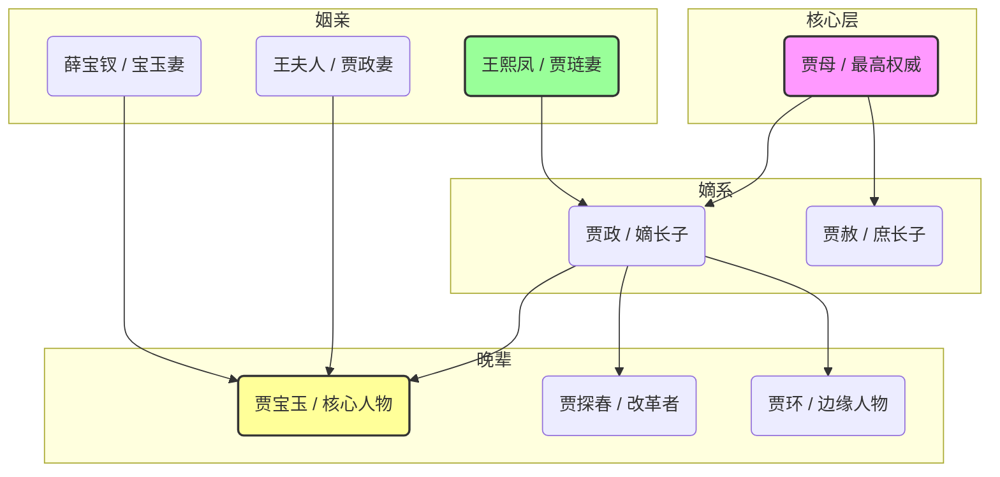

# 红楼梦：知识图谱与核心要素可视化

> **描述**: 本图谱基于《红楼梦》的核心内容，通过"衰败维度分类树"、"金陵十二钗命运图谱"、"贾府兴衰时间轴"和"人情关系网络图"，系统展示《红楼梦》中的周期思维、人情世故、细节洞察与系统崩溃智慧。
> **适用场景**: 深度阅读、职场管理、周期思维、人情练达、系统认知
> **风格建议**: 古典美学与现代商业元素结合，色彩典雅，层次清晰。背景为大观园全景，前景为四个模块的详细图谱。

---

## 图谱总览



---

## 图谱模块一：衰败维度分类树



---

## 图谱模块二：金陵十二钗命运图谱



---

## 图谱模块三：贾府兴衰时间轴



---

## 图谱模块四：人情关系网络图



---

## 核心关键词

```
盛极必衰, 周期思维, 人情世故, 草蛇灰线, 金陵十二钗, 系统崩溃, 细节洞察, 家族企业, 管理启示, 人性幽微
```

---

## 总结

通过这四个图谱，我们可以清晰地看到：
1.  **衰败维度分类树**展示了衰败的多维度，财务、人才、管理分别对应不同的危机类型。
2.  **金陵十二钗命运图谱**揭示了人物命运的宿命感，每个人都有自己的悲剧轨迹。
3.  **贾府兴衰时间轴**展现了从繁荣到崩溃的完整周期，帮助理解盛极必衰的规律。
4.  **人情关系网络图**描绘了贾府复杂的社会关系，体现了人情世故的底层逻辑。

《红楼梦》不仅是一部古典小说，更是一部**家族企业兴衰史**和**人情世故百科全书**。
