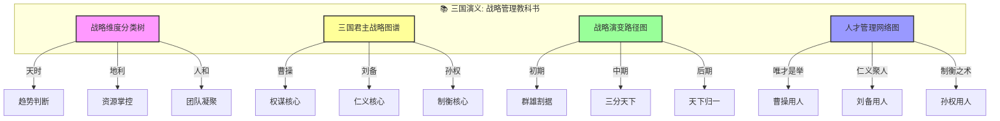
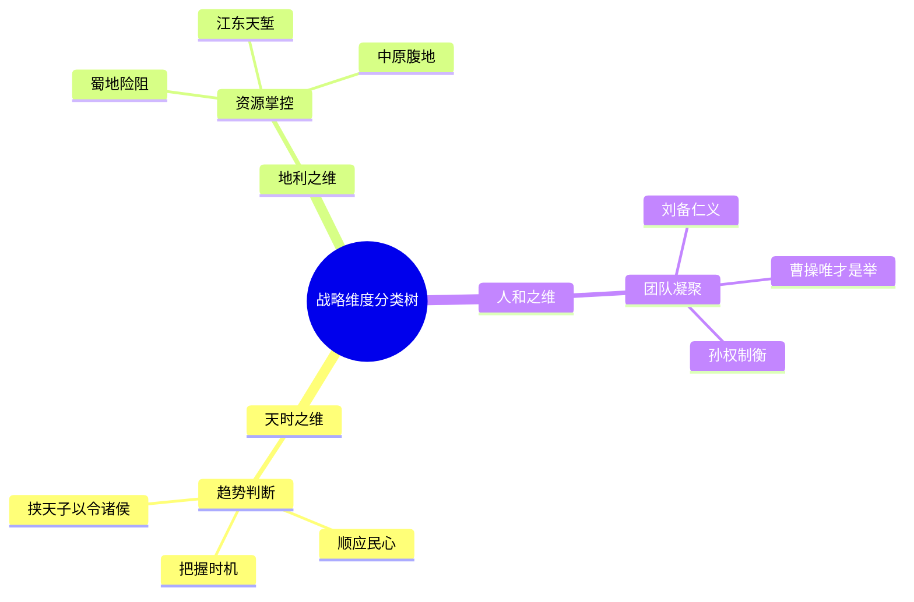
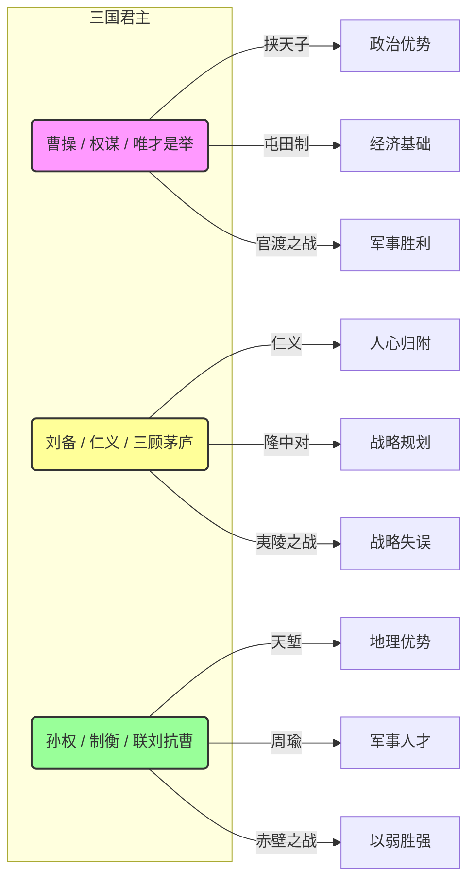
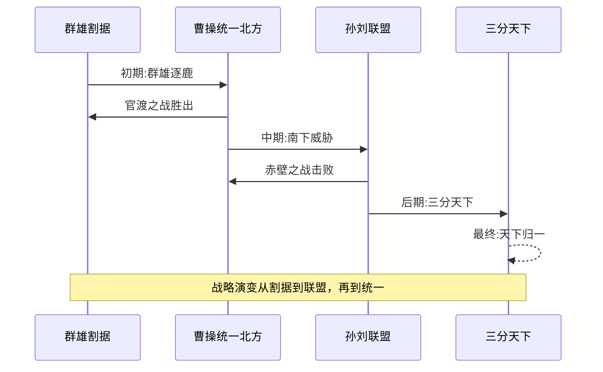
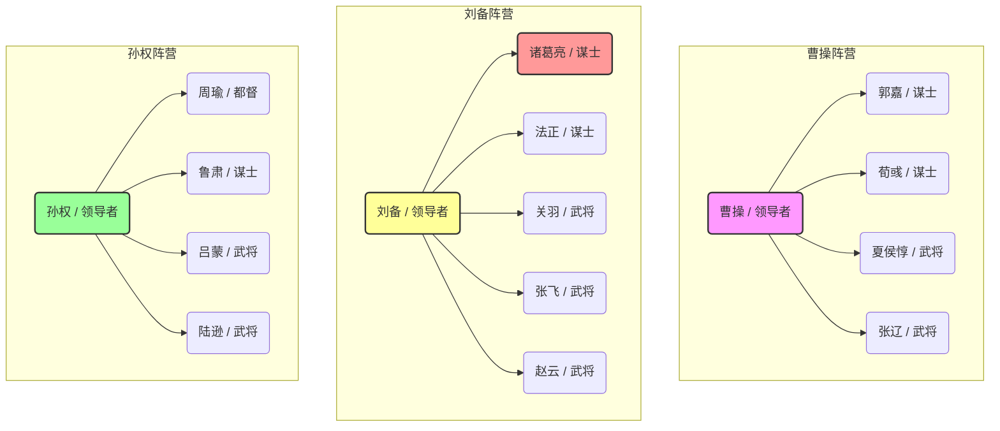

# 三国演义：知识图谱与核心要素可视化

> **描述**: 本图谱基于《三国演义》的核心内容，通过"战略维度分类树"、"三国君主战略图谱"、"战略演变路径图"和"人才管理网络图"，系统展示《三国演义》中的战略思维、知人善任、周期判断与格局决策智慧。
> **适用场景**: 深度阅读、职场管理、战略规划、人才管理、决策格局
> **风格建议**: 古典战争与现代商业元素结合，色彩鲜明，层次清晰。背景为三国地图，前景为四个模块的详细图谱。

---

## 图谱总览



---

## 图谱模块一：战略维度分类树



---

## 图谱模块二：三国君主战略图谱



---

## 图谱模块三：战略演变路径图



---

## 图谱模块四：人才管理网络图



---

## 核心关键词

```
隆中对, 战略思维, 知人善任, 分久必合, 唯才是举, 天时地利人和, 格局决策, 周期判断, 以弱胜强, 三分天下
```

---

## 总结

通过这四个图谱，我们可以清晰地看到：
1.  **战略维度分类树**展示了战略的多维度，天时、地利、人和分别对应不同的战略考量。
2.  **三国君主战略图谱**揭示了三位君主的战略配置，每个人都有自己的核心竞争力。
3.  **战略演变路径图**展现了从群雄割据到天下归一的完整周期，帮助理解分久必合的规律。
4.  **人才管理网络图**描绘了三方阵营的人才结构，体现了知人善任的底层逻辑。

《三国演义》不仅是一部古典小说，更是一部**战略管理教科书**和**人才管理百科全书**。
