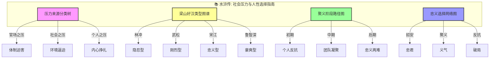
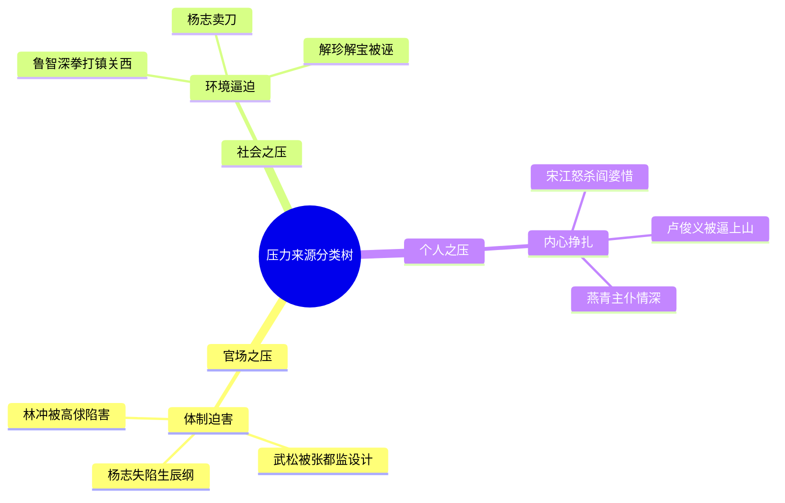
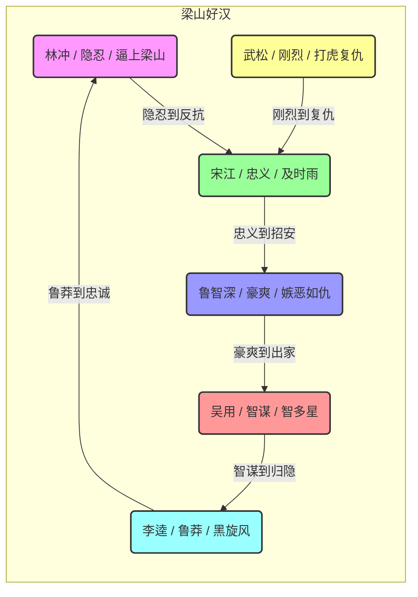
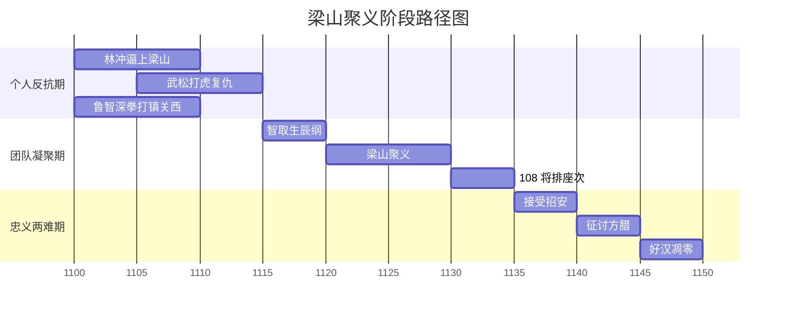
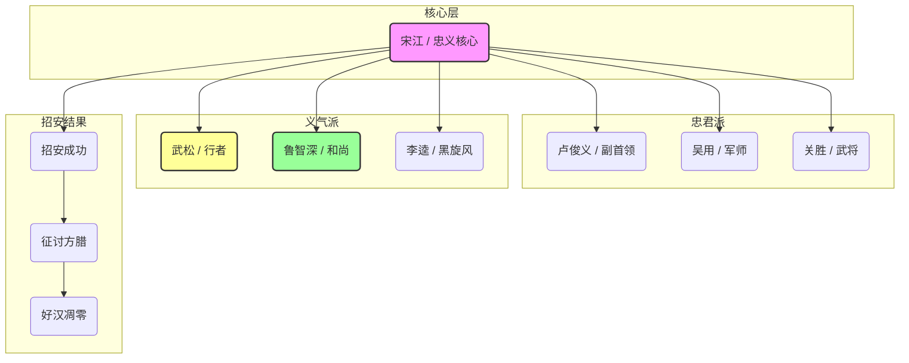

# 水浒传：知识图谱与核心要素可视化

> **描述**: 本图谱基于《水浒传》的核心内容，通过"压力来源分类树"、"梁山好汉类型图谱"、"聚义阶段路径图"和"忠义选择网络图"，系统展示《水浒传》中的压力觉醒、团队凝聚、忠义两难与选择智慧。
> **适用场景**: 深度阅读、职场管理、压力管理、团队凝聚、选择决策
> **风格建议**: 古典英雄与现代职场元素结合，色彩鲜明，层次清晰。背景为梁山泊全景，前景为四个模块的详细图谱。

---

## 图谱总览



---

## 图谱模块一：压力来源分类树



---

## 图谱模块二：梁山好汉类型图谱



---

## 图谱模块三：聚义阶段路径图



---

## 图谱模块四：忠义选择网络图



---

## 核心关键词

```
逼上梁山, 压力觉醒, 忠义两难, 八方共域, 团队凝聚, 选择取舍, 官场迫害, 草根创业, 反抗精神, 招安悲剧
```

---

## 总结

通过这四个图谱，我们可以清晰地看到：
1.  **压力来源分类树**展示了压力的多维度，官场、社会、个人分别对应不同的压力类型。
2.  **梁山好汉类型图谱**揭示了人物类型的多样性，每个人都有自己的反抗路径。
3.  **聚义阶段路径图**展现了从个人反抗到忠义两难的完整周期，帮助理解逼上梁山的规律。
4.  **忠义选择网络图**描绘了梁山内部的忠义分歧，体现了选择取舍的底层逻辑。

《水浒传》不仅是一部古典小说，更是一部**社会压力与人性选择指南**和**团队管理与制度困境启示录**。
