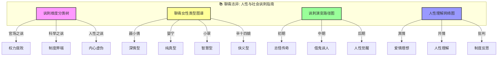
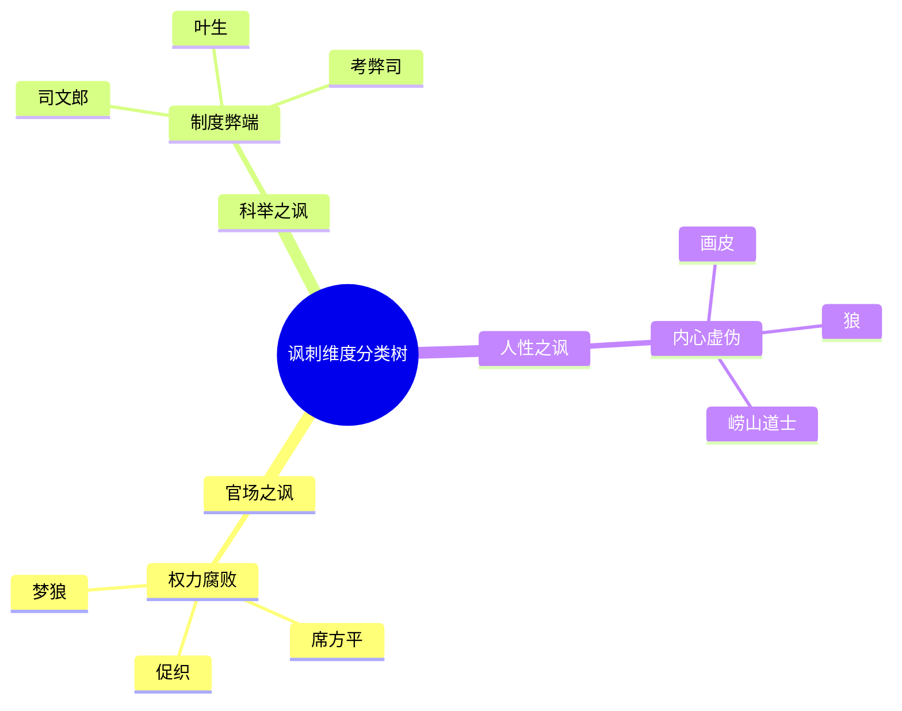
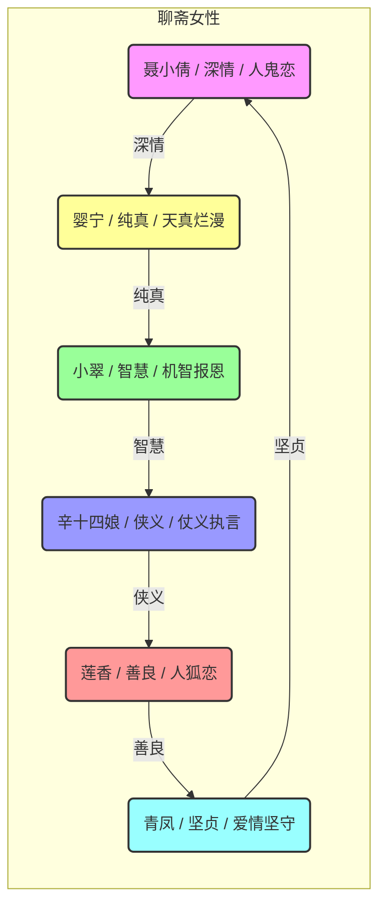
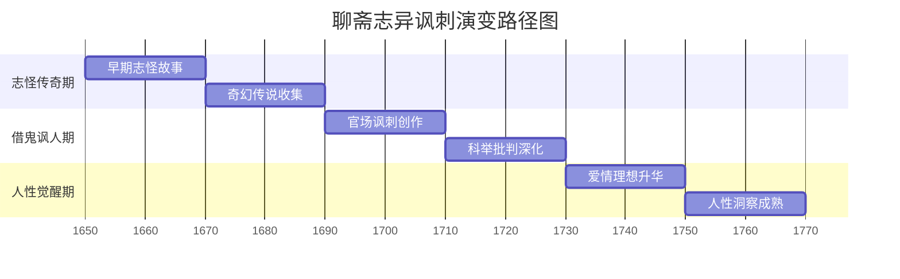
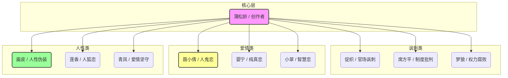

# 聊斋志异：知识图谱与核心要素可视化

> **描述**: 本图谱基于《聊斋志异》的核心内容，通过"讽刺维度分类树"、"聊斋女性类型图谱"、"讽刺演变路径图"和"人性理解网络图"，系统展示《聊斋志异》中的社会批判、人性理解、制度反思与借鬼讽人智慧。
> **适用场景**: 深度阅读、职场管理、社会洞察、人性理解、批判思维
> **风格建议**: 古典奇幻与现代职场元素结合，色彩神秘，层次清晰。背景为聊斋书房，前景为四个模块的详细图谱。

---

## 图谱总览



---

## 图谱模块一：讽刺维度分类树



---

## 图谱模块二：聊斋女性类型图谱



---

## 图谱模块三：讽刺演变路径图



---

## 图谱模块四：人性理解网络图



---

## 核心关键词

```
借鬼讽人, 社会批判, 爱情理想, 科举批判, 写鬼写妖, 刺贪刺虐, 人性伪装, 真情追求, 制度反思, 洞察觉醒
```

---

## 总结

通过这四个图谱，我们可以清晰地看到：
1.  **讽刺维度分类树**展示了讽刺的多维度，官场、科举、人性分别对应不同的讽刺类型。
2.  **聊斋女性类型图谱**揭示了女性形象的多样性，每个人都有自己的爱情轨迹。
3.  **讽刺演变路径图**展现了从志怪传奇到人性觉醒的完整周期，帮助理解借鬼讽人的规律。
4.  **人性理解网络图**描绘了蒲松龄的创作网络，体现了社会批判的底层逻辑。

《聊斋志异》不仅是一部古典小说，更是一部**人性与社会讽刺指南**和**社会批判与人性觉醒启示录**。
