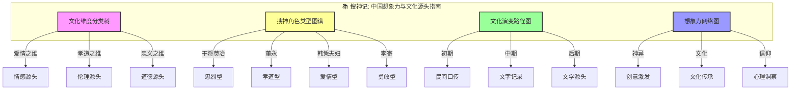
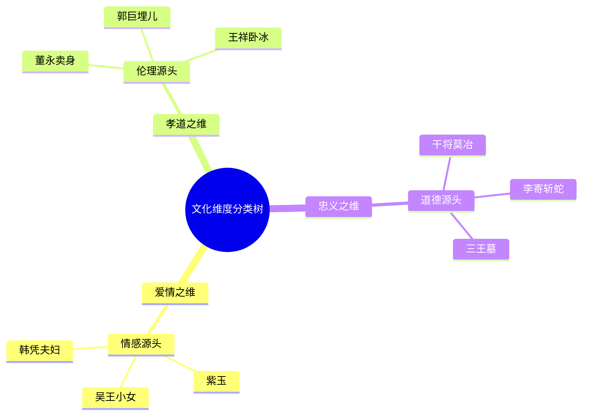
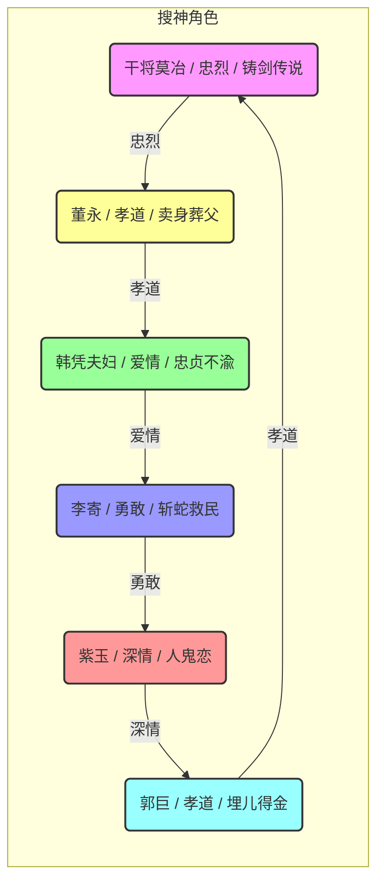
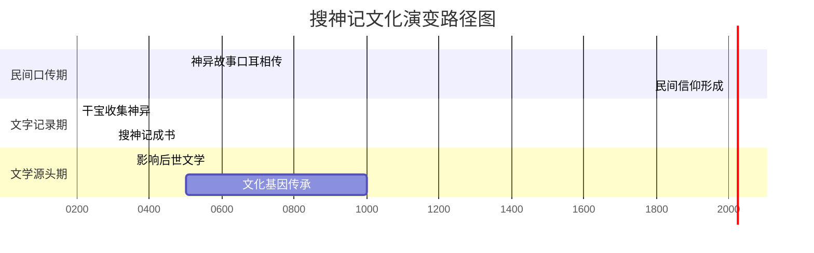
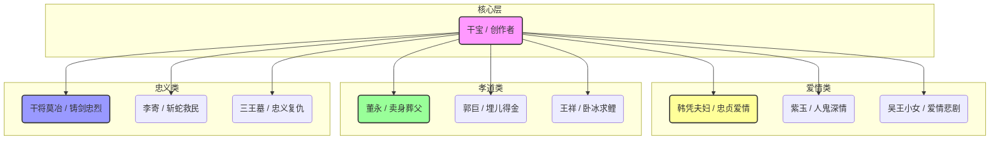

# 搜神记：知识图谱与核心要素可视化

> **描述**: 本图谱基于《搜神记》的核心内容，通过"文化维度分类树"、"搜神角色类型图谱"、"文化演变路径图"和"想象力网络图"，系统展示《搜神记》中的神异传说、文化传承、民间信仰与创意激发智慧。
> **适用场景**: 深度阅读、职场创意、文化传承、想象力培养、社会心理
> **风格建议**: 古典神异与现代创意元素结合，色彩神秘，层次清晰。背景为古老神庙，前景为四个模块的详细图谱。

---

## 图谱总览



---

## 图谱模块一：文化维度分类树



---

## 图谱模块二：搜神角色类型图谱



---

## 图谱模块三：文化演变路径图



---

## 图谱模块四：想象力网络图



---

## 核心关键词

```
神异传说, 文化基因, 民间信仰, 发明天道, 想象力觉醒, 文化传承, 创意激发, 忠义孝道, 爱情源头, 志怪鼻祖
```

---

## 总结

通过这四个图谱，我们可以清晰地看到：
1.  **文化维度分类树**展示了文化的多维度，爱情、孝道、忠义分别对应不同的文化类型。
2.  **搜神角色类型图谱**揭示了角色类型的多样性，每个人都有自己的文化轨迹。
3.  **文化演变路径图**展现了从民间口传到文学源头的完整周期，帮助理解神异传说的规律。
4.  **想象力网络图**描绘了干宝的创作网络，体现了文化传承的底层逻辑。

《搜神记》不仅是一部古典小说，更是一部**中国想象力与文化源头指南**和**文化基因与想象力觉醒启示录**。
