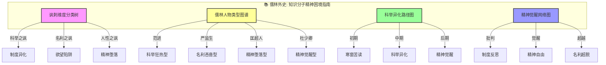
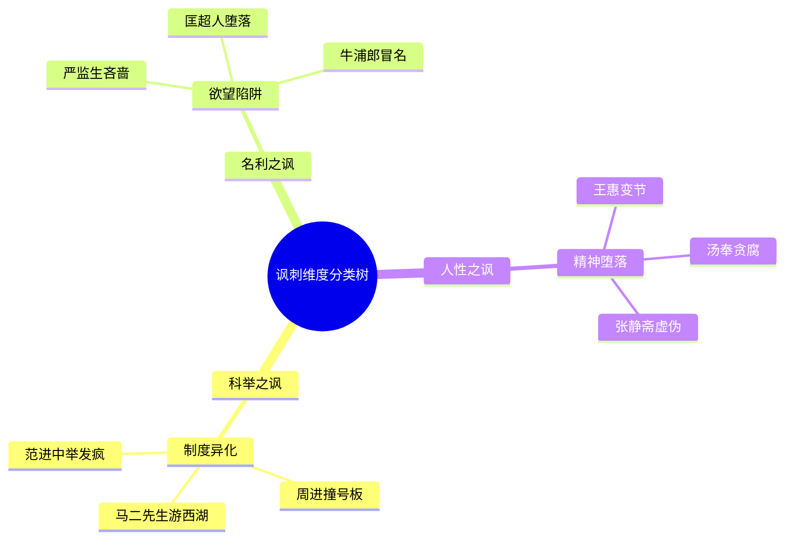
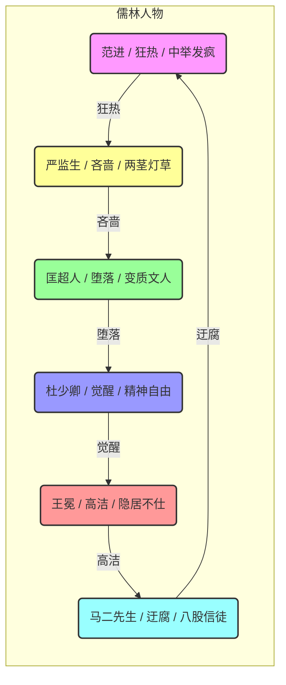
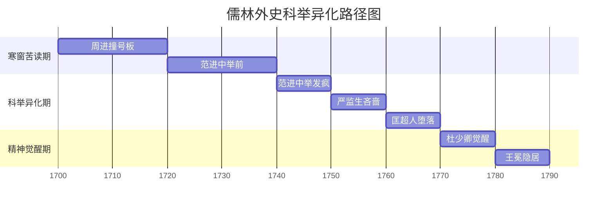
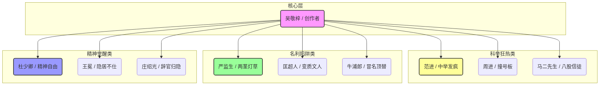

# 儒林外史：知识图谱与核心要素可视化

> **描述**: 本图谱基于《儒林外史》的核心内容，通过"讽刺维度分类树"、"儒林人物类型图谱"、"科举异化路径图"和"精神觉醒网络图"，系统展示《儒林外史》中的科举异化、名利陷阱、精神觉醒与制度批判智慧。
> **适用场景**: 深度阅读、教育反思、制度批判、精神觉醒、价值观重塑
> **风格建议**: 古典讽刺与现代教育元素结合，色彩鲜明，层次清晰。背景为古代考场，前景为四个模块的详细图谱。

---

## 图谱总览



---

## 图谱模块一：讽刺维度分类树



---

## 图谱模块二：儒林人物类型图谱



---

## 图谱模块三：科举异化路径图



---

## 图谱模块四：精神觉醒网络图



---

## 核心关键词

```
科举异化, 精神困境, 名利陷阱, 范进中举, 讽刺巅峰, 制度批判, 精神觉醒, 教育焦虑, 人性异化, 价值观重塑
```

---

## 总结

通过这四个图谱，我们可以清晰地看到：
1.  **讽刺维度分类树**展示了讽刺的多维度，科举、名利、人性分别对应不同的讽刺类型。
2.  **儒林人物类型图谱**揭示了人物类型的多样性，每个人都有自己的精神轨迹。
3.  **科举异化路径图**展现了从寒窗苦读到精神觉醒的完整周期，帮助理解科举异化的规律。
4.  **精神觉醒网络图**描绘了吴敬梓的创作网络，体现了制度批判的底层逻辑。

《儒林外史》不仅是一部古典小说，更是一部**知识分子精神困境指南**和**教育焦虑与人性异化启示录**。
