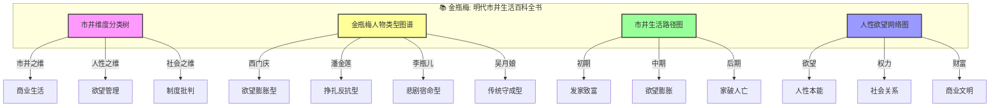
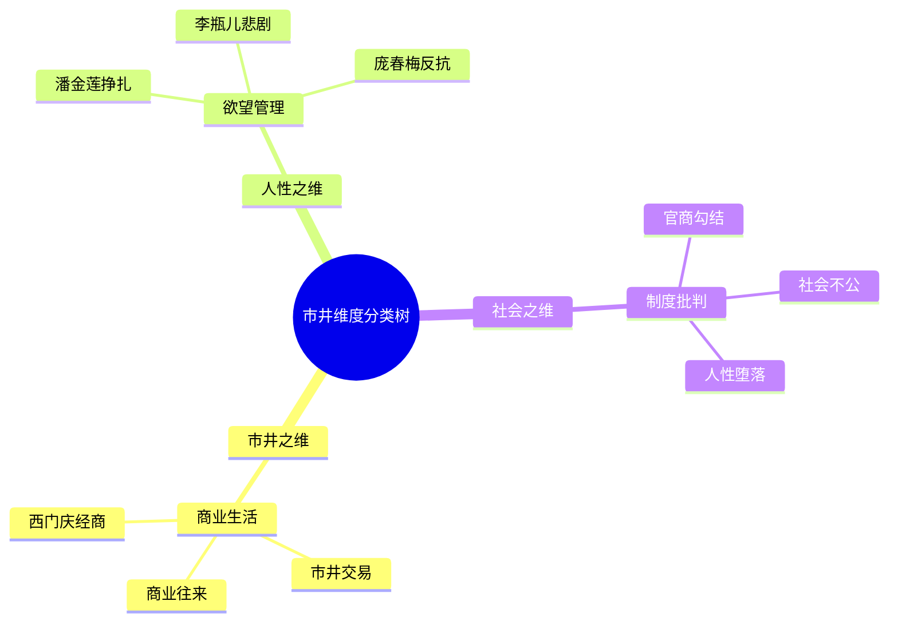
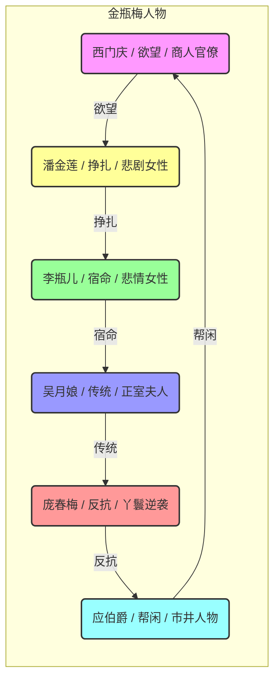
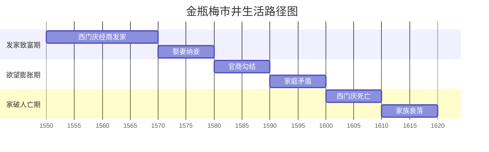
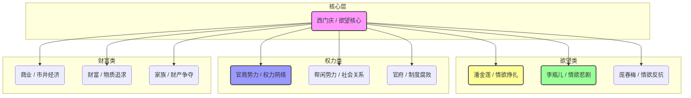

# 金瓶梅：知识图谱与核心要素可视化

> **描述**: 本图谱基于《金瓶梅》的核心内容，通过"市井维度分类树"、"金瓶梅人物类型图谱"、"市井生活路径图"和"人性欲望网络图"，系统展示《金瓶梅》中的市井生活、人性欲望、社会批判与现实主义智慧。
> **适用场景**: 深度阅读、社会观察、人性理解、欲望管理、现实主义
> **风格建议**: 明代市井与现代商业元素结合，色彩丰富，层次清晰。背景为明代市井街景，前景为四个模块的详细图谱。

---

## 图谱总览



---

## 图谱模块一：市井维度分类树



---

## 图谱模块二：金瓶梅人物类型图谱



---

## 图谱模块三：市井生活路径图



---

## 图谱模块四：人性欲望网络图



---

## 核心关键词

```
市井生活, 人性欲望, 社会批判, 西门庆, 现实主义, 商业文明, 欲望管理, 社会众生相, 明代社会, 文学里程碑
```

---

## 总结

通过这四个图谱，我们可以清晰地看到：
1.  **市井维度分类树**展示了市井的多维度，商业、人性、社会分别对应不同的市井类型。
2.  **金瓶梅人物类型图谱**揭示了人物类型的多样性，每个人都有自己的欲望轨迹。
3.  **市井生活路径图**展现了从发家致富到家破人亡的完整周期，帮助理解市井生活的规律。
4.  **人性欲望网络图**描绘了西门庆的欲望网络，体现了人性欲望的底层逻辑。

《金瓶梅》不仅是一部古典小说，更是一部**明代市井生活百科全书**和**人性欲望与社会众生相启示录**。
