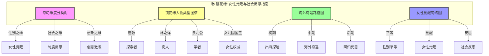
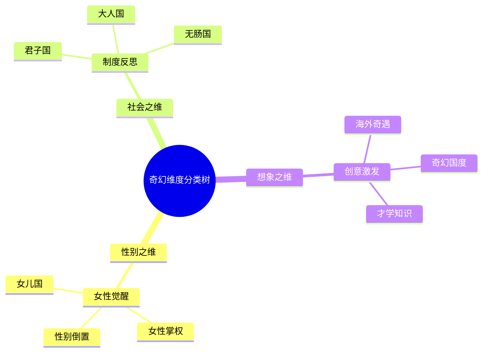
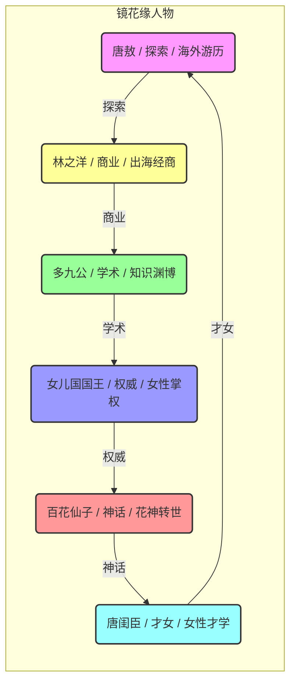
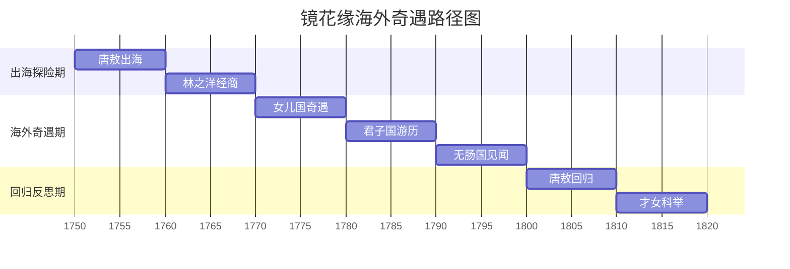
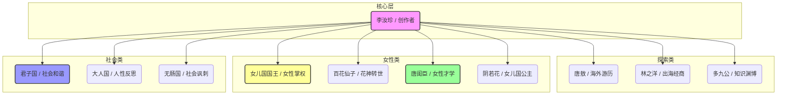

# 镜花缘：知识图谱与核心要素可视化

> **描述**: 本图谱基于《镜花缘》的核心内容，通过"奇幻维度分类树"、"镜花缘人物类型图谱"、"海外奇遇路径图"和"女性觉醒网络图"，系统展示《镜花缘》中的女性觉醒、社会反思、想象力培养与性别平等等智慧。
> **适用场景**: 深度阅读、性别平等、社会反思、想象力培养、女性觉醒
> **风格建议**: 古典奇幻与现代女性元素结合，色彩绚丽，层次清晰。背景为海外奇幻国度，前景为四个模块的详细图谱。

---

## 图谱总览



---

## 图谱模块一：奇幻维度分类树



---

## 图谱模块二：镜花缘人物类型图谱



---

## 图谱模块三：海外奇遇路径图



---

## 图谱模块四：女性觉醒网络图



---

## 核心关键词

```
女性觉醒, 性别平等, 社会反思, 女儿国, 奇幻游记, 想象力培养, 海外奇遇, 才学知识, 君子国, 创意激发
```

---

## 总结

通过这四个图谱，我们可以清晰地看到：
1.  **奇幻维度分类树**展示了奇幻的多维度，性别、社会、想象分别对应不同的奇幻类型。
2.  **镜花缘人物类型图谱**揭示了人物类型的多样性，每个人都有自己的奇幻轨迹。
3.  **海外奇遇路径图**展现了从出海探险到回归反思的完整周期，帮助理解奇幻游记的规律。
4.  **女性觉醒网络图**描绘了李汝珍的创作网络，体现了女性觉醒的底层逻辑。

《镜花缘》不仅是一部古典小说，更是一部**女性觉醒与社会反思指南**和**性别平等与想象力觉醒启示录**。
