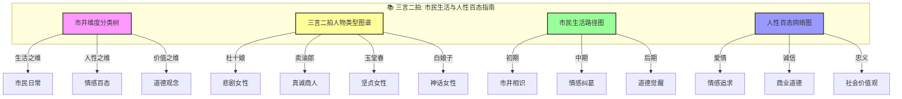
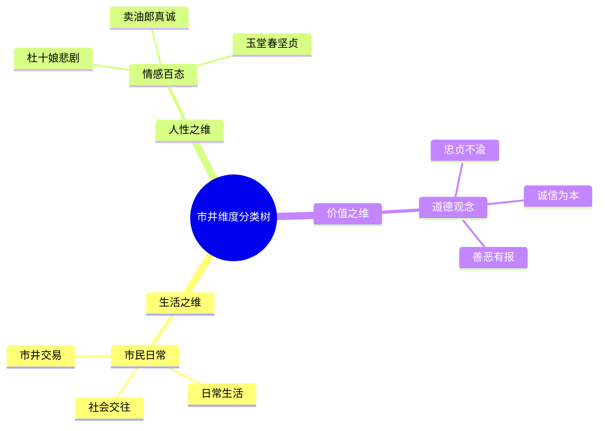
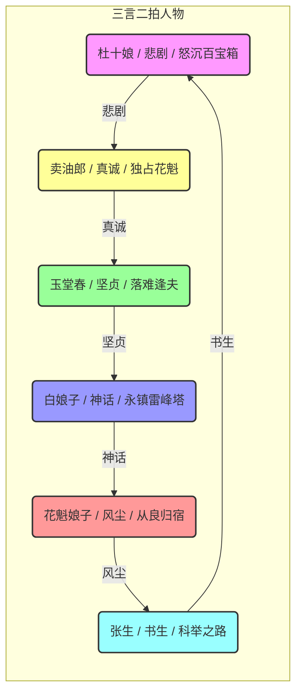
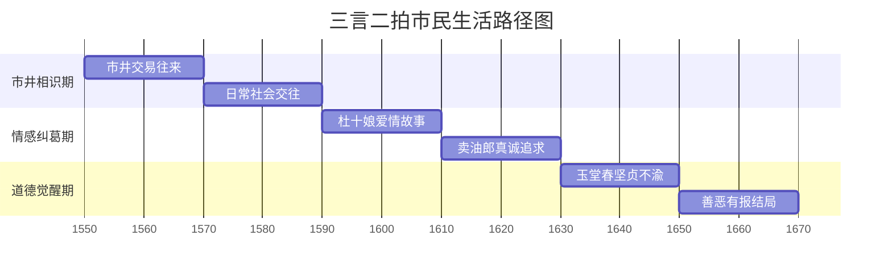
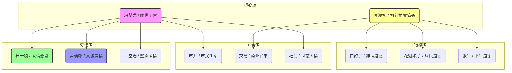

# 三言二拍：知识图谱与核心要素可视化

> **描述**: 本图谱基于《三言二拍》的核心内容，通过"市井维度分类树"、"三言二拍人物类型图谱"、"市民生活路径图"和"人性百态网络图"，系统展示《三言二拍》中的市民生活、人性百态、社会价值观与共情智慧。
> **适用场景**: 深度阅读、社会观察、人性理解、共情培养、价值观重塑
> **风格建议**: 明代市井与现代人文元素结合，色彩丰富，层次清晰。背景为明代市井街景，前景为四个模块的详细图谱。

---

## 图谱总览



---

## 图谱模块一：市井维度分类树



---

## 图谱模块二：三言二拍人物类型图谱



---

## 图谱模块三：市民生活路径图



---

## 图谱模块四：人性百态网络图



---

## 核心关键词

```
市民生活, 人性百态, 社会价值观, 杜十娘, 短篇小说, 共情培养, 世态人情, 道德觉醒, 市井故事, 现实主义
```

---

## 总结

通过这四个图谱，我们可以清晰地看到：
1.  **市井维度分类树**展示了市井的多维度，生活、人性、价值分别对应不同的市井类型。
2.  **三言二拍人物类型图谱**揭示了人物类型的多样性，每个人都有自己的情感轨迹。
3.  **市民生活路径图**展现了从市井相识到道德觉醒的完整周期，帮助理解市民生活的规律。
4.  **人性百态网络图**描绘了冯梦龙和凌濛初的创作网络，体现了人性百态的底层逻辑。

《三言二拍》不仅是一部古典小说，更是一部**市民生活与人性百态指南**和**市井人性与社会价值观启示录**。
