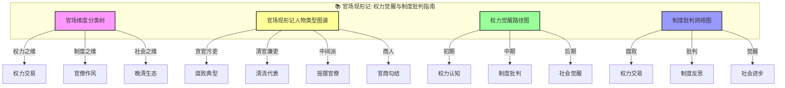
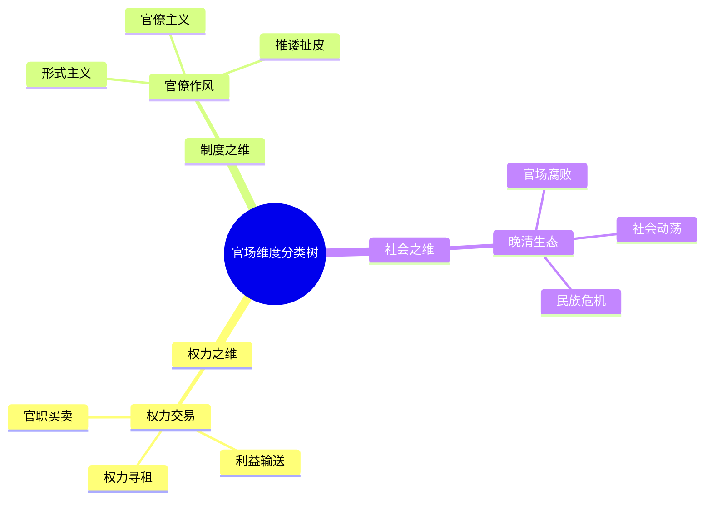
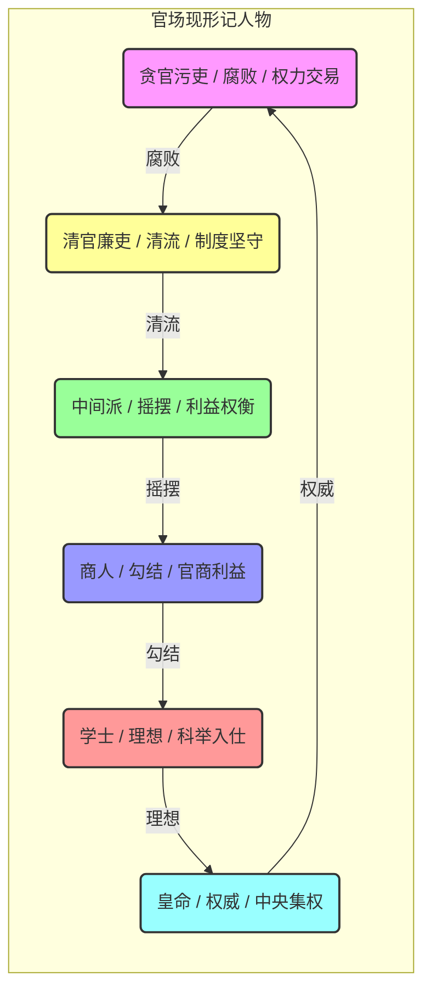
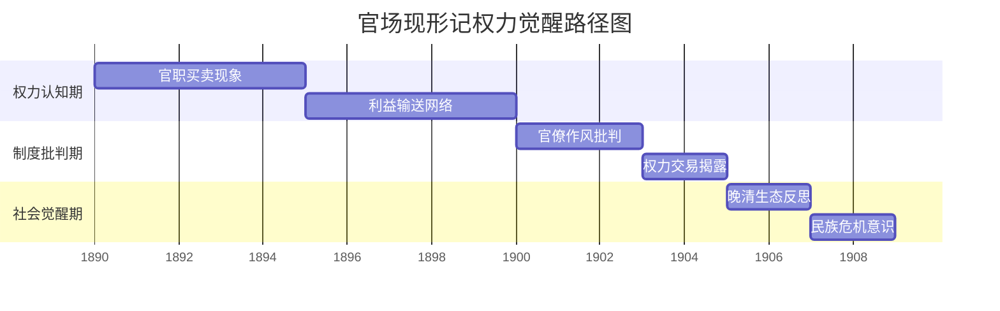
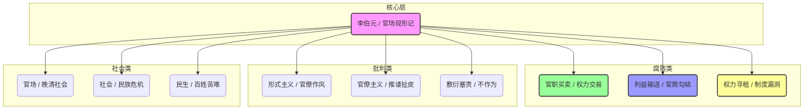

# 官场现形记：知识图谱与核心要素可视化

> **描述**: 本图谱基于《官场现形记》的核心内容，通过"官场维度分类树"、"官场现形记人物类型图谱"、"权力觉醒路径图"和"制度批判网络图"，系统展示《官场现形记》中的权力觉醒、制度批判、官场腐败与晚清社会。
> **适用场景**: 深度阅读、权力认知、制度批判、官场观察、社会觉醒
> **风格建议**: 晚清官衙与现代制度元素结合，色彩对比强烈，层次清晰。背景为晚清官衙，前景为四个模块的详细图谱。

---

## 图谱总览



---

## 图谱模块一：官场维度分类树



---

## 图谱模块二：官场现形记人物类型图谱



---

## 图谱模块三：权力觉醒路径图



---

## 图谱模块四：制度批判网络图



---

## 核心关键词

```
权力觉醒, 制度批判, 官场腐败, 晚清社会, 谴责小说, 官僚作风, 官职买卖, 社会觉醒, 官场生态, 现实批判
```

---

## 总结

通过这四个图谱，我们可以清晰地看到：
1.  **官场维度分类树**展示了官场的多维度，权力、制度、社会分别对应不同的官场类型。
2.  **官场现形记人物类型图谱**揭示了人物类型的多样性，每个人都有自己的权力轨迹。
3.  **权力觉醒路径图**展现了从权力认知到社会觉醒的完整周期，帮助理解官场运作的规律。
4.  **制度批判网络图**描绘了李伯元的批判网络，体现了制度批判的底层逻辑。

《官场现形记》不仅是一部古典小说，更是一部**权力觉醒与制度批判指南**和**官场腐败与晚清社会启示录**。
