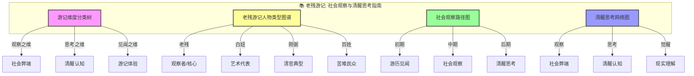
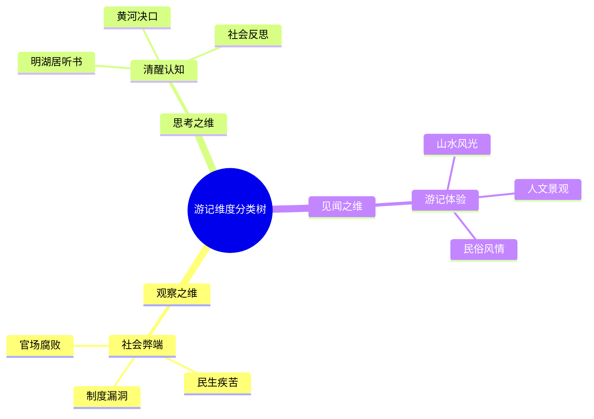
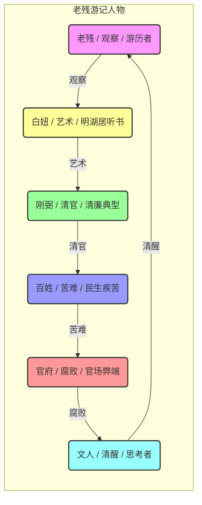
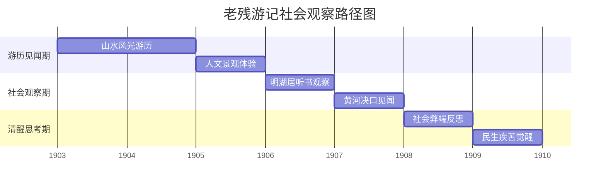
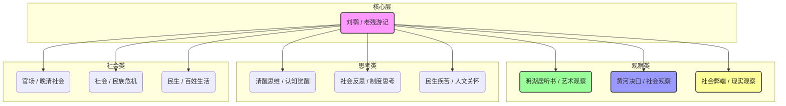

# 老残游记：知识图谱与核心要素可视化

> **描述**: 本图谱基于《老残游记》的核心内容，通过"游记维度分类树"、"老残游记人物类型图谱"、"社会观察路径图"和"清醒思考网络图"，系统展示《老残游记》中的社会观察、清醒思考、游记见闻与晚清社会。
> **适用场景**: 深度阅读、社会观察、清醒思考、游记见闻、现实理解
> **风格建议**: 晚明湖居与现代观察元素结合，色彩清新，层次清晰。背景为明湖居听书场景，前景为四个模块的详细图谱。

---

## 图谱总览



---

## 图谱模块一：游记维度分类树



---

## 图谱模块二：老残游记人物类型图谱



---

## 图谱模块三：社会观察路径图



---

## 图谱模块四：清醒思考网络图



---

## 核心关键词

```
社会观察, 清醒思考, 游记见闻, 明湖居听书, 晚清社会, 黄河决口, 现实理解, 民生疾苦, 官场腐败, 人文关怀
```

---

## 总结

通过这四个图谱，我们可以清晰地看到：
1.  **游记维度分类树**展示了游记的多维度，观察、思考、见闻分别对应不同的游记类型。
2.  **老残游记人物类型图谱**揭示了人物类型的多样性，每个人都有自己的观察轨迹。
3.  **社会观察路径图**展现了从游历见闻到清醒思考的完整周期，帮助理解社会观察的规律。
4.  **清醒思考网络图**描绘了刘鹗的思考网络，体现了清醒思考的底层逻辑。

《老残游记》不仅是一部古典小说，更是一部**社会观察与清醒思考指南**和**游记见闻与晚清社会启示录**。
