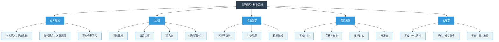
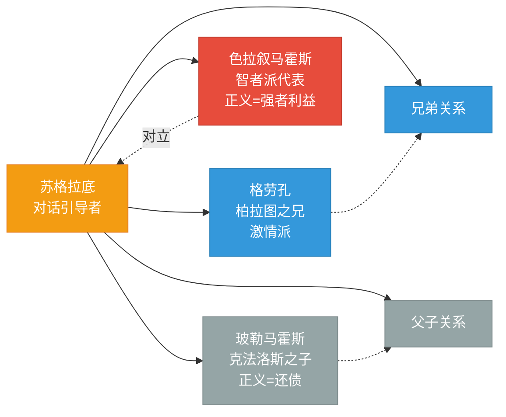
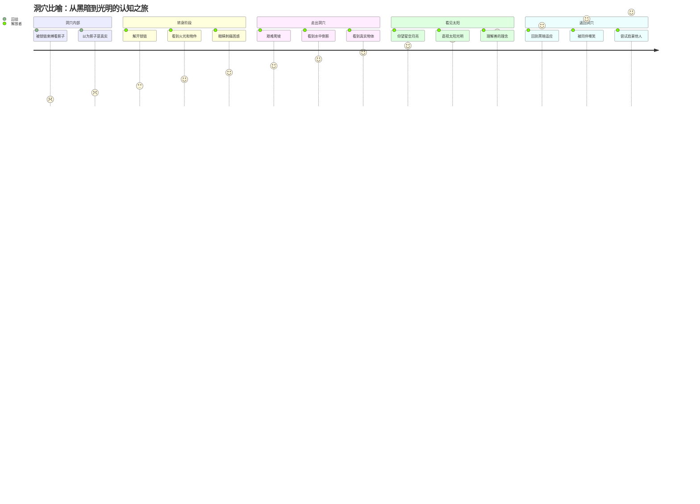
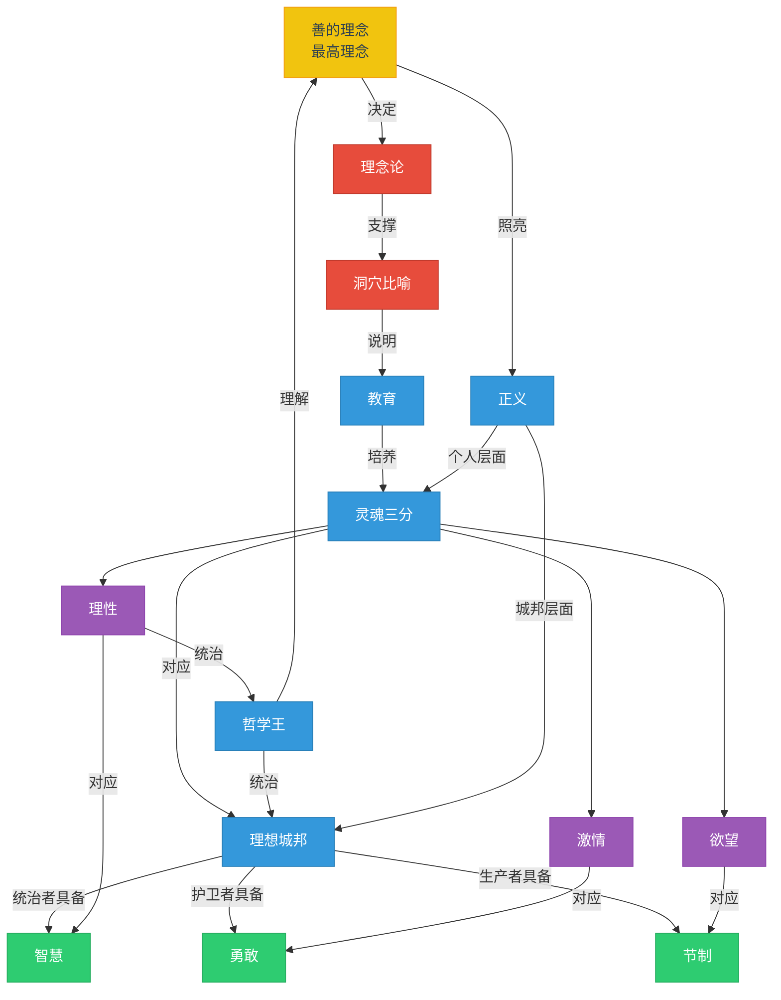

# 《理想国》知识图谱：一图读懂柏拉图的思想宇宙

> 📜 **人类文明经典阅读计划 | 西方哲学系列**
> 
> "用图像理解经典，让思想看得见。"

---

## 🔵 图谱说明

本文包含 4 张知识图谱，分别展示《理想国》的核心概念结构、人物关系、思想路径和概念网络。

每张图谱下方配有详细说明，帮助读者理解图谱逻辑。

---

## 🟢 图谱一：核心概念分类树

### 🔵 分类树说明

**结构解读**：
- 根节点：《理想国》核心思想
- 五大分支：正义理论、认识论、政治哲学、教育思想、心理学
- 每个分支向下展开 3-4 个具体概念

**设计逻辑**：
- 采用自顶向下的树状结构，符合认知习惯
- 五大分支覆盖了从个人到城邦、从理论到实践的完整体系
- 颜色区分层级，便于快速定位

**使用场景**：
- 快速建立对《理想国》的整体认知框架
- 作为阅读前的"地图"，帮助理解后续章节

---

## 🟡 图谱二：对话人物关系网

### 🟢 人物关系说明

**核心人物**：
- 🔵 苏格拉底：对话的引导者，柏拉图的思想代言人
- 🟢 格劳孔 & 阿德曼托斯：柏拉图的亲兄弟，代表追求真理的年轻人
- 🟡 色拉叙马霍斯：主要论敌，提出"正义是强者的利益"
- 🔴 克法洛斯 & 玻勒马霍斯：代表传统观念的长者与青年

**关系解读**：
- 兄弟组合：格劳孔偏激情，阿德曼托斯偏理性，恰好对应灵魂的两部分
- 对立结构：色拉叙马霍斯代表世俗权力观，与苏格拉底形成核心冲突
- 代际传承：从克法洛斯的经验主义到年轻人的哲学探索

---

## 🟠 图谱三：洞穴比喻路径图

### 🔵 路径图说明

**四个阶段**：
- 🌑 洞穴内部：无知状态，把幻象当真实
- 🌗 转身阶段：开始怀疑，经历认知冲击
- 🌓 走出洞穴：逐步认识更高层次的真实
- ☀️ 看见太阳：把握最高理念——善

**返回的意义**：
- 哲学家的使命不是留在光明中，而是回到洞穴启蒙他人
- 这对应"哲学王"的责任：见过真理的人必须参与治理
- 返回者会被嘲笑，因为习惯了黑暗的人无法理解光明

---

## 🟣 图谱四：概念网络关系图

### 🟢 网络图说明

**核心连接**：
- 🔵 "善的理念"处于最高位置，决定其他一切
- 🟢 "正义"贯穿个人与城邦两个层面
- 🟡 "灵魂三分"与"城邦三阶层"一一对应
- 🔴 "洞穴比喻"是理解教育本质的隐喻

**关键对应关系**：

| 灵魂部分 | 城邦阶层 | 核心美德 | 认知层次 |
|----------|----------|----------|----------|
| 理性 | 统治者 | 智慧 | 理性 |
| 激情 | 护卫者 | 勇敢 | 信念 |
| 欲望 | 生产者 | 节制 | 想象 |

**网络特征**：
- 所有概念最终指向"善的理念"
- 个人与城邦形成镜像结构
- 教育是连接无知与智慧的桥梁

---

## 🔵 如何使用这些图谱？

### 🟢 阅读前
- 先看**分类树**，建立整体框架
- 再看**人物关系**，了解对话背景

### 🟡 阅读中
- 遇到洞穴比喻时，对照**路径图**理解阶段
- 理解概念关联时，参考**网络图**

### 🔵 阅读后
- 用**网络图**复盘核心思想的内在逻辑
- 尝试用自己的话解释图谱中的关系

---

## 🟢 互动话题

看完图谱，哪个概念之间的关联最让你意外？

在评论区分享你的发现！

---

## 🔵 系列导航

| 上一篇 | 下一篇 |
|--------|--------|
| [《会饮篇》知识图谱](#) | [《斐多篇》知识图谱](#) |

📖 **人类文明经典阅读计划**
- 📚 东方智慧：论语、道德经、庄子、坛经
- 🏛️ 西方哲学：理想国、沉思录、纯粹理性批判
- 📖 文学经典：神曲、堂吉诃德、百年孤独

**关注我们，用图像读懂经典。**

---

*本文为"人类文明经典阅读计划"系列配套图谱，配合正文阅读效果更佳。*
*📌 收藏本文，随时查看。🔔 关注公众号，获取高清图谱下载。*
