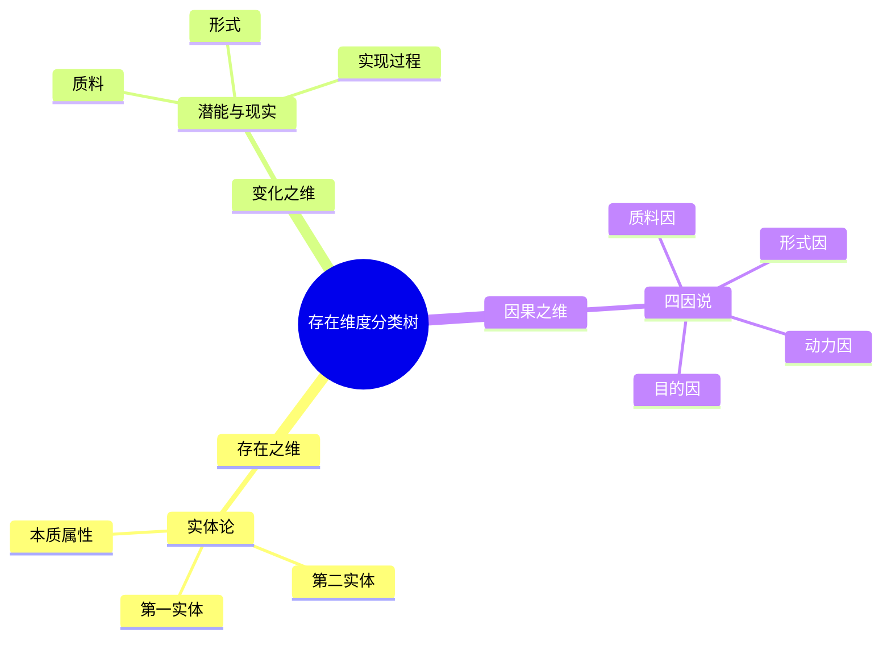
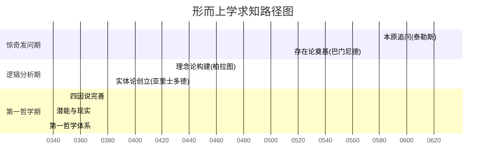

# 形而上学：知识图谱与核心要素可视化

> **描述**: 本图谱基于《形而上学》的核心内容，通过"存在维度分类树"、"形而上学思想人物图谱"、"求知路径图"和"理性思维网络图"，系统展示《形而上学》中的存在探求、本质追问、逻辑奠基与求知本性。
> **适用场景**: 深度阅读、存在探求、本质追问、理性思维、第一哲学
> **风格建议**: 古希腊哲学与现代理性元素结合，色彩深邃，层次清晰。背景为雅典学院场景，前景为四个模块的详细图谱。

---

## 图谱总览

```mermaid
graph TD
    subgraph 形而上学_知识图谱 [📚 形而上学: 存在探求与本质追问指南]
        A[存在维度分类树]
        B[形而上学思想人物图谱]
        C[求知路径图]
        D[理性思维网络图]
    end
    
    A -->|存在之维| A1[实体论]
    A -->|变化之维| A2[潜能与现实]
    A -->|因果之维| A3[四因说]
    
    B -->|亚里士多德| B1[第一哲学奠基者]
    B -->|柏拉图| B2[理念论先驱]
    B -->|巴门尼德| B3[存在论起点]
    B -->|泰勒斯| B4[本原追问者]
    
    C -->|初期| C1[惊奇发问]
    C -->|中期| C2[逻辑分析]
    C -->|后期| C3[第一哲学]
    
    D -->|存在| D1[实体探求]
    D -->|变化| D2[因果理解]
    D -->|理性| D3[求知本性]
    
    style A fill:#2c3e50,stroke:#ecf0f1,stroke-width:2px
    style B fill:#8e44ad,stroke:#ecf0f1,stroke-width:2px
    style C fill:#27ae60,stroke:#ecf0f1,stroke-width:2px
    style D fill:#c0392b,stroke:#ecf0f1,stroke-width:2px
```



---

## 图谱模块一：存在维度分类树



---

## 图谱模块二：形而上学思想人物图谱

```mermaid
graph LR
    subgraph 形而上学思想传承
        AR(亚里士多德 / 第一哲学 / 实体论)
        PL(柏拉图 / 理念论 / 分有说)
        PM(巴门尼德 / 存在论 / 一元论)
        TH(泰勒斯 / 本原论 / 水为万物之源)
        AN(阿那克西曼德 / 无限者 / 对立生成)
        HE(赫拉克利特 / 流变论 / 火为本原)
    end
    
    TH -->|本原追问| AN
    AN -->|对立统一| PM
    PM -->|存在一元| PL
    PL -->|理念超越| AR
    AR -->|实体奠基| TH
    AR -->|批判继承| PL
    AR -->|综合超越| PM
    
    style AR fill:#2c3e50,stroke:#ecf0f1,stroke-width:2px
    style PL fill:#8e44ad,stroke:#ecf0f1,stroke-width:2px
    style PM fill:#27ae60,stroke:#ecf0f1,stroke-width:2px
    style TH fill:#f39c12,stroke:#2c3e50,stroke-width:2px
    style AN fill:#e74c3c,stroke:#2c3e50,stroke-width:2px
    style HE fill:#3498db,stroke:#2c3e50,stroke-width:2px
```



---

## 图谱模块三：求知路径图



---

## 图谱模块四：理性思维网络图

```mermaid
graph TD
    subgraph 核心层
        ME(形而上学 / 第一哲学)
    end
    
    subgraph 存在类
        ST(实体论 / 存在探求)
        ES(本质 / 是什么)
        AC(属性 / 偶性)
    end
    
    subgraph 变化类
        PO(潜能 / 可能性)
        AC2(现实 / 实现态)
        MT(质料 / 载体)
        FM(形式 / 规定性)
    end
    
    subgraph 因果类
        M1(质料因 / 构成材料)
        M2(形式因 / 本质结构)
        M3(动力因 / 变化源头)
        M4(目的因 / 终极目标)
    end
    
    subgraph 理性类
        QN(求知本性 / 好奇心)
        RS(理性思维 / 逻辑)
        WS(智慧 / 第一原理)
    end
    
    ME --> ST
    ME --> ES
    ME --> AC
    ME --> PO
    ME --> AC2
    ME --> MT
    ME --> FM
    ME --> M1
    ME --> M2
    ME --> M3
    ME --> M4
    ME --> QN
    ME --> RS
    ME --> WS
    
    style ME fill:#2c3e50,stroke:#ecf0f1,stroke-width:2px
    style ST fill:#8e44ad,stroke:#ecf0f1,stroke-width:2px
    style PO fill:#27ae60,stroke:#ecf0f1,stroke-width:2px
    style AC2 fill:#27ae60,stroke:#ecf0f1,stroke-width:2px
    style M1 fill:#c0392b,stroke:#ecf0f1,stroke-width:2px
```



---

## 核心关键词

```
存在探求, 本质追问, 实体论, 四因说, 潜能与现实, 求知本性, 第一哲学, 理性思维, 逻辑奠基, 形式与质料
```

---

## 总结

通过这四个图谱，我们可以清晰地看到：
1.  **存在维度分类树**展示了存在的多维度，实体、变化、因果分别对应不同的存在类型。
2.  **形而上学思想人物图谱**揭示了思想传承的多样性，每位哲学家都有自己的存在轨迹。
3.  **求知路径图**展现了从惊奇发问到第一哲学的完整周期，帮助理解求知本性的规律。
4.  **理性思维网络图**描绘了亚里士多德的思维网络，体现了理性思维的底层逻辑。

《形而上学》不仅是一部哲学经典，更是一部**存在探求与本质追问指南**和**求知本性与第一哲学启示录**。
