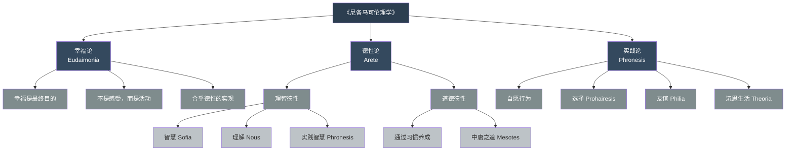
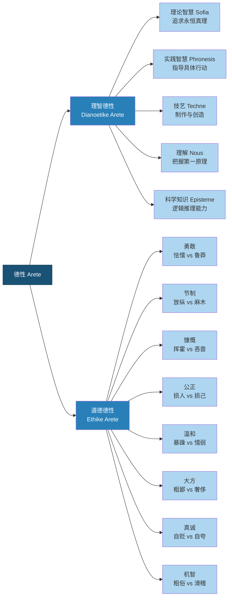
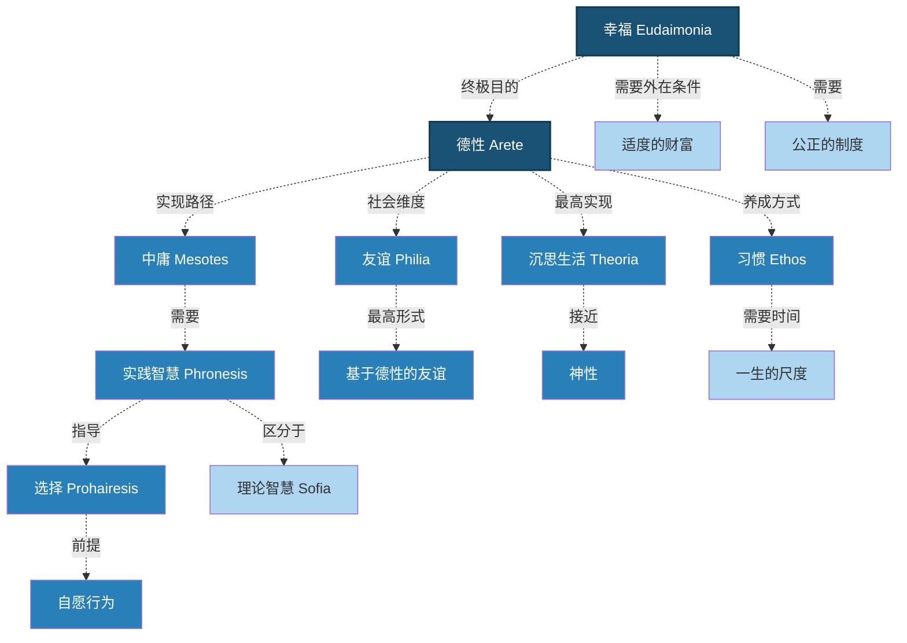
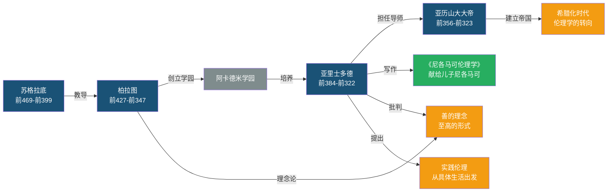

# 《尼各马可伦理学》知识图谱：一幅德性觉醒的地图

---

> "如果要用一幅图来理解亚里士多德的伦理学，它会是什么样子？"

---

## 一、总体结构图：伦理学的三大支柱



**图谱说明：**

这幅分类树展示了《尼各马可伦理学》的三层架构。

最顶层是全书的终极问题：**什么是幸福？** 这是所有伦理思考的起点和终点。

中间层是两大支柱：**德性论**回答"什么样的人能获得幸福"，**实践论**回答"如何在具体生活中实现幸福"。

最底层是具体概念：理智德性与道德德性的区分、中庸之道的定位、选择的本质、友谊的分类，以及最终指向的沉思生活。

---

## 二、德性分类图谱：理智与道德的双重修炼



**图谱说明：**

亚里士多德对德性的二分法是理解其伦理学的关键。

**理智德性**关乎理性能力——既有指向永恒真理的理论智慧，也有指导日常决策的实践智慧。前者让你"看得远"，后者让你"走得对"。

**道德德性**关乎品格特质——每一种德性都位于两个恶习之间。比如勇敢，过之则鲁莽，不及则怯懦。

注意两者之间的关系：**没有实践智慧的道德德性是盲目的，没有道德德性的实践智慧是空洞的。** 它们必须协同工作。

---

## 三、中庸之道路径图：在极端之间寻找平衡

```mermaid
graph TD
    A["人生的每一个选择"] --> B{"偏离中庸了吗？"}

    B -->|"过度"| C["极端一<br/>Excess"]
    B -->|"不及"| D["极端二<br/>Deficiency"]
    B -->|"适中"| E["中庸 Mesotes"]

    C --> C1["鲁莽"]
    C --> C2["挥霍"]
    C --> C3["暴躁"]
    C --> C4["自夸"]
    C --> C5["谄媚"]

    D --> D1["怯懦"]
    D --> D2["吝啬"]
    D --> D3["懦弱"]
    D --> D4["自贬"]
    D --> D5["冷漠"]

    E --> E1["勇敢"]
    E --> E2["慷慨"]
    E --> E3["温和"]
    E --> E4["真诚"]
    E --> E5["友善"]

    C -.->|"亚里士多德说：过度和不及<br/>都属于恶"| D
    E -.->|"中庸是唯一通向<br/>幸福的路径"| F["幸福 Eudaimonia"]

    classDef start fill:#f39c12,color:#fff
    classDef decision fill:#e74c3c,color:#fff
    classDef excess fill:#c0392b,color:#fff
    classDef deficiency fill:#7f8c8d,color:#fff
    classDef virtue fill:#27ae60,color:#fff
    classDef end fill:#1a5276,color:#fff
    class A start
    class B decision
    class C,C1,C2,C3,C4,C5 excess
    class D,D1,D2,D3,D4,D5 deficiency
    class E,E1,E2,E3,E4,E5 virtue
    class F end
```

**图谱说明：**

这幅路径图展示了中庸之道的决策逻辑。

亚里士多德不认为中庸是一个固定的"中点"。对运动员来说，"适中的饭量"和对普通人来说是完全不同的。**中庸是相对于我们每个人的"恰到好处的位置"。**

更重要的是：**过度往往比不及看起来更有吸引力。** 鲁莽看起来像勇敢，挥霍看起来像慷慨，自夸看起来像自信。这就是为什么找到中庸需要实践智慧（phronesis）——它需要经验、反思和理性判断。

---

## 四、核心概念网络图：伦理学的内在逻辑



**图谱说明：**

这幅网络图揭示了《尼各马可伦理学》中各个核心概念的内在关联。

**幸福是终极目的**，但它不是孤立存在的。幸福需要德性作为支撑，德性需要习惯来养成，而习惯的培养需要一生的时间。

**实践智慧是整个体系的枢纽**——它连接了中庸的选择、自愿的行为和最终的沉思生活。

同时，亚里士多德没有忽视现实条件：适度的财富和公正的制度是幸福的必要前提。这让他与后来的斯多葛学派（认为幸福完全不受外在条件影响）区别开来。

---

## 五、人物关系图谱：从柏拉图到亚历山大



**图谱说明：**

理解《尼各马可伦理学》，不能脱离亚里士多德的思想史背景。

亚里士多德是柏拉图的学生，但他对柏拉图的"理念论"提出了根本性批判。柏拉图认为"善"是一个超越性的理念，而亚里士多德认为**善必须在具体的人类生活中被理解和实践**。

这种"从抽象回到具体"的转向，正是《尼各马可伦理学》最革命性的贡献。

而亚里士多德与亚历山大大帝的师生关系，也暗示了伦理学与政治学之间的内在联系——**个人的善与城邦的善不可分割。**

---

**标签：** #德性觉醒 #中庸智慧 #幸福探求 #实践理性 #人类文明经典阅读计划
