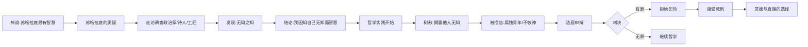
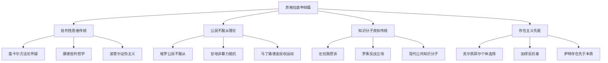
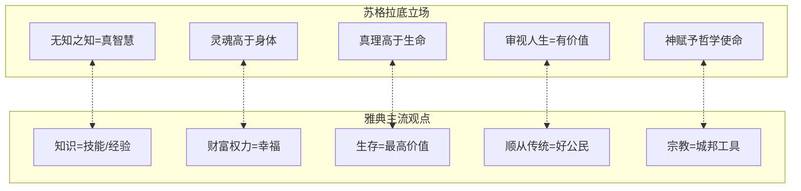

# 《申辩篇》知识图谱图片描述

> 本文档为《申辩篇》系列文章配图提供详细的图片描述和设计指引。

---

## ◆ 整体视觉风格

- **主色调**：深蓝、墨黑、金色点缀，营造古典哲学氛围
- **字体风格**：衬线体为主，标题加粗，正文清晰
- **构图原则**：留白充足，层次分明，避免信息过载
- **图标风格**：简约线性图标，配合文字符号 ◇○●◆

---

## ◇ 图谱一：《申辩篇》核心概念分类树

### 设计描述

一棵从底部向上生长的概念树，根部是"认识你自己"，主干分为三大枝干，每根枝干继续分叉。

### 结构层级

```
根：认识你自己（德尔斐神谕）
├── 智慧观
│   ├── 无知之知
│   ├── 真正的智慧
│   └── 自以为知的危险
├── 使命观
│   ├── 神赋予的使命
│   ├── 哲学家的责任
│   └── 牛虻精神
└── 生死观
    ├── 灵魂不朽
    ├── 真理高于生命
    └── 死亡的两种可能
```

### 视觉建议

- 树根用金色高亮
- 三大枝干用不同深浅的蓝色区分
- 末端节点用圆形图标标注
- 背景可叠加古希腊建筑纹理

---

## ○ 图谱二：苏格拉底与相关人物关系图谱

### 设计描述

以苏格拉底为中心的辐射状人物关系网络，标注每个人物与苏格拉底的关系及在《申辩篇》中的角色。

### 结构层级

```
中心：苏格拉底
├── 原告方
│   ├── 美勒托（正式控告者）
│   ├── 阿尼图斯（幕后推动者）
│   └── 吕孔（演说家）
├── 辩护相关
│   ├── 柏拉图（记录者/学生）
│   ├── 斐多（在场学生）
│   └── 克里同（逃亡安排者）
├── 被审视者
│   ├── 政治家
│   ├── 诗人
│   └── 工匠
└── 精神源头
    ├── 德尔斐神谕
    └── 神灵/守护神（daimonion）
```

### 视觉建议

- 中心用较大的圆形，标注苏格拉底头像轮廓
- 原告方用红色系标注
- 辩护相关用蓝色系
- 被审视者用灰色系
- 精神源头用金色系
- 连线标注关系关键词

---

## ● 图谱三：《申辩篇》论证路径图

### 设计描述

从左至右的流程图，展示苏格拉底申辩的逻辑推演路径。每个节点是一个论证阶段，用箭头连接。

### 结构层级



### 视觉建议

- 水平布局，从左到右
- 关键转折点用菱形标注
- 最终选择分支用不同颜色区分
- 在底部添加时间轴标注

---

## ◆ 图谱四：哲学思想影响网络图

### 设计描述

展示《申辩篇》核心思想对后世的影响网络。从苏格拉底出发，辐射到不同时代、不同领域的思想家和文化现象。

### 结构层级



### 视觉建议

- 中心节点用金色高亮
- 四大传承方向用不同颜色
- 末端节点用较小字体
- 背景可添加年代时间线
- 整体呈扇形辐射布局

---

## ◇ 图谱五：核心命题逻辑对照图

### 设计描述

对比展示苏格拉底的核心命题与其对立面（雅典主流观点），形成鲜明的思想张力。

### 结构层级



### 视觉建议

- 左右分栏，苏格拉底立场用蓝色，雅典观点用暖灰色
- 中间用虚线连接，标注对立关系
- 底部添加总结性文字框
- 可添加天平图标象征思想较量

---

## ○ 图谱六：现代应用映射图

### 设计描述

将《申辩篇》的核心思想映射到现代生活场景，帮助读者建立古典哲学与当代实践的连接。

### 结构层级

```
苏格拉底思想 --> 现代应用场景

无知之知 --> 终身学习/认知谦逊
牛虻精神 --> 批判性媒体素养/独立思考
真理高于生命 --> 学术诚信/职业操守
审视人生 --> 正念冥想/自我反思实践
哲学使命 --> 知识传播/公共教育
```

### 视觉建议

- 左侧古典元素（古希腊风格图标）
- 右侧现代元素（简约现代图标）
- 中间用渐变箭头连接
- 每个对应关系用一行展示
- 整体色调从古典金过渡到现代蓝

---

## ◆ 配图使用建议

1. **首图**：使用概念分类树，作为系列开篇的视觉锚点
2. **文中配图**：论证路径图和人物关系图交替使用
3. **结尾配图**：使用现代应用映射图，引导读者思考当下意义
4. **尺寸规范**：宽度 1080px，高度根据内容自适应
5. **文字比例**：图片中文字不超过总面积的 30%
