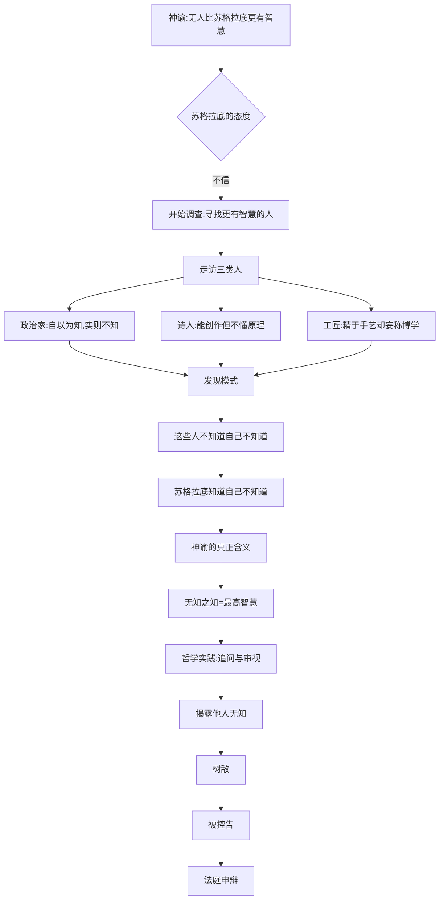
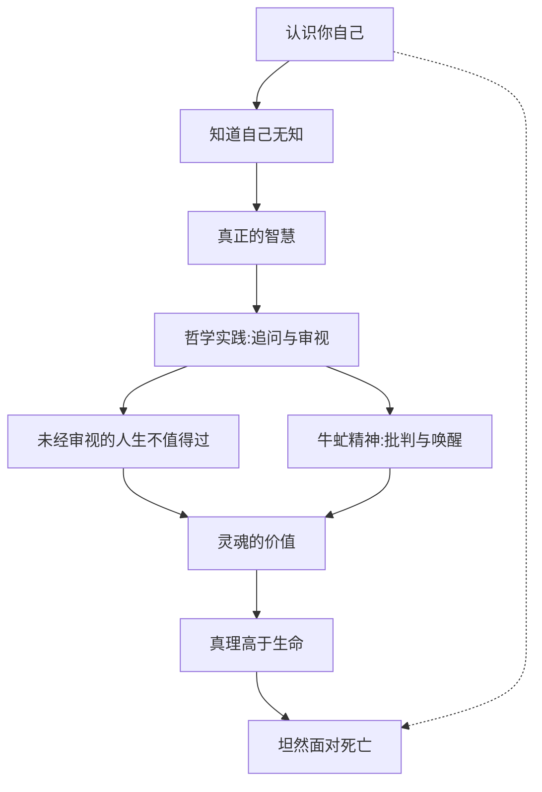

# 从神谕到死刑：《申辩篇》的逻辑脉络｜图谱逻辑

> 一篇申辩，何以成为西方哲学的奠基之作？让我们沿着苏格拉底的思维路径，一步步走进这场跨越千年的思想审判。

---

## ◆ 引子：一个神谕引发的连锁反应

一切始于德尔斐神庙的一句神谕。

苏格拉底的朋友凯勒丰去德尔斐求问："有人比苏格拉底更有智慧吗？"神谕的回答是：**没有**。

这个答案让苏格拉底困惑不已。他自认为一无所知，神怎么能说他是最高智慧的人呢？为了解开这个谜团，他踏上了一段"证伪神谕"的旅程。

但他没有想到，这段旅程最终把他送上了法庭，也送进了哲学的永恒殿堂。

---

## ◇ 逻辑主线：苏格拉底的论证链条



### 关键转折点

**转折点一：从"证伪"到"证实"**

苏格拉底本想去证明神谕错了，结果却发现神谕以他未曾预料的方式是对的。这个"反转"是整篇申辩的逻辑起点。

**转折点二：从"认知"到"行动"**

理解了神谕的含义后，苏格拉底没有止步于自我认知，而是将其转化为一种使命——继续追问、继续审视、继续做那只"牛虻"。

---

## ○ 审判逻辑：控告与反驳的博弈

```mermaid
graph LR
    subgraph 控告方
        C1[腐蚀青年]
        C2[不敬城邦的神]
    end

    subgraph 苏格拉底反驳
        R1[谁在真正影响青年?]
        R2[我是否有意腐蚀?]
        R3[我的哲学活动源于神谕]
        R4[神灵(daimonion)指引我]
    end

    C1 --> R1
    C1 --> R2
    C2 --> R3
    C2 --> R4

    R1 --> R1A["如我腐蚀了青年,谁使他们变好?<br/>答案是:法律,而非我一人"]
    R2 --> R2A["有意腐蚀会伤害自己,<br/>我不会如此愚蠢"]
    R3 --> R3A["我的一生都是对神谕的服从"]
    R4 --> R4A["我内在的神灵比城邦的神更真实"]
```

### 苏格拉底的反驳策略

苏格拉底的反驳不是简单的否认，而是通过追问揭示控告本身的荒谬：

- **关于腐蚀青年**：如果我真腐蚀了青年，那要么是有意为之，要么是无心之失。有意腐蚀对我自己有害，我不会做；无心之失应被教导而非惩罚。

- **关于不敬神**：我的一生都在服从德尔斐神谕，我的内在神灵一直在指引我。我比控告者更虔诚。

---

## ● 生死抉择：最后的逻辑推演

审判进入最后阶段，苏格拉底面临两个选择：

```mermaid
graph TD
    A[被判有罪] --> B{量刑选择}
    
    B --> C[原告提议:死刑]
    B --> D[苏格拉底提议:罚金]
    
    D --> D1[最初:一顿免费餐<br/>(讽刺自己为城邦的贡献)]
    D1 --> D2[后改为:3000德拉克马罚金<br/>(由柏拉图等人担保)]
    
    C --> E{最终判决}
    D2 --> E
    
    E --> F[死刑胜出]
    F --> G[学生安排逃亡]
    
    G --> H{苏格拉底的抉择}
    H --> I[逃亡]
    H --> J[接受死刑]
    
    I --> I1[违背法律]
    I1 --> I2[否定一生信念]
    I2 --> I3[逻辑矛盾]
    
    J --> J1[遵守法律]
    J1 --> J2[践行真理高于生命]
    J2 --> J3[逻辑一致]
    
    J3 --> K[饮下毒堑汁]
```

### 抉择的深层逻辑

苏格拉底选择接受死刑，不是出于懦弱或绝望，而是基于一套严密的逻辑：

1. 我一生在雅典生活，享受了雅典法律带来的好处
2. 这种生活构成了一种默示的契约：我同意遵守雅典的法律
3. 如今法律判决我死，如果我逃亡，就是违背这个契约
4. 违背契约 = 否定我一生的信念 = 灵魂的堕落
5. 灵魂堕落比死亡更可怕
6. 因此，我选择死亡

---

## ◆ 结构总览：《申辩篇》的三段式

```mermaid
graph TD
    A[申辩篇整体结构] --> B[第一部分:辩护]
    A --> C[第二部分:量刑]
    A --> D[第三部分:终言]

    B --> B1[回应"旧偏见":阿里斯托芬的讽刺]
    B --> B2[回应"新控告":美勒托等人的指控]
    B --> B3[阐述哲学使命]

    C --> C1[原告提议死刑]
    C --> C2[苏格拉底的反提议]
    C --> C3[陪审团选择死刑]

    D --> D1[对有罪判决者的话]
    D --> D2[对无罪投票者的话]
    D --> D3[最后的遗言:谁的去路好,唯有神知道]
```

---

## ◇ 核心命题的逻辑关系

《申辩篇》的思想体系可以用以下逻辑网络来理解：



---

## ○ 系列导航

```
【人类文明经典阅读计划 · 西方哲学系列】

上一篇：◇ 03-理想国：洞穴寓言与理想政体
当前篇：● 04-申辩篇：图谱逻辑解析
下一篇：○ 05-尼各马可伦理学：幸福的本质

回复关键词"哲学"获取完整系列目录
```

---

## ◆ 互动话题

**你觉得苏格拉底应该逃亡吗？**

从逻辑和情感两个角度思考：

1. 如果你站在苏格拉底的位置，你会如何选择？
2. 遵守不公正的法律，是一种美德还是愚忠？
3. "真理高于生命"这句话，在今天还成立吗？

---

> 下期预告：深入解读《申辩篇》的核心思想——"认识你自己"的真正含义。
