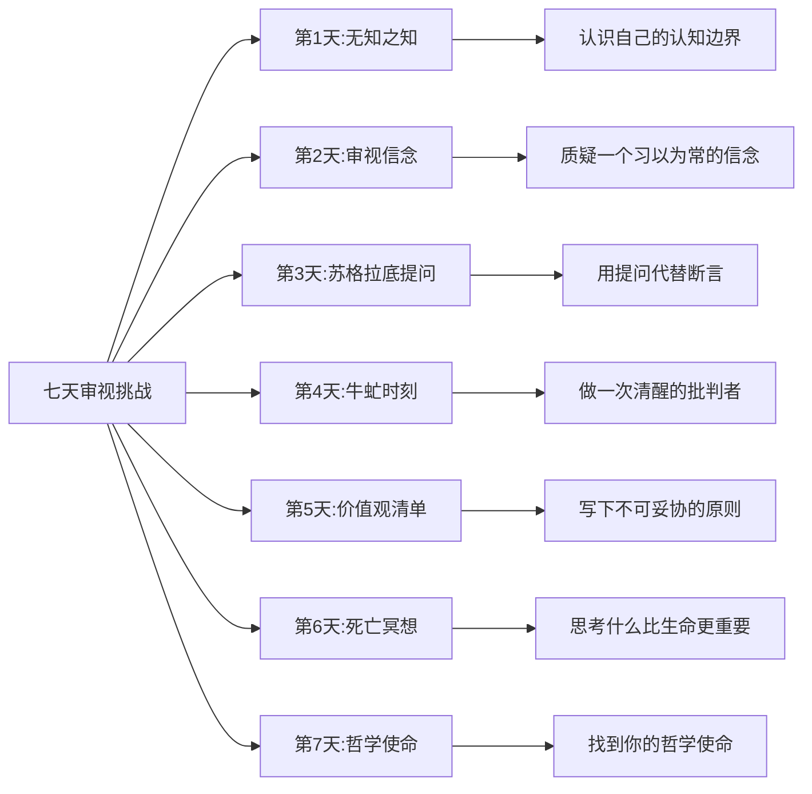
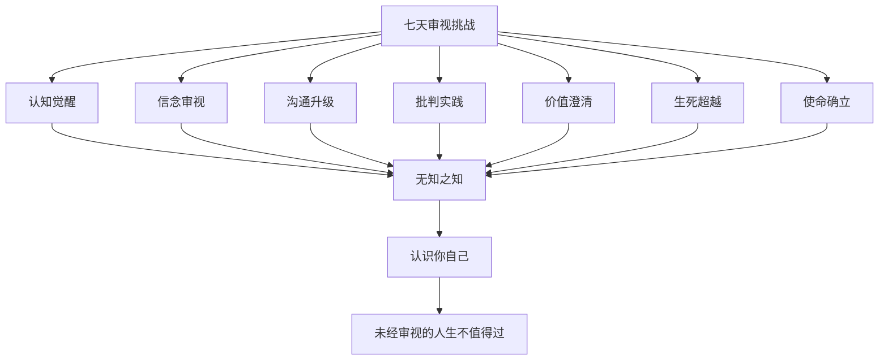

# 七天审视挑战：用《申辩篇》开启你的哲学实践

> 认识你自己，不是一句话，而是一生的实践。

---

## ◆ 引子：从阅读到行动

我们读了《申辩篇》，被苏格拉底的精神所打动。但感动之后呢？

苏格拉底不会满足于你"读过"他的故事。他会问你：**你打算怎么做？**

《申辩篇》不是一本用来收藏的书，而是一份用来践行的邀请函。今天，我们为你设计了一个七天挑战，把两千四百年前的哲学智慧，变成当下可以执行的日常实践。

---

## ◇ 挑战总览



---

## ○ 第一天：无知之知

### 今日主题

承认自己有所不知。

### 苏格拉底的提醒

> "我知道我一无所知。"

### 今日行动

**行动一：记录你的"我不知道"**

今天，每次你遇到不了解的事情，不要假装明白，诚实地记录下来：

- 同事提到的某个概念，你不了解
- 新闻中的某个事件，你缺乏背景知识
- 工作中的某个流程，你不清楚全貌

**行动二：主动承认一次无知**

在某个场合，当你不确定时，说出这句话：

> "我不确定，我需要了解更多。"

观察自己的感受和周围人的反应。

### 反思问题

1. 承认无知时，你的第一反应是什么？是焦虑还是释然？
2. 有没有哪些领域，你一直以为自己很懂，其实并非如此？
3. "知道自己不知道"和"完全不知道"有什么本质区别？

---

## ● 第二天：审视信念

### 今日主题

质疑一个你深信不疑的信念。

### 苏格拉底的提醒

> "未经审视的人生不值得过。"

### 今日行动

**行动一：选一个信念**

选择一个你长期以来深信不疑的信念。例如：

- "努力就一定会成功"
- "赚钱是衡量价值的标准"
- "年龄到了就该结婚"
- "稳定比冒险更重要"

**行动二：用苏格拉底式追问审视它**

对选定的信念，连续追问以下问题：

1. 这个信念从哪来？是我自己思考的结果，还是别人告诉我的？
2. 有没有反例可以推翻它？
3. 如果这个信念是错的，我会怎样？
4. 有没有更合理的替代信念？

**行动三：写下你的发现**

用一段话记录审视后的结果。

### 反思问题

1. 审视过程中，你感到不舒服吗？为什么？
2. 你的信念动摇了，还是更坚定了？
3. 审视之后，你的行为会有变化吗？

---

## ◆ 第三天：苏格拉底提问法

### 今日主题

用提问代替断言。

### 苏格拉底的提醒

苏格拉底从不直接给出答案，他只做一件事：**提问**。

### 今日行动

**行动一：今天少说结论，多提问题**

在至少三次对话中，刻意用提问代替结论：

- 把"这个方案不行"换成"你觉得这个方案最大的风险是什么？"
- 把"他肯定错了"换成"有没有另一种可能性？"
- 把"这不可能成功"换成"如果要让它成功，需要什么条件？"

**行动二：练习追问**

当对方给出一个答案后，继续追问：

- "为什么这么认为？"
- "能举个例子吗？"
- "如果换一个角度呢？"

### 反思问题

1. 用提问代替断言，对话的氛围有什么变化？
2. 你有没有发现对方之前忽略的盲点？
3. 提问比断言更难吗？难在哪里？

---

## ◇ 第四天：牛虻时刻

### 今日主题

做一次清醒的批判者。

### 苏格拉底的提醒

> "城邦需要一只牛虻来保持清醒。"

### 今日行动

**行动一：识别一次"群体沉睡"**

观察你所在的团队或社交圈，有没有以下情况：

- 所有人都在附和同一个观点
- 某个明显的风险被忽略
- "我们一直都是这么做的"成为唯一的理由

**行动二：做一次温和的牛虻**

用建设性的方式提出质疑：

- "我有一个不同的想法，想听听大家的意见..."
- "我注意到我们可能忽略了一个问题..."
- "如果我们从另一个角度来看，会有什么不同？"

### 反思问题

1. 提出不同意见时，你紧张吗？
2. 团队的反应是什么？
3. 你的质疑有没有帮助团队更清醒地思考？

---

## ○ 第五天：价值观清单

### 今日主题

写下你的不可妥协原则。

### 苏格拉底的提醒

苏格拉底用生命证明：**有些东西值得用一切去捍卫**。

### 今日行动

**行动一：列出你的核心价值观**

写下 5 个你最看重的价值观。例如：诚实、自由、公正、成长、爱。

**行动二：为每个价值观写出"绝不"清单**

- 诚实：绝不为了短期利益说谎
- 公正：绝不因个人好恶而区别对待
- 成长：绝不在舒适区里停滞不前
- ...

**行动三：检查你的行为是否匹配**

回顾过去一周的行为，有没有违背这些价值观的时刻？

### 反思问题

1. 你的价值观清单中，哪一个最难坚守？
2. 有没有某个时刻，你为了便利而妥协了原则？
3. 如果苏格拉底看你的价值观清单，他会赞同吗？

---

## ● 第六天：死亡冥想

### 今日主题

思考什么比生命更重要。

### 苏格拉底的提醒

> **"逃避死亡并不难，真正难的是逃避不义。"**

### 今日行动

**行动一：想象你的最后一年**

假设你只有一年的生命，问自己：

- 我现在的生活方式需要改变吗？
- 有哪些事我一直想做却不敢做？
- 有哪些关系我一直想修复却没有勇气？

**行动二：写下你的"不怕失去"**

苏格拉底不怕死亡，因为他有比生命更重要的东西。你的答案是什么？

- 我不怕失去______，只要我能守住______。

**行动三：给十年后的自己写一封信**

在信中回答：你希望自己成为一个什么样的人？

### 反思问题

1. 思考死亡时，你的情绪是什么？恐惧、平静、还是其他？
2. 如果明天就是最后一天，你今天最大的遗憾是什么？
3. "什么比生命更重要"——你有答案了吗？

---

## ◆ 第七天：哲学使命

### 今日主题

找到你的哲学使命。

### 苏格拉底的提醒

苏格拉底从神谕中读出了自己的使命：**做一只牛虻，唤醒沉睡的灵魂**。

### 今日行动

**行动一：回顾前六天**

回顾这七天的实践，回答：

- 哪一天的行动让你最有触动？
- 哪一次审视让你发现了自己之前忽略的东西？
- 苏格拉底的哪个思想最贴近你的内心？

**行动二：写下你的"哲学使命宣言"**

用一段话描述：在这个时代，你的哲学使命是什么？

参考格式：

> 我相信______。因此，我承诺______。即使面对______，我也不会放弃______。因为______是我灵魂的底色。

**行动三：分享给一个人**

把你的使命宣言分享给一个你信任的人，请他/她做你的"见证者"。

### 反思问题

1. 写下使命宣言时，你感到力量还是不安？
2. 这个宣言是你真正相信的，还是写出来"好看"的？
3. 一年后回看这个宣言，你希望看到什么？

---

## ○ 七天挑战总结



---

## ◆ 系列导航

```
【人类文明经典阅读计划 · 西方哲学系列】

上一篇：◇ 03-理想国：洞穴寓言与理想政体
当前篇：● 04-申辩篇：七天行动挑战
下一篇：○ 05-尼各马可伦理学：幸福的本质

核心标签：自我审视 | 批判精神 | 真理追求 | 哲学启蒙
```

---

## ◇ 互动话题

**你的七天挑战体验如何？**

在评论区分享：

1. 七天中哪一天最有挑战？为什么？
2. 你的"哲学使命宣言"是什么？（可以匿名分享核心内容）
3. 这个挑战改变了你什么？

完成挑战的读者，回复"申辩"，获取本系列完整电子书合集。

---

> 经典不是用来读的，是用来活的。
