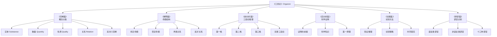
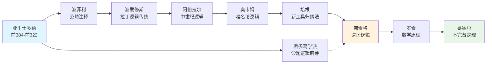
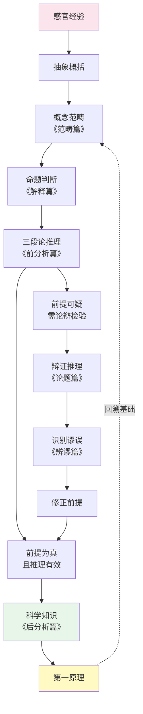
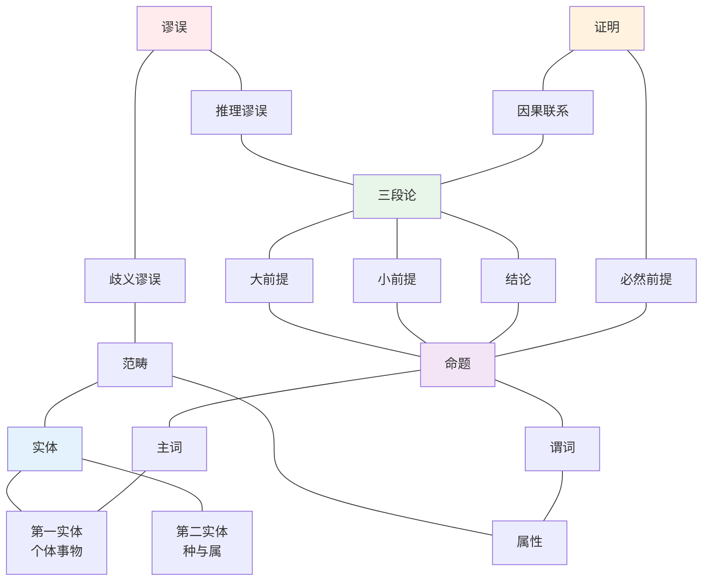

# 知识图谱：《工具论》核心概念全景图

> 说明：本文描述《工具论》知识图谱的图片内容，用于公众号文章中的知识可视化。包含四张 Mermaid 图表：分类树、人物图谱、路径图和网络图。

---

## ◆ 图谱一：《工具论》六篇分类树

此图展示《工具论》六篇著作的层级结构与功能定位。

**图表说明：**
- 根节点为《工具论》整体
- 六大分支对应六篇著作
- 每篇下方列出核心子概念
- 颜色区分：概念层/命题层/推理层/应用层

---

## ◆ 图谱二：逻辑学传承人物图谱

此图展示从亚里士多德到现代逻辑学的关键人物与思想传承关系。

**图表说明：**
- 主线：亚里士多德形式逻辑的传承
- 辅线：斯多葛学派对命题逻辑的贡献
- 三个高亮节点：源头/转折/现代
- 箭头方向表示思想影响关系

---

## ◆ 图谱三：从概念到知识的推理路径

此图展示人类思维从基本概念出发，经由推理，最终到达科学知识的完整路径。

**图表说明：**
- 路径从左到右、从上到下展开
- 绿色节点为理想终点（科学知识）
- 粉色节点为起点（感官经验）
- 循环箭头表示论辩修正过程

---

## ◆ 图谱四：《工具论》概念网络图

此图展示《工具论》核心概念之间的交叉引用与关联网络。

**图表说明：**
- 五种颜色区分五类核心概念
- 实线连接表示直接的逻辑依赖
- 概念之间存在多对多的交叉引用
- 网络密度反映了《工具论》体系的内在一致性

---

## ◆ 使用建议

1. 分类树适合快速了解《工具论》整体架构
2. 人物图谱帮助理解逻辑学的历史纵深
3. 推理路径图展示思维运作的动态过程
4. 概念网络图揭示理论内部的精密关联

建议四图配合使用，从静态到动态、从历史到理论，全方位把握《工具论》的知识版图。

---

*图片设计：「人类文明经典阅读计划」视觉组。转载请注明出处。*
