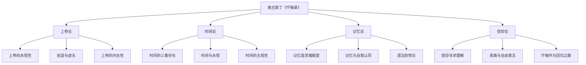
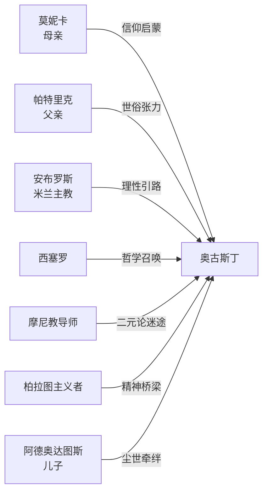
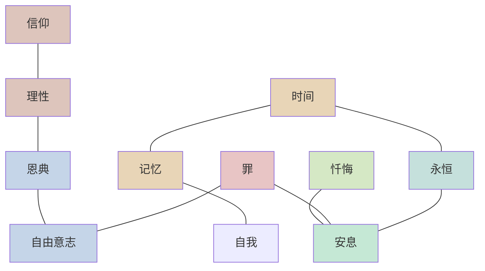

# 知识图谱图片描述：奥古斯丁《忏悔录》

---

## 图片一：思想分类树

### 描述说明

这是一张树状思维导图，展示了《忏悔录》核心思想的层级结构。

**中心节点：** "奥古斯丁《忏悔录》"

**第一层级（四大主题分支）：**

- 上帝论
  - 上帝的永恒性
  - 创造与虚无
  - 上帝的内在性
- 时间论
  - 时间的三重存在（记忆、注意、期待）
  - 时间与永恒的对立
  - 时间的主观性
- 记忆论
  - 记忆作为灵魂的殿堂
  - 记忆与自我认同
  - 遗忘的悖论
- 信仰论
  - 信仰寻求理解
  - 恩典与自由意志
  - 忏悔作为回归之路

**视觉风格：** 从中心向外辐射的树状结构，主分支使用不同颜色区分，末端节点用圆点标注。

---

## 图片二：人物关系图谱

### 描述说明

这是一张以奥古斯丁为中心的人物关系网络图，展示了影响他思想形成的重要人物。

**中心人物：** 奥古斯丁（ Augustine of Hippo，354-430 ）

**关键人物节点及关系：**

- 莫妮卡（母亲）
  - 关系：虔诚的基督徒，为儿子流泪祷告三十年
  - 连接词：信仰的启蒙者
- 帕特里克（父亲）
  - 关系：异教徒，后皈依基督教
  - 连接词：世俗与信仰的张力
- 安布罗斯（米兰主教）
  - 关系：精神导师，引导奥古斯丁理解圣经的寓意解经
  - 连接词：理性的信仰引路人
- 西塞罗
  - 关系：哲学启蒙者，《荷尔顿西乌斯》使其转向哲学
  - 连接词：哲学的召唤
- 摩尼教导师
  - 关系：九年摩尼教追随经历
  - 连接词：二元论的迷途
- 柏拉图主义者
  - 关系：新柏拉图主义帮助其理解非物质实体
  - 连接词：从物质到精神的桥梁
- 阿德奥达图斯（儿子）
  - 关系：与侍女所生之子，早逝
  - 连接词：尘世之爱的牵绊

**视觉风格：** 人物照片或头像围绕中心排列，关系线用不同颜色标注正向/负向影响。

---

## 图片三：灵魂回归路径图

### 描述说明

这是一张从左到右的流程图，描绘了奥古斯丁灵魂从"迷失"到"安息"的旅程。

**路径节点（从左至右）：**

1. **起点：迦太基**
   - 标签：欲望的泥沼
   - 描述：沉溺于情欲、修辞学野心、摩尼教信仰
2. **转折：罗马**
   - 标签：幻灭与追问
   - 描述：对摩尼教失望，开始寻求真理
3. **关键：米兰**
   - 标签：理性的光照
   - 描述：遇见安布罗斯，接受新柏拉图主义，花园中的皈依
4. **过渡：卡西齐亚根**
   - 标签：沉思与对话
   - 描述：退隐庄园，与朋友进行哲学对话
5. **回归：希波**
   - 标签：服侍与写作
   - 描述：成为主教，写下《忏悔录》
6. **终点：上帝**
   - 标签：灵魂的安息
   - 描述："你为自己创造我们，我们的心不得安宁，直到安息于你"

**视觉风格：** 弯曲的路径连接各节点，每个节点配有图标和简短说明，路径颜色从暗到明渐变，象征从黑暗走向光明。

---

## 图片四：核心概念网络图

### 描述说明

这是一张网状关系图，展示了《忏悔录》中核心概念之间的相互关联。

**核心概念节点：**

- 时间
- 记忆
- 永恒
- 信仰
- 理性
- 恩典
- 自由意志
- 罪
- 忏悔
- 安息

**关键连接关系：**

- "时间" 连接 "记忆"：时间是心灵的延展（distentio animi）
- "时间" 连接 "永恒"：时间是有限的，永恒是上帝的属性
- "记忆" 连接 "自我"：记忆构成了"我是谁"
- "信仰" 连接 "理性"：信仰寻求理解（fides quaerens intellectum）
- "恩典" 连接 "自由意志"：自由需要恩典的修复
- "罪" 连接 "自由意志"：罪是自由意志的误用
- "忏悔" 连接 "安息"：忏悔是回归安息之路
- "罪" 连接 "安息"：罪使灵魂流亡，安息是罪的终结
- "永恒" 连接 "安息"：安息是进入永恒的状态
- "理性" 连接 "恩典"：理性需要恩典的照亮

**视觉风格：** 节点大小根据重要性调整，连接线粗细表示关联强度，形成一张紧密交织的概念网络。

---

## Mermaid 图表代码

### 分类树

---

### 人物图谱

---

### 路径图

---

### 网络图

