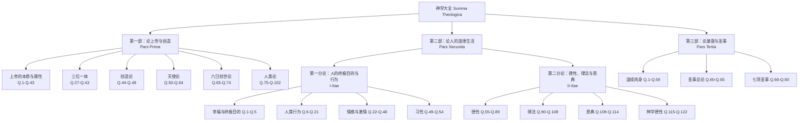
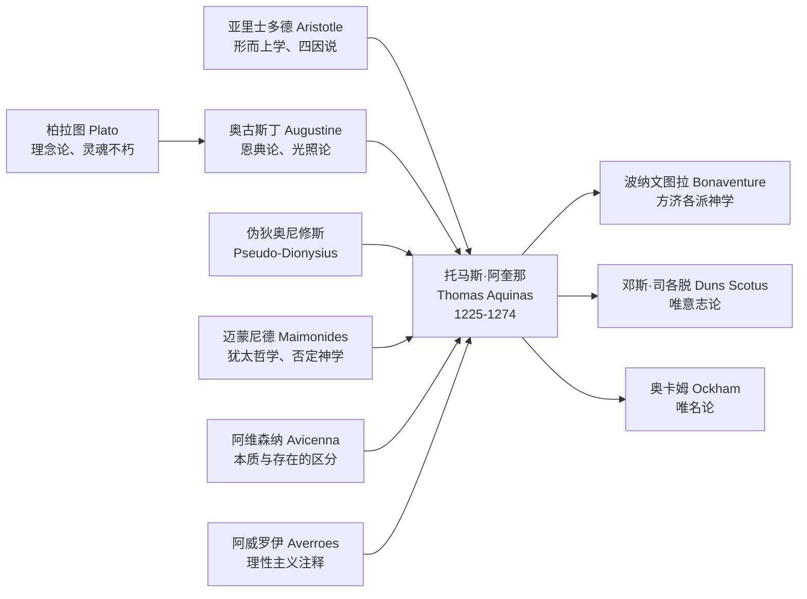
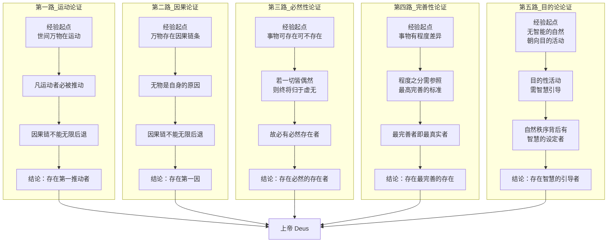
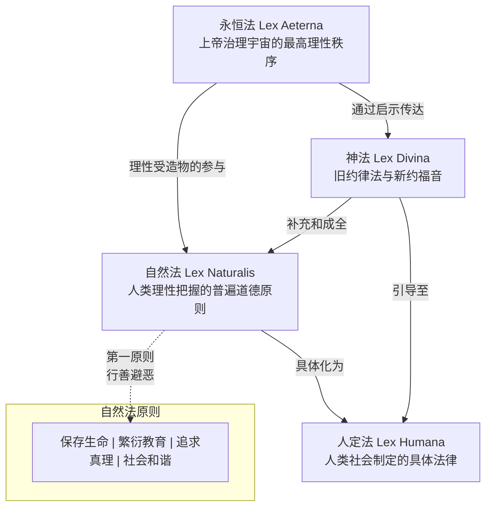

# 知识图谱图片描述 --《神学大全》结构化解析

---

## 图一：《神学大全》全书结构分类树

### 描述

本图以树形结构展示《神学大全》的三层知识架构。根节点为"神学大全 Summa Theologica"，向下分为三大主干部分，每部分再细分为若干论题。

### Mermaid 图表

### 视觉说明

此图采用自上而下的层次结构，根节点使用金色强调色，三大主干部分分别使用蓝、绿、橙三色区分。子节点逐级缩小字号，体现从宏观到微观的知识展开路径。

---

## 图二：阿奎那思想的哲学渊源人物图谱

### 描述

本图以阿奎那为中心，向外辐射展示影响其思想的关键人物及思想流派。图谱分为"古典哲学渊源"、"教父哲学传统"、"同时代论战对手"三个方向。

### Mermaid 图表

### 视觉说明

图谱采用中心辐射式布局，阿奎那位于中央，使用圆形节点突出。左侧为影响阿奎那的思想源头，使用蓝色系；右侧为阿奎那影响的后世思想家，使用橙色系。箭头方向表示思想影响的流向。

---

## 图三：五路证明的逻辑路径图

### 描述

本图以流程图形式展示阿奎那"五路证明"从经验观察出发，经逻辑推理，最终抵达上帝存在的五条独立论证路径。每条路径标注关键推理步骤。

### Mermaid 图表

### 视觉说明

五条论证路径并列展示，从左至右编号。每条路径分三段颜色：绿色表示经验观察起点，蓝色表示逻辑推理过程，橙色表示论证结论。五条路径最终汇聚于底部的"上帝"节点，使用红色强调。

---

## 图四：律法四层次关系网络图

### 描述

本图以网络图形式展示阿奎那关于律法的四个层次及其相互关系，揭示从永恒法到人定法、从神法到自然法的层级结构和参与关系。

### Mermaid 图表

### 视觉说明

采用自上而下的层级布局，永恒法位于顶端，使用紫色调。自然法位于第二层中央，使用绿色调，内部展开四个基本原则。神法位于右侧，使用橙色调，显示其对自然法的补充关系。人定法位于底层，使用蓝色调，表示其由自然法具体化而来。虚线表示补充关系，实线表示推导关系。

---

## 排版建议

1. **图一（结构分类树）**适合放在文章开头，帮助读者建立全局认知框架
2. **图二（人物图谱）**适合放在思想渊源部分，展示学术传承脉络
3. **图三（五路证明路径图）**是核心图表，建议独立成段重点展示
4. **图四（律法关系网络）**适合放在道德哲学或自然法相关段落

所有图表均可使用 Mermaid 渲染引擎生成 SVG 或 PNG 格式，建议在公众号文章中使用宽度 100% 的响应式布局。
