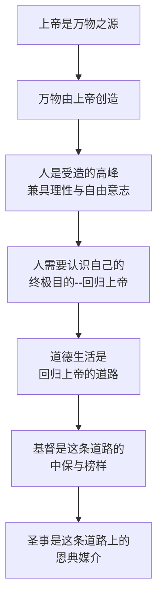
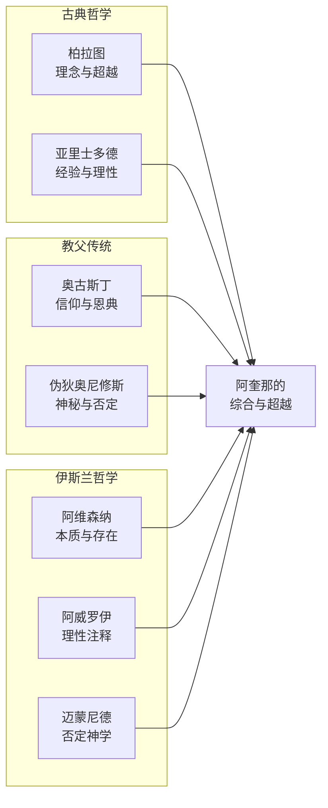
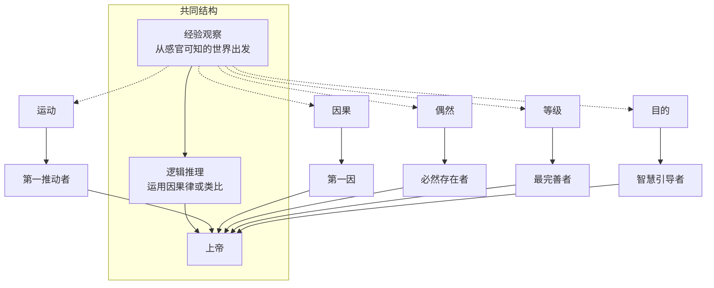
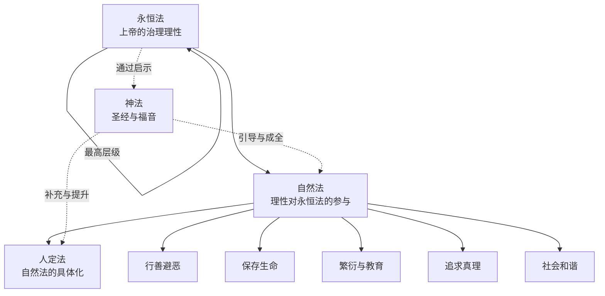

# 图谱逻辑解析 --《神学大全》的知识架构之美

---

## ◇ 引言：一张图读懂一座思想的圣殿

《神学大全》全书超过三百问、数千条辩题，总字数超过百万。面对如此庞大的著作，读者常常感到无从下手。

但如果我们将其核心结构提炼为一张知识图谱，便会发现：阿奎那的思想并非杂乱无章的堆砌，而是一座精心设计的建筑。

本篇将用四张图表，带你理解《神学大全》的内在逻辑。

---

## ○ 图一逻辑：从上帝到人的"下降-上升"结构

**图谱解读：**

《神学大全》的三部结构遵循一个宏大的叙事弧线：

第一部从上帝出发，探讨万物的终极源头。这是"下降"的路径--从最高的存在逐步下降到受造世界。

第二部聚焦于人的道德生活。这是转折点--人虽然来自上帝，但因堕落而偏离了方向，需要通过德性和律法重新走上回归之路。

第三部论基督与圣事。这是"上升"的路径--人通过基督的救赎和教会的圣事，最终回归上帝。

整部著作实际上是一个"出"--"回"的圆环：万物从上帝而出，最终又回归于上帝。

---

## ◆ 图二逻辑：思想渊源的"综合-超越"模式

**图谱解读：**

阿奎那的伟大之处不在于提出全新的理论，而在于他以前所未有的广度和深度，将多条思想传统融为一体。

从亚里士多德那里，他获得了理性分析的工具和形而上学的框架；从奥古斯丁那里，他继承了信仰的优先性和恩典的必要性；从阿拉伯哲学家那里，他吸收了关于本质与存在、理智与意志的深刻讨论。

但他不是简单地拼凑。他以基督教信仰为根基，以理性为方法，对各家思想进行了批判性的综合，创造出一种既尊重理性又忠于信仰的新型神学体系。

这种"综合-超越"的方法论，本身就是对当代跨学科思考的启示。

---

## ● 图三逻辑：五路证明的"经验-推理-结论"三段式

五路证明的结构具有高度的一致性，每一条都遵循相同的三段式推理模式：

**图谱解读：**

五路证明的精妙之处在于：它们不从信仰前提出发，也不诉诸圣经权威，而是从每个人都能观察到的经验事实出发，通过逻辑推理，得出一个必然的结论。

这种论证方式的意义不在于"说服无神论者"（这本身就是一个误解），而在于展示：**信仰并非非理性，理性本身就会指向超越的维度。**

五条路径分别从运动、因果、必然性、完善性和目的性五个角度切入，形成了一个多角度的论证网络，彼此呼应，互相补充。

---

## ○ 图四逻辑：律法体系的"层级-参与"关系

**图谱解读：**

阿奎那的律法理论是一个精密的层级体系。永恒法是上帝治理宇宙的最高理性秩序，它超越一切，却又通过不同方式向受造物展现。

自然法是这个体系的关键枢纽。它是理性受造物（人类）对永恒法的"参与"--不是被动接受，而是通过理性主动把握。这使得阿奎那的理论与后来的自然权利理论产生了深刻共鸣。

神法则是一种特殊的补充。由于人类理性的有限性，单靠自然法不足以引导人走向超自然的终极目的，因此需要上帝的启示作为额外的指引。

这一层级体系展现了一种既尊重人类理性自主性，又承认其有限性的平衡智慧。

---

## ◇ 总结：图谱背后的统一性原则

通过四张图表，我们可以看到《神学大全》内在的统一性：

**从出发点到终点**：万物从上帝而出，最终回归上帝。

**从方法到内容**：理性与信仰并行不悖，经验与启示互为补充。

**从理论到实践**：形而上学的沉思最终指向道德生活的实践。

阿奎那之所以被称为"通儒"（Doctor Angelicus），不仅因为他的知识渊博，更因为他能够将如此广博的知识融贯为一个统一的整体。

这种追求统一性的思想气魄，正是今天碎片化的学术生态中最稀缺的品质。

---

## ◆ 系列导航

| 上一篇 | 下一篇 |
|--------|--------|
| [02-知识图谱图片描述](#) | [04-核心思想精解](#) |

---

## ○ 互动话题

在你看来，《神学大全》的知识架构中，哪一部分的逻辑最为精巧？是五路证明的推理？还是律法理论的层级？欢迎在评论区交流。

---

*本文是"人类文明经典阅读计划"系列第28篇。关注我们，一起阅读塑造人类思想的伟大著作。*

**核心标签：** #逻辑论证 #知识图谱 #神学体系 #经院哲学 #托马斯阿奎那
