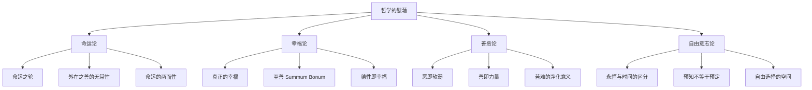
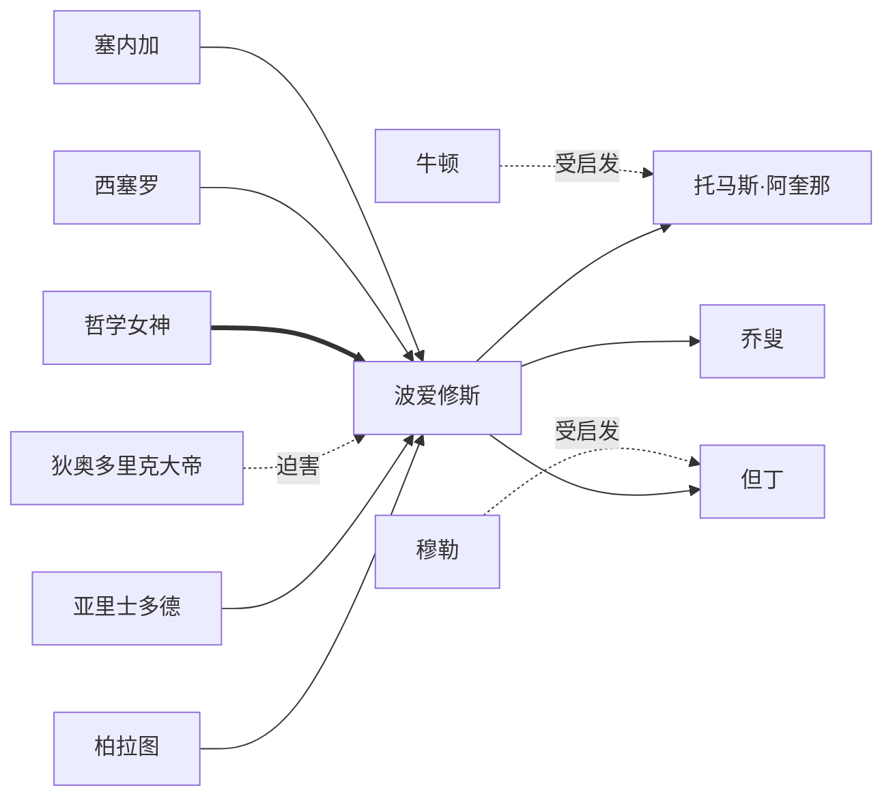
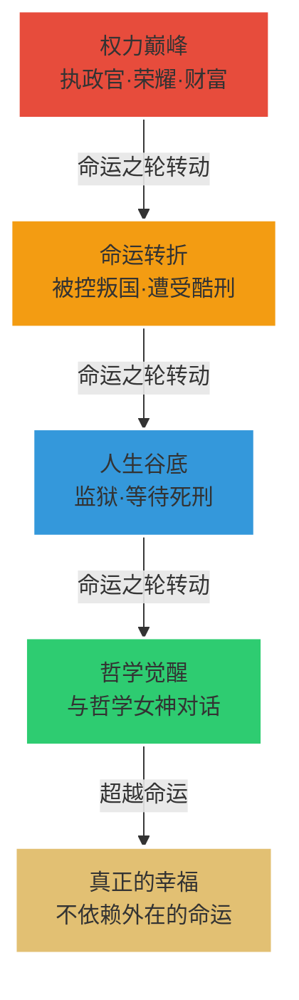

# 知识图谱图片描述

---

## 图一：思想分类树

**Mermaid 源码：**



**图片设计说明：**

- 整体采用深色背景(#1a1a2e)，节点使用浅金色(#e2c073)
- 根节点「哲学的慰藉」居中顶部，字号最大
- 四大主干(命运论、幸福论、善恶论、自由意志论)横向排列
- 每个主干下方展开三个子节点
- 连接线使用渐变灰白色，体现层级递进关系
- 整体布局呈倒树形，寓意从核心思想向分支延伸

---

## 图二：人物关系图谱

**Mermaid 源码：**



**图片设计说明：**

- 中心节点为「波爱修斯」，使用圆形高亮显示
- 左侧为思想渊源(柏拉图、亚里士多德、西塞罗、塞内加)
- 右侧为后世影响(阿奎那、但丁、乔叟)
- 上方为精神对话者(哲学女神)，使用双线连接
- 下方为迫害者(狄奥多里克)，使用虚线标注"迫害"
- 背景采用深蓝色调，节点按关系类型着色：
  - 渊源：浅蓝色(#5b9bd5)
  - 影响：浅金色(#e2c073)
  - 对话者：浅紫色(#c39bd3)
  - 迫害者：浅红色(#e74c3c)

---

## 图三：思想演进路径图

**Mermaid 源码：**


**图片设计说明：**

- 水平时间轴布局，从左到右展现思想传承
- 每个节点包含时代名称和代表人物
- 波爱修斯节点使用金色高亮，强调其在思想史中的枢纽地位
- 最终节点"当代心灵哲学"使用蓝色，暗示思想仍在延续
- 连接线使用箭头，表示影响方向
- 背景采用渐变色，从左侧古典的暖色调过渡到右侧现代的冷色调
- 底部可添加时间标注：公元前4世纪 → 公元21世纪

---

## 图四：核心概念网络图

**Mermaid 源码：**

```mermaid
graph TD
    A["命运 Fortuna"]
    B["幸福 Felicitas"]
    C["至善 Summum Bonum"]
    D["德性 Virtus"]
    E["自由意志 Liberum Arbitrium"]
    F["永恒 Aeternitas"]
    G["天意 Providentia"]
    H["苦难 Adversitas"]

    A -.无常.-> H
    H -->|"净化"| D
    D -->|"通向"| B
    B -->|"即"| C
    C -->|"源于"| G
    G -.超越时间.-> F
    F -.包容"| E
    E -->|"选择"| D
    A -.不可控.-> B
    D -.不可剥夺.-> E
    C -.终极目标.-> B
```

**图片设计说明：**

- 八个核心概念节点呈环状排列
- 中心区域留白，形成视觉呼吸感
- 节点颜色按语义分组：
  - 命运/天意/永恒：金色系(#e2c073)
  - 幸福/至善/德性：绿色系(#82c082)
  - 自由意志/苦难：蓝紫色系(#9b8ec4)
- 连接线标注关系性质(无常、净化、通向等)
- 虚线表示间接关系，实线表示直接关系
- 整体呈现哲学概念的内在逻辑闭环

---

## 图五：命运之轮可视化

**Mermaid 源码：**



**图片设计说明：**

- 采用循环布局，象征命运的轮转
- 四个象限分别对应人生的不同阶段
- 颜色从红(巅峰)→橙(转折)→蓝(谷底)→绿(觉醒)，形成情绪弧线
- 最终节点"真正的幸福"使用金色，代表超越性的境界
- 背景可使用浅灰色，突出节点色彩
- 可在图外添加波爱修斯名言："命运只是收回了她所给予的东西"

---

*标签：#知识图谱 #Mermaid图表 #哲学的慰藉 #概念网络*
