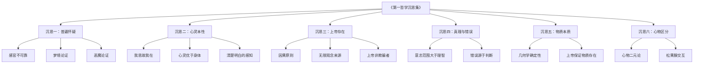
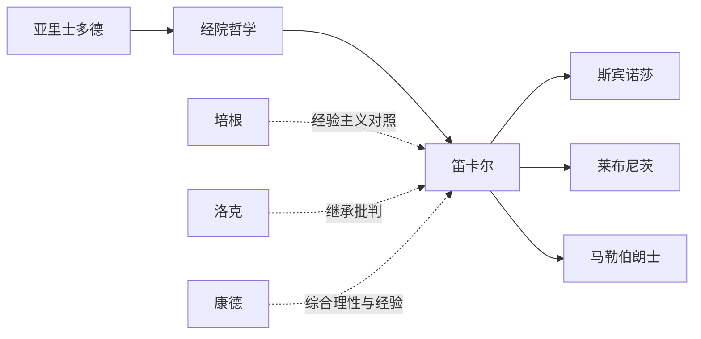
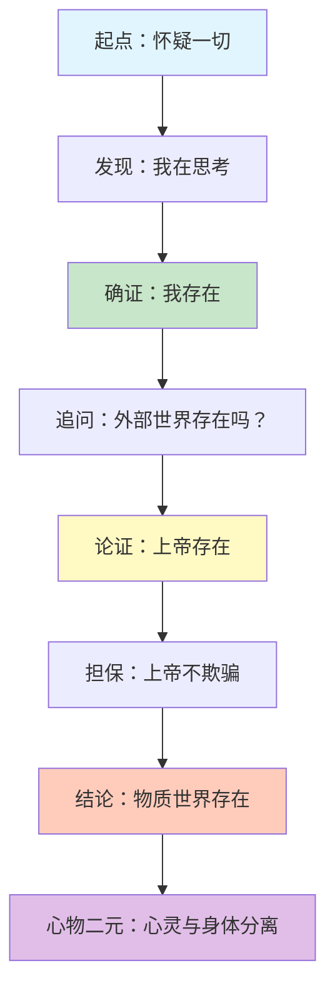
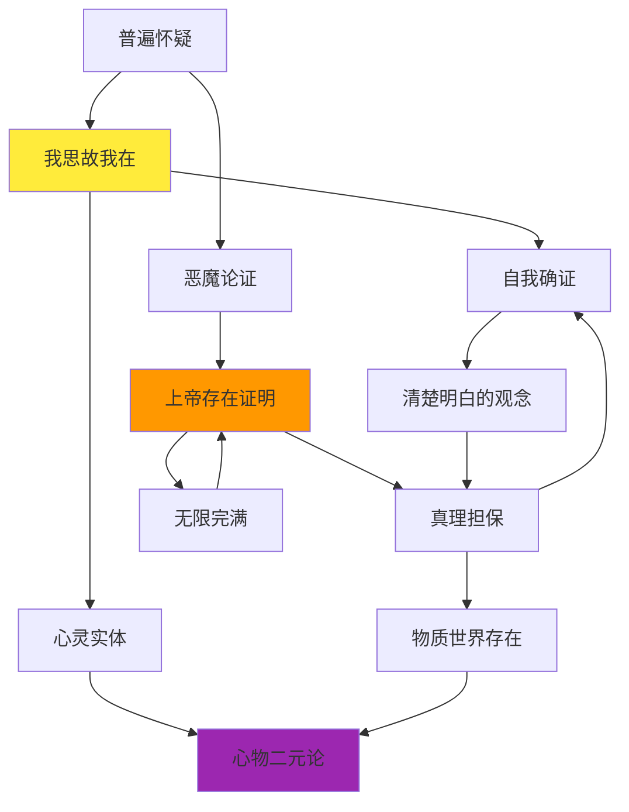

# 知识图谱：一图读懂《第一哲学沉思集》

> 用视觉化的方式，把握笛卡尔哲学的核心结构。

---

## 图表一：六沉思分类树

---

## 图表二：哲学家谱系图

---

## 图表三：思想路径图

---

## 图表四：核心概念网络图

---

## 图谱解读指南

### 分类树：六沉思的逻辑递进

笛卡尔的六个沉思不是并列的，而是一个严密的论证链条：

- **沉思一至二**：通过怀疑找到「我思」这个不可动摇的起点
- **沉思三至四**：从「我」出发，论证上帝存在，解决真理的担保问题
- **沉思五至六**：借助上帝的担保，重建对外部世界的知识，最终确立心物二元

### 人物图谱：笛卡尔的历史坐标

笛卡尔处于西方哲学的转折点上：

- **向前**：他终结了经院哲学的权威传统
- **向后**：他开启了理性主义哲学的主流
- **横向**：他与经验主义形成对照，共同塑造了近代认识论

### 路径图：从怀疑到确定的旅程

这条路径展现了笛卡尔方法论的精髓：

怀疑不是终点，而是**通往确定性的方法**。每一步推导都建立在前一步的确定性之上。

### 网络图：概念的内在关联

核心概念不是孤立的，它们相互支撑：

- 「普遍怀疑」通向「我思故我在」
- 「我思」需要「上帝」来担保外部世界
- 「上帝证明」反过来依赖「清楚明白的观念」
- 最终汇聚于「心物二元论」的结论

---

**互动话题：**

这四张图谱中，哪一张帮助你最好地理解了笛卡尔的思想结构？欢迎在评论区分享。

---

*本文是「人类文明经典阅读计划」西方哲学系列的第九篇。*
