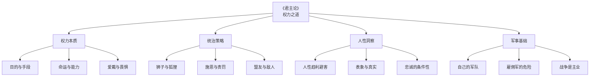
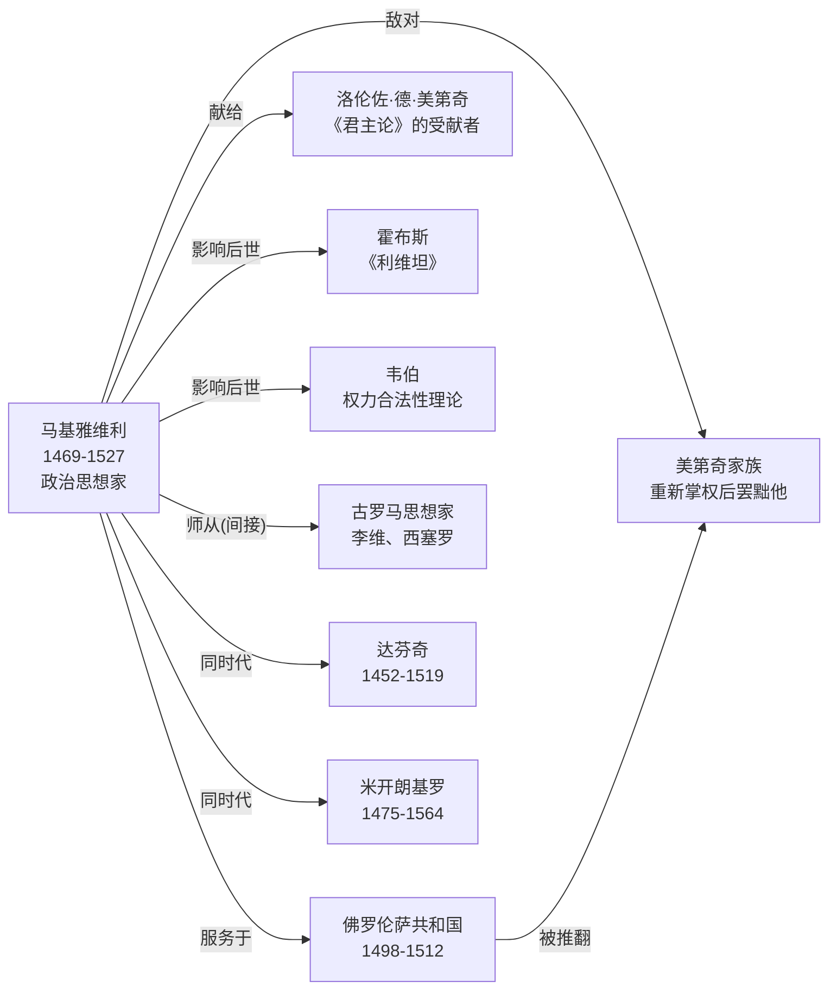
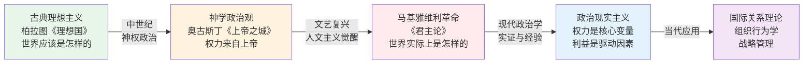
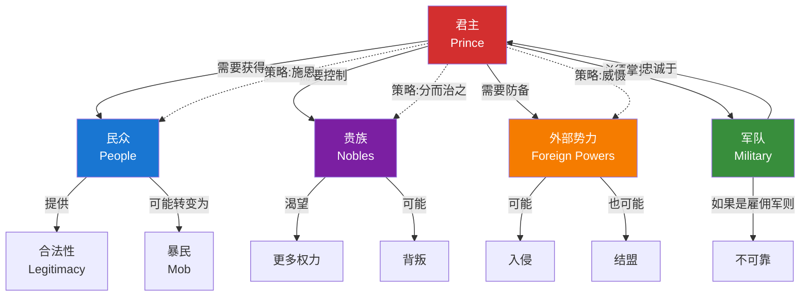

# 《君主论》知识图谱图片描述

> 本文档为《君主论》系列知识图谱的图片生成提供详细描述，包含 4 张核心图谱的设计方案。

---

## ◆ 图谱一：《君主论》核心概念分类树

### 图片类型
思维导图 / 树状图

### 中心主题
「君主论 · 权力之道」

### 分支结构

### 视觉设计要求

- **整体风格**：深色系背景，金色线条勾勒，体现古典与权力的质感
- **中心节点**：使用盾牌或皇冠图标，字号最大，金色高亮
- **一级分支**（权力本质、统治策略、人性洞察、军事基础）：使用粗线条，每支一个颜色
  - 权力本质：深红色
  - 统治策略：深蓝色
  - 人性洞察：暗紫色
  - 军事基础：铁灰色
- **二级节点**：使用矩形卡片样式，白字深色底
- **背景**：暗纹理，类似羊皮纸或大理石质感

### 图片用途
用于文章开头或中间，帮助读者快速建立《君主论》的整体知识框架。

---

## ◆ 图谱二：马基雅维利与同时代人物关系图

### 图片类型
人物关系网络图

### 中心人物
「尼科洛·马基雅维利」(1469-1527)

### 人物节点与关系

### 视觉设计要求

- **整体布局**：以马基雅维利为中心，向四周辐射
- **人物节点**：圆形头像占位框 + 姓名 + 生卒年份
- **关系连线**：带箭头的曲线，线上标注关系说明
- **颜色区分**：
  - 马基雅维利本人：金色边框，深色底
  - 服务对象/盟友：蓝色系
  - 敌对人物：红色系
  - 后世影响者：绿色系
  - 同时代人物：灰色系
- **背景**：文艺复兴时期佛罗伦萨城市素描作为底图，降低透明度

### 图片用途
用于介绍马基雅维利的时代背景，帮助读者理解他思想形成的历史语境。

---

## ◆ 图谱三：从理想到现实 —— 权力认知的演进路径

### 图片类型
路径图 / 流程图

### 主题
展示西方政治思想从古典理想主义到马基雅维利现实主义的转变

### 视觉设计要求

- **整体风格**：从左到右的时间轴式布局
- **节点样式**：每个阶段使用不同颜色的卡片，卡片内包含时期名称、代表人物、核心观点
- **箭头**：带有年份标注的粗箭头，表示历史演进方向
- **关键转折点**（马基雅维利处）：使用爆炸形或闪电符号高亮，标注"范式转换"
- **底部时间线**：标注关键年份（前380柏拉图、426奥古斯丁、1513君主论、1651利维坦、1948现代IR理论）
- **背景**：从浅到深的渐变，象征从理想之光到现实之暗

### 图片用途
用于文章核心部分，展示马基雅维利在思想史上的革命性地位。

---

## ◆ 图谱四：权力博弈网络图 —— 君主、民众、贵族与外部势力

### 图片类型
网络关系图

### 核心节点

### 视觉设计要求

- **整体布局**：君主位于中心，四个势力分布在四周
- **节点大小**：根据重要性调整，君主最大，军队次之
- **连线类型**：
  - 实线 = 直接关系
  - 虚线 = 策略性关系
  - 红色箭头 = 威胁/风险
  - 绿色箭头 = 支持/助力
- **节点样式**：使用图标 + 文字，每个势力使用不同图标
  - 君主：皇冠
  - 民众：人群
  - 贵族：权杖
  - 外部势力：剑
  - 军队：盾牌
- **背景**：深色棋盘格纹理，象征博弈

### 图片用途
用于文章后半部分，解析马基雅维利笔下的权力博弈格局，帮助读者理解统治的复杂性。

---

## ◆ 通用设计规范

### 配色方案

| 用途 | 色值 | 说明 |
|:---|:---|:---|
| 主色调 | #1a1a2e | 深蓝黑背景 |
| 强调色 | #c9a227 | 金色，用于标题和重点 |
| 文字主色 | #ffffff | 白色 |
| 文字辅色 | #b0b0b0 | 浅灰，用于次要文字 |
| 危险/警示 | #d32f2f | 红色 |
| 安全/支持 | #388e3c | 绿色 |
| 信息/中性 | #1976d2 | 蓝色 |

### 字体建议

- **标题**：思源宋体 / 方正清刻本悦宋（古典感）
- **正文**：思源黑体 / 苹方（移动端易读）
- **数字和英文**：Montserrat / Roboto

### 尺寸规格

- **公众号首图**：900 x 383 px（2.35:1）
- **正文配图**：900 x 500 px（16:9）
- **最小字号**：12px（确保移动端可读）
- **行距**：1.6 倍

---

*本文档为 AI 图片生成提供结构化描述，确保图谱内容准确、视觉统一。*
