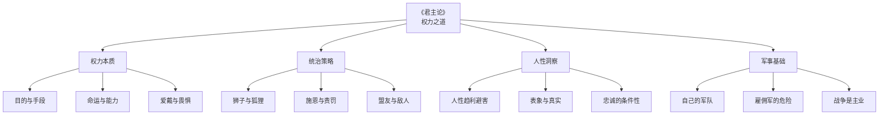
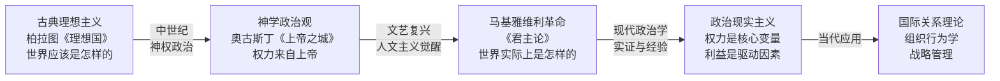
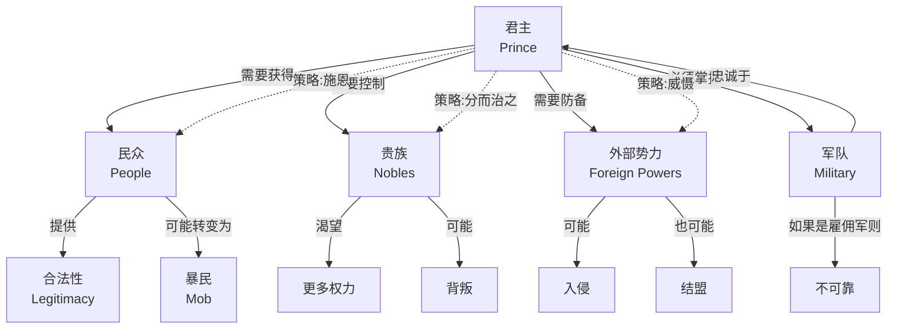
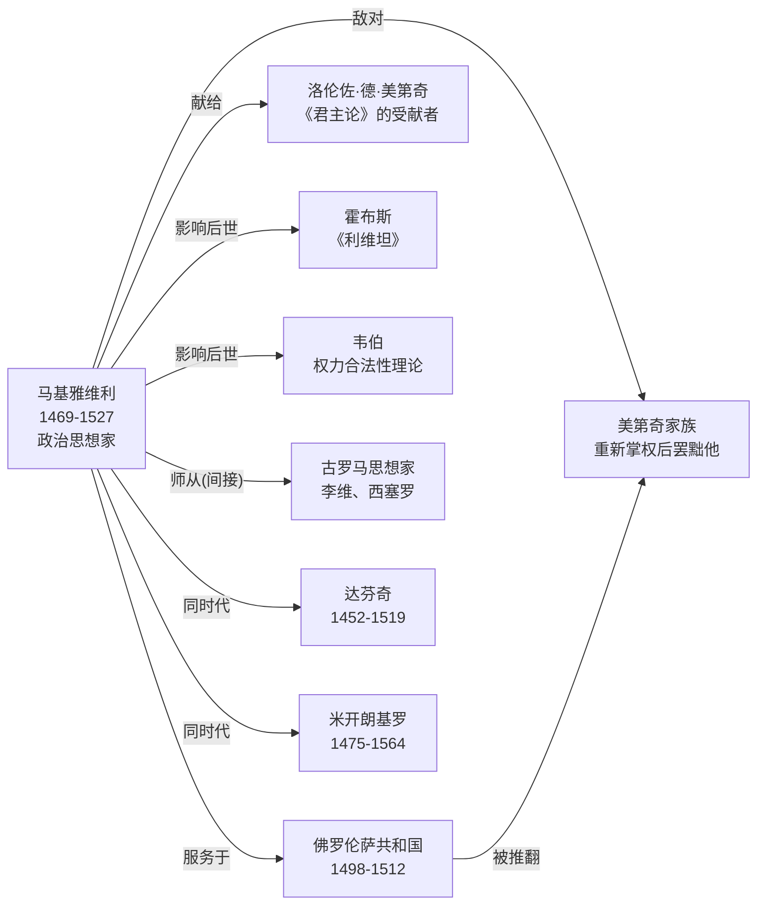

# 看懂《君主论》的底层逻辑：一张图理清权力的运行规则

> 马基雅维利不是教人变坏，他只是把世界的运行逻辑画给你看。

---

## ◆ 为什么你需要一张图谱？

读《君主论》，很多人会觉得散。

一会儿讲君主怎么打仗，一会儿讲人性怎么自私，一会儿又讲该不该守信。

但这些看似零散的观点，背后有一条清晰的逻辑主线：

**权力如何获得、如何维持、如何失去。**

今天，我们用四张知识图谱，把这条主线彻底理清。

---

## ◆ 图谱一：核心概念树 —— 马基雅维利思想的四大支柱

### 逻辑解读

这四大支柱不是孤立的，它们之间有着严密的因果链条：

**人性洞察是基础** --> 因为人趋利避害，所以需要统治策略 --> 统治需要权力 --> 权力最终靠军事保障

马基雅维利的整个思想体系，就是建立在这个链条之上的。

他首先承认人性的现实（不完美但真实），然后基于这个现实设计统治方法（不道德但有效），最终指向一个目标：**权力的稳固**。

---

## ◆ 图谱二：思想史坐标 —— 马基雅维利为何是"革命者"

### 逻辑解读

在马基雅维利之前，政治学的核心问题是：

> "一个好的统治者应该具备哪些美德？"

在马基雅维利之后，政治学的核心问题变成了：

> "一个统治者如何才能保住权力？"

这是**从"应然"到"实然"的范式转换**。

就像物理学从"物体应该如何运动"转向"物体实际上如何运动"，马基雅维利把政治学从道德哲学变成了一门经验科学。

这也是为什么他被称为"现代政治学之父"——不是因为他最道德，而是因为他最诚实。

---

## ◆ 图谱三：权力博弈网络 —— 君主的四面楚歌

### 逻辑解读

这张图揭示了马基雅维利最核心的洞察：

**君主的处境本质上是脆弱的。**

他四面受敌：

- 民众可能从支持变为暴乱
- 贵族永远渴望更多权力
- 外部势力随时可能入侵
- 军队如果是雇佣的，根本靠不住

所以君主必须时刻处于"战略警觉"状态。没有一劳永逸的安全，只有持续不断的博弈。

这也是为什么马基雅维利反复强调：**永远不要放松对权力的经营。**

---

## ◆ 图谱四：人物关系 —— 马基雅维利的时代与影响

### 逻辑解读

理解了马基雅维利的个人经历，你就理解了他为什么写出《君主论》：

他曾是佛罗伦萨共和国的外交官，亲眼见过各国君主的兴衰。

他被美第奇家族罢黜、刑讯、流放。

在绝望中，他写下这本书，希望能获得美第奇的重新启用。

**《君主论》本身就是一场权力博弈的产物。**

他把自己的政治洞察作为"礼物"献给当权者，希望能换取重返政坛的机会。

这本身就是马基雅维利主义的完美实践。

---

## ◆ 四张图谱的内在联系

现在让我们把四张图串起来：

1. **概念树**告诉你马基雅维利思想的"内容"是什么
2. **思想史坐标**告诉你这些思想在历史中的"位置"在哪里
3. **权力博弈网络**告诉你这些思想描述的"局面"有多复杂
4. **人物关系**告诉你这些思想产生的"背景"是什么

四张图合在一起，就是一个完整的认知框架：

> **谁**在**什么背景下**提出了**什么思想**，这些思想描述的**世界是什么样的**，以及它们在**历史中处于什么位置**。

---

## ◆ 写在最后：图谱是地图，不是领土

知识图谱的价值，不在于它有多精美，而在于它能帮你：

- 快速定位你想知道的内容
- 看清概念之间的逻辑关系
- 在阅读时有一个"导航系统"

但记住：**地图不是领土。**

真正的理解，还需要你回到原文，去感受马基雅维利的文字，去思考他每一个判断背后的逻辑。

图谱只是帮你少走弯路，不能代替你走路。

---

## ◇ 互动话题

> 四张图谱中，哪一张对你理解《君主论》帮助最大？你觉得还缺少什么维度的图谱？

欢迎在评论区告诉我们。

---

## ○ 系列导航

| 上一篇 | 下一篇 |
|:---:|:---:|
| 《君主论 · 读后感》 | 《君主论 · 核心思想》 |

**核心标签：** #权力认知 #现实主义 #政治智慧 #人性洞察 #知识图谱 #思维导图

---

*本文是「人类文明经典阅读计划」系列第 10 期，聚焦西方哲学经典。关注我们，每周一期深度解读。*
