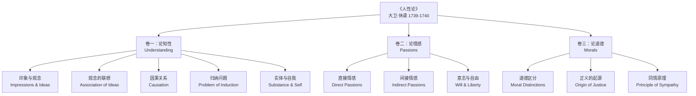
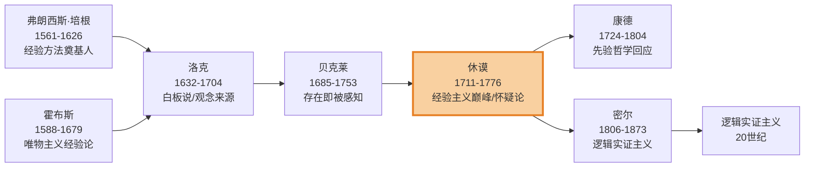
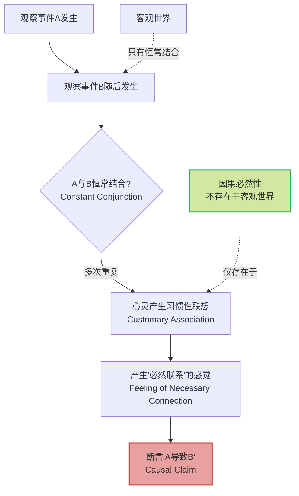
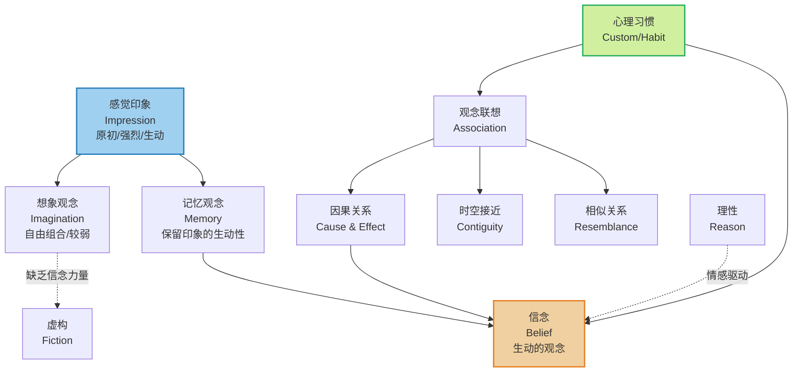

# 《人性论》知识图谱图片描述

> **系列导航** | 《人类文明经典阅读计划》
> 
> ◆ 上一篇：[洛克《人类理解论》| 经验主义的奠基](../10-人类理解论/)
> ◆ 下一篇：[康德《纯粹理性批判》| 先验哲学的革命](../12-纯粹理性批判/)

---

## ◇ 图一：人性论核心概念分类树

本图以树状结构展示《人性论》三大卷的核心概念层级关系。

**图注：** 休谟将人性研究分为知性、情感、道德三个维度，构建了从认识论到伦理学的完整体系。分类树从三大卷出发，逐层展开核心概念，展现了《人性论》的知识架构。

---

## ◇ 图二：经验主义哲学家传承图谱

本图展示经验主义传统中主要人物的思想传承关系，以及他们对休谟的影响和休谟对后世的启发。

**图注：** 从培根的经验方法到休谟的怀疑论，经验主义传统经历了从建设到解构的演变。休谟站在经验主义的终点，同时也开启了康德哲学的新纪元。橙色高亮标记了休谟在思想史中的枢纽位置。

---

## ◇ 图三：因果推理的心理路径图

本图以流程图形式展示休谟对因果推理的解构过程，揭示"因果必然性"如何从心理习惯中产生。

**图注：** 休谟指出，因果推理的关键环节不在客观世界，而在心灵的习惯性联想。我们感受到的"必然性"是一种心理状态，而非事物本身的属性。红色标记揭示因果断言的脆弱性，绿色标记指出休谟的核心洞见。

---

## ◇ 图四：印象-观念-信念网络图

本图以网络结构展示休谟认识论中核心概念之间的关系，包括印象、观念、记忆、想象和信念的相互作用。

**图注：** 休谟的认识论网络中，感觉印象是知识的起点，信念是"生动的观念"，而心理习惯是连接印象与信念的桥梁。蓝色标记起点，橙色标记核心产物，绿色标记关键机制。理性在此网络中处于从属位置。

---

## ◇ 互动话题

> **今日思考：**
> 
> 四张知识图谱中，哪一张最让你对休谟的思想有了新理解？
> 
> 欢迎在评论区留言分享。

---

> **系列信息**
> 
> ◆ 系列：人类文明经典阅读计划 · 西方哲学篇
> ◆ 本期：休谟《人性论》知识图谱
> ◆ 核心标签：`#经验觉醒` `#因果质疑` `#怀疑精神` `#归纳反思`
> 
> ◆ **点赞** ◆ **在看** ◆ **分享** — 让更多人在经典中找到思想的力量
