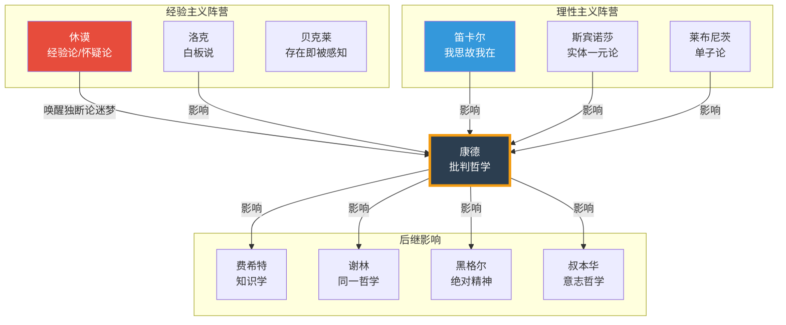
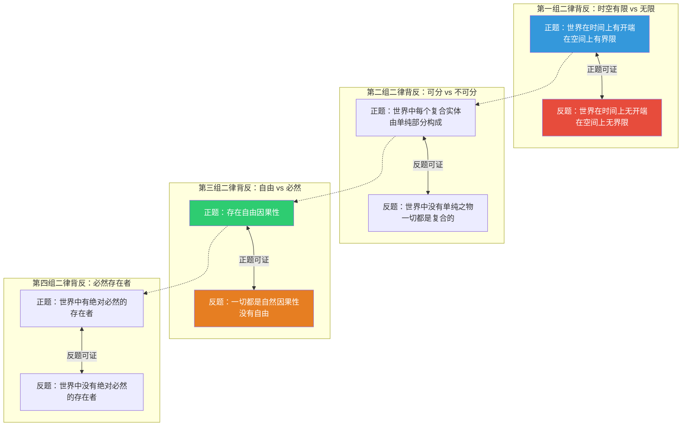

# 知识图谱图片描述 | 康德《纯粹理性批判》认知体系全景图

---

## ◇ 图片一：康德哲学体系分类树

**【图表类型】** 树状分类图

**【视觉描述】**

这是一张以"康德哲学体系"为根节点的知识分类树，采用自上而下的层级结构，整体配色以深蓝和白色为主，体现学术严谨感。

**【结构层级】**

```
康德哲学体系
├── 理论哲学（《纯粹理性批判》）
│   ├── 先验感性论
│   │   ├── 空间（外部直观形式）
│   │   └── 时间（内部直观形式）
│   ├── 先验分析论
│   │   ├── 概念分析论（十二范畴）
│   │   │   ├── 量：单一性、多数性、全体性
│   │   │   ├── 质：实在性、否定性、限制性
│   │   │   ├── 关系：实体与偶性、因果性、协同性
│   │   │   └── 模态：可能性、存在性、必然性
│   │   └── 原理分析论
│   │       ├── 直观的公理
│   │       ├── 知觉的预测
│   │       ├── 经验的类比
│   │       └── 一般经验性思维的公设
│   └── 先验辩证论
│       ├── 理性心理学（灵魂）
│       ├── 理性宇宙论（世界整体）
│       └── 理性神学（上帝）
├── 实践哲学（《实践理性批判》）
│   └── 道德法则、自由意志、至善
└── 判断力哲学（《判断力批判》）
    ├── 审美判断力
    └── 目的论判断力
```

**【标注要点】**
- 用不同颜色区分"理论哲学""实践哲学""判断力哲学"三大分支
- "十二范畴"部分用表格样式突出展示
- "先验辩证论"的三个幻相用红色警示标记
- 图表右下角标注"核心标签：认识论革命、先验思维、理性界限、知识奠基"

---

## ◇ 图片二：认知加工路径图

**【图表类型】** 从左到右的流程路径图

**【视觉描述】**

这张图展示康德认识论中"知识如何产生"的完整路径，从左至右依次展开，用箭头连接各阶段，体现信息加工的动态过程。

**【路径流程】**


**【关键标注】**
- 在"物自体"上方添加注释："不可知的实在本身"
- 在"感性直观"下方添加注释："现象界，知识的起点"
- 在"知性判断"下方添加注释："范畴赋予经验以普遍必然性"
- 在"二律背反"下方添加注释："理性越界的必然结果"
- 从"知性判断"到"理念"的箭头标注"理性追求无条件者"
- 从"理念"到"二律背反"的虚线箭头标注"超越经验界限"

**【底部说明】**
"知识止步于现象界，物自体不可知，但可思。"

---

## ◇ 图片三：哲学史人物关系图谱

**【图表类型】** 关系网络图

**【视觉描述】**

这张图以康德为中心节点，用不同颜色的连线和箭头展示他与前代哲学家及后继者的思想关系。

**【人物关系网络】**



**【关键注释】**
- 从休谟到康德的连线旁标注："休谟的怀疑论将康德从独断论的迷梦中唤醒"
- 康德节点旁标注核心贡献："先天综合判断何以可能？"
- 后继影响区域标注："德国古典哲学的开端"

---

## ◇ 图片四：知识界限与二律背反网络图

**【图表类型】** 概念关系网络图

**【视觉描述】**

这张图聚焦《纯粹理性批判》中最具争议和思辨性的"二律背反"问题，展示四个二律背反正反命题之间的张力关系。

**【二律背反结构】**



**【核心注释】**
- 图表顶部标题："理性的困境：二律背反"
- 第三组二律背反旁标注："为实践哲学（道德与自由）留下空间"
- 底部总结："康德方案：正题适用于物自体领域，反题适用于现象界"

**【底部说明】**
"认识到理性的界限，恰恰是批判哲学的智慧所在。"

---

*本文知识图谱可配合公众号排版使用，建议将 Mermaid 图表渲染为 SVG 或 PNG 图片后插入文章。*
