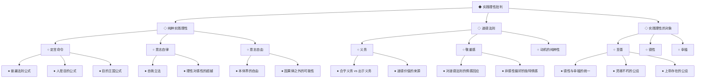
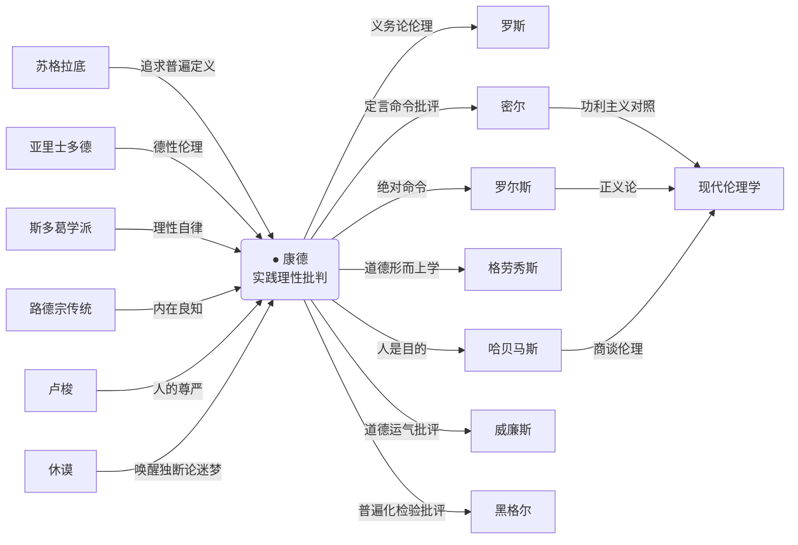
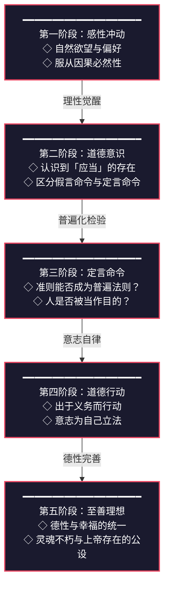
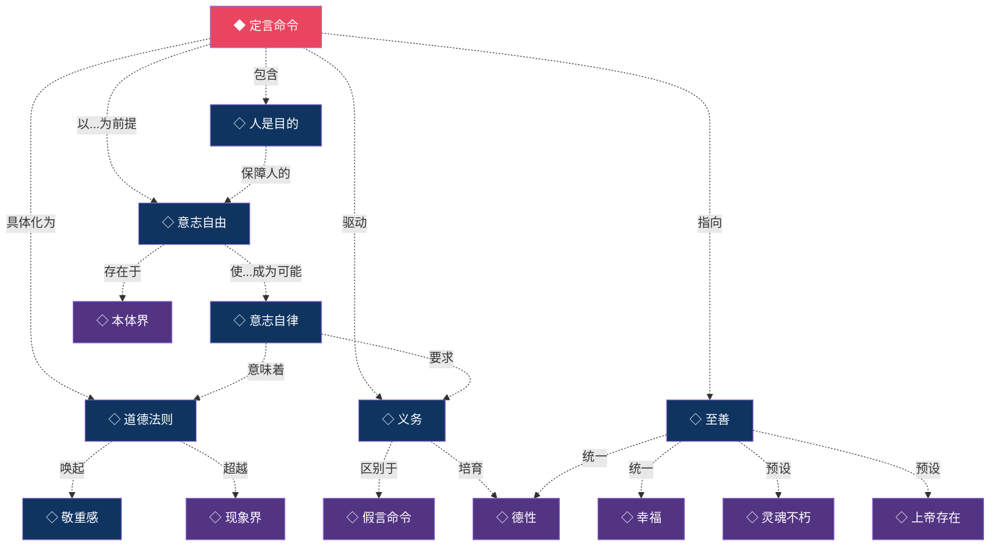

# 知识图谱图片描述 | 《实践理性批判》核心概念全景

---

## 图谱一：概念分类树

### 图片描述

一张纵向展开的树状分类图，顶部为根节点「实践理性批判」，向下分为三大主干，每根主干继续展开为子节点和叶子节点。整体采用深蓝底色配白色文字，节点以菱形、圆角矩形区分层级。

### Mermaid 源码

---

## 图谱二：人物与思想传承谱系

### 图片描述

一张横向展开的人物关系图谱，以康德为中心节点，左侧为思想先驱与影响者，右侧为后继发展与批评者。人物节点以圆形呈现，连线标注思想关系类型。背景采用暗色调，连线以不同颜色区分「继承」「影响」「批判」「发展」等关系。

### Mermaid 源码

---

## 图谱三：从现象到本体的道德实践路径

### 图片描述

一张纵向路径图，展示从经验世界到道德实践的逐步上升过程。路径分为五个阶段，每个阶段有对应的核心概念和实践要求。路径以阶梯式上升的视觉结构呈现，底部为「感性冲动」，顶部为「至善理想」。

### Mermaid 源码

---

## 图谱四：核心概念网络关系图

### 图片描述

一张网状关系图，展示《实践理性批判》中核心概念之间的多维关联。中心节点为「定言命令」，周围辐射连接「意志自由」「道德法则」「义务」「人是目的」「至善」「自律」等概念。连线标注关系性质，如「以...为前提」「导出」「蕴含」「指向」等。整体采用深色背景，概念节点以不同形状和颜色区分类型。

### Mermaid 源码

---

## 图谱使用建议

- **分类树**：适合用于文章开篇，帮助读者快速建立概念框架
- **人物图谱**：适合用于历史背景介绍，展示康德在伦理学史中的位置
- **路径图**：适合用于正文讲解，配合逐步深入的论述节奏
- **网络图**：适合用于全文总结，帮助读者理解概念间的内在联系

---

**本期核心标签**：#道德觉醒 #义务伦理 #自由意志 #理性实践

**系列归属**：人类文明经典阅读计划 ・ 05-西方哲学 ・ 13-实践理性批判
