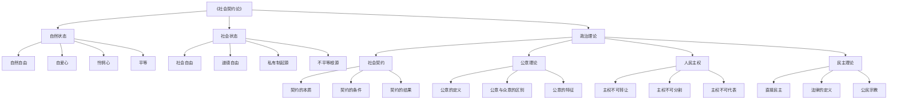
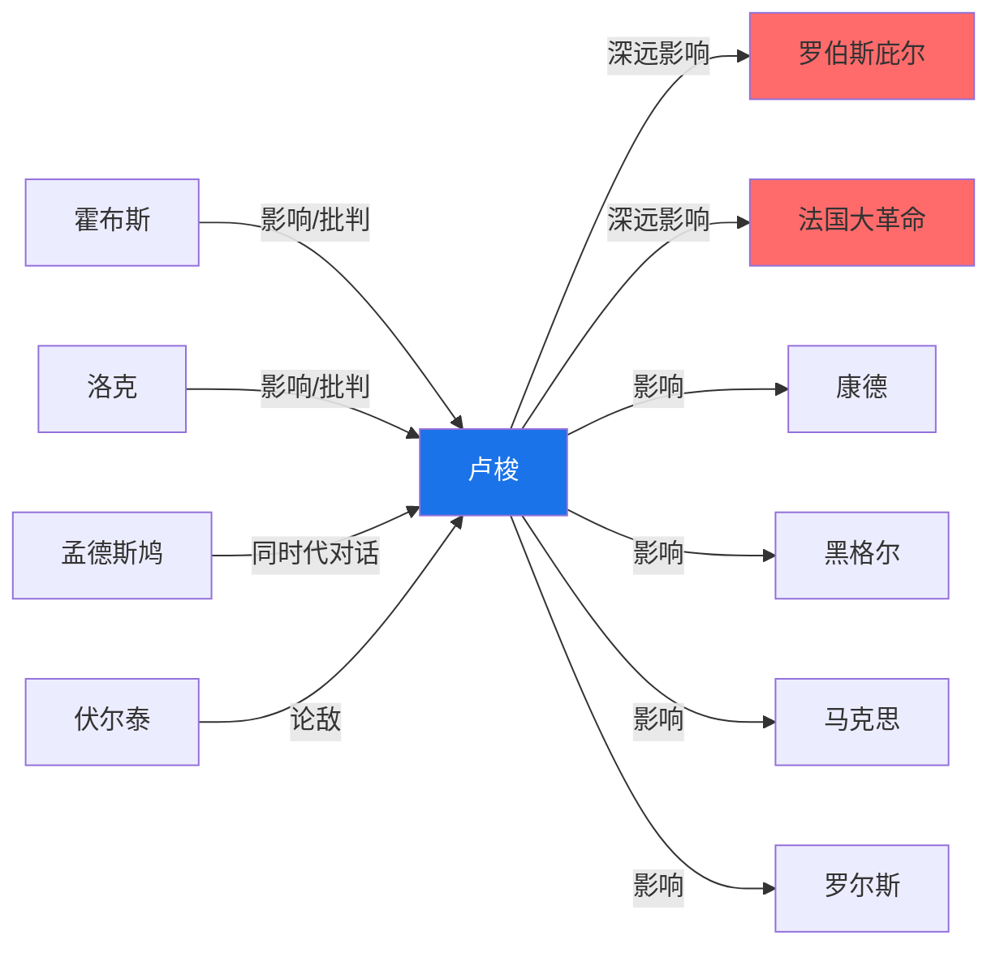
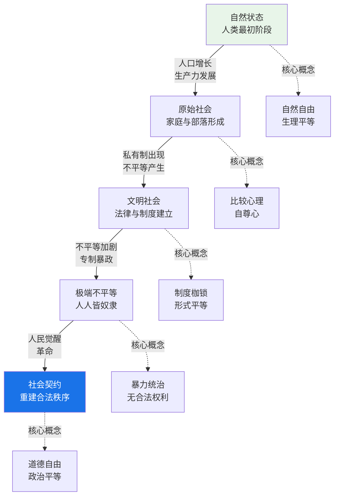
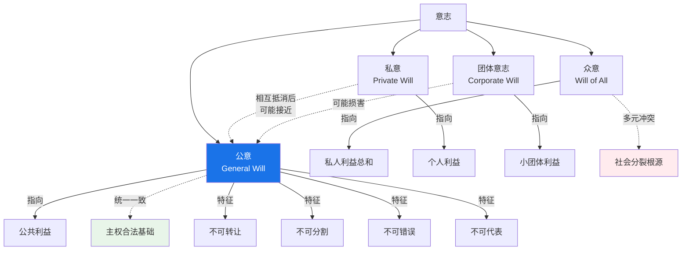

# 知识图谱图片描述——《社会契约论》

> 本文用于公众号文章中知识图谱的替代描述，包含 Mermaid 图表代码。

---

◆ 知识图谱系列 ◆ 
《社会契约论》核心概念全景图

---

## 图一：《社会契约论》核心概念分类树

本图展示了卢梭社会契约理论的整体概念架构，从自然状态到社会状态，从自由到主权，形成一个完整的理论体系。

---

## 图二：卢梭思想与关键人物关系图谱

本图展示了卢梭与前后时代思想家的理论关联，呈现启蒙时代思想的传承与对话。

---

## 图三：从自然状态到社会契约的演进路径

本图描绘了卢梭理论中人类从自然状态经过不平等发展到社会契约的完整历史演进路径。

---

## 图四：公意与私意的概念网络图

本图展示了公意、私意、众意等核心概念之间的关系网络，是理解卢梭政治哲学的关键。

---

◆ 人类文明经典阅读计划 ◆ 
知识图谱帮助理解经典理论的核心架构 ◆

