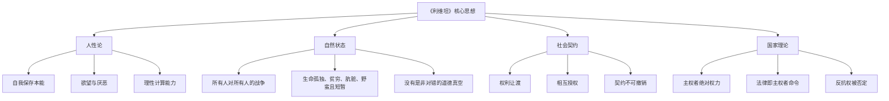
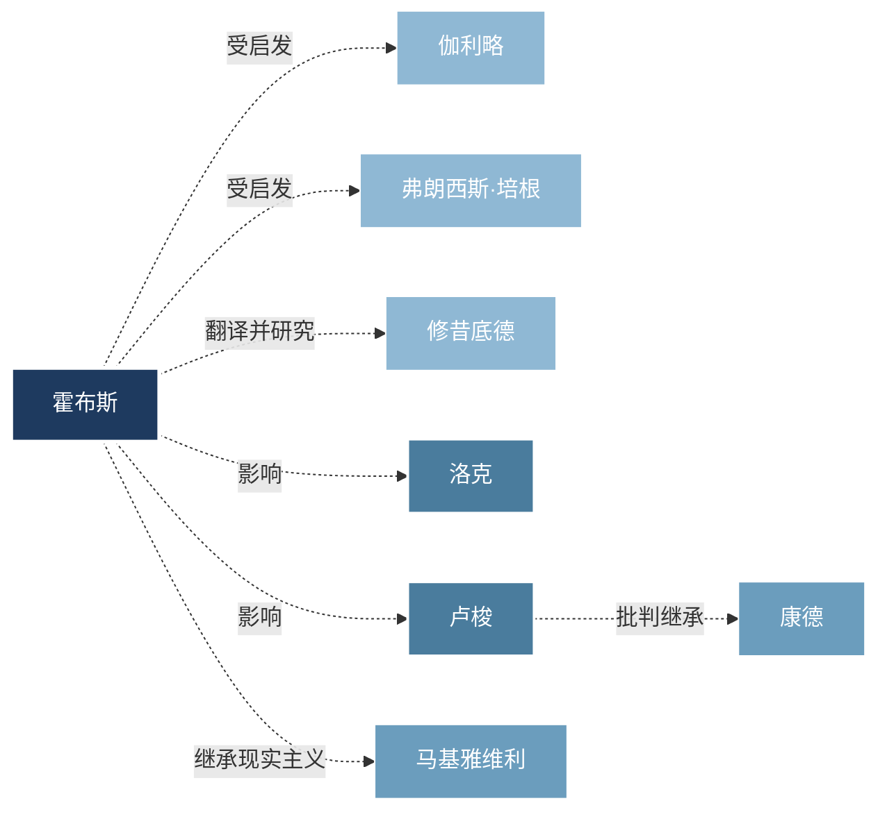
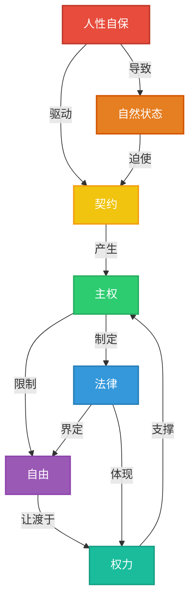

# 《利维坦》知识图谱图片描述

> ◆ 说明：本文档描述《利维坦》知识图谱中的四张图片，用于公众号排版时的图片生成参考。

---

## ◇ 图片一：概念分类树

### 描述

这是一张树状图，展示《利维坦》核心概念的层级关系。

### 图表说明

- **根节点：**《利维坦》核心思想
- **第一层分支：**四大理论支柱——人性论、自然状态、社会契约、国家理论
- **第二层分支：**每个理论支柱的三个核心要点
- **排版建议：**使用从左到右的层级布局，配色建议深蓝色系，体现冷峻、严肃的哲学气质

---

## ● 图片二：人物思想关系图谱

### 描述

这是一张网络关系图，展示霍布斯与其他哲学家、思想家之间的关系。

### 图表说明

- **核心节点：**霍布斯（深色突出）
- **思想先驱：**伽利略（科学方法论）、培根（经验主义）、修昔底德（现实主义政治观）、马基雅维利（权力政治）
- **后继影响者：**洛克（批判性继承，发展出有限政府理论）、卢梭（改造社会契约概念）、康德（进一步发展为永久和平理论）
- **连线样式：**实线表示直接影响，虚线表示思想启发
- **排版建议：**霍布斯居中，先驱在左，后继者在右，体现思想史的传承脉络

---

## ○ 图片三：从自然状态到国家的路径图

### 描述

这是一张流程图，展示人类如何从自然状态通过社会契约建立国家。

### 图表说明

- **起点（红色系）：**自然状态——混乱、恐惧、战争
- **转折点（橙色系）：**恐惧死亡、理性觉醒——人类开始思考出路
- **过渡阶段（黄绿色系）：**发现自然法、订立契约——理性引导行动
- **终点（蓝绿色系）：**利维坦诞生、秩序与和平——国家机器运转
- **排版建议：**从左到右的水平流程，颜色从暖色（危险）渐变到冷色（安全），体现从混乱到秩序的转变

---

## ◆ 图片四：核心概念网络图

### 描述

这是一张思维导图式的网络图，展示《利维坦》各核心概念之间的交叉关系。

### 图表说明

- **核心逻辑链：**人性自保导致自然状态，自然状态迫使人们订立契约，契约产生主权，主权制定法律并限制自由
- **关键关系：**
  - "人性自保"是整个理论体系的起点
  - "自然状态"是问题的核心
  - "契约"是解决方案
  - "主权"是制度保障
  - "法律"与"自由"构成张力关系
- **排版建议：**采用网状布局，突出概念之间的相互关联，颜色区分不同性质的概念（人性相关用暖色，制度相关用冷色）

---

## ◇ 图片生成建议汇总

| 图片 | 类型 | 配色 | 布局 | 核心信息 |
|------|------|------|------|---------|
| 图片一 | 分类树 | 深蓝渐变 | 从左到右层级 | 理论体系结构 |
| 图片二 | 关系图 | 多色区分 | 中心辐射 | 思想史传承 |
| 图片三 | 路径图 | 红到绿渐变 | 从左到右流程 | 从混乱到秩序 |
| 图片四 | 网络图 | 概念分类色 | 网状交叉 | 概念间逻辑关系 |

> ◆ 排版提示：建议在公众号文章中使用深色背景搭配浅色文字，体现《利维坦》冷峻、严肃的哲学气质。
