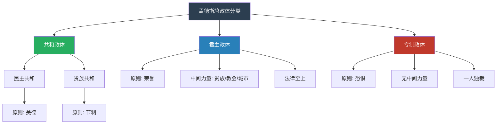
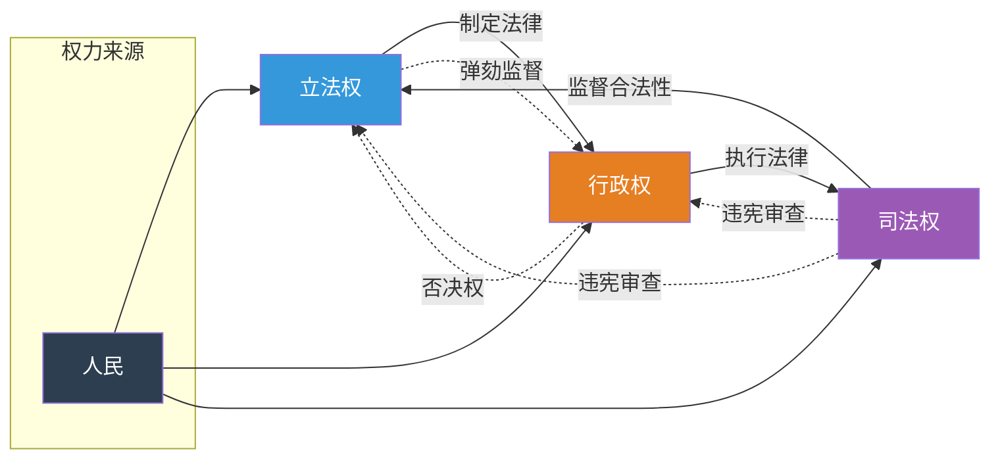
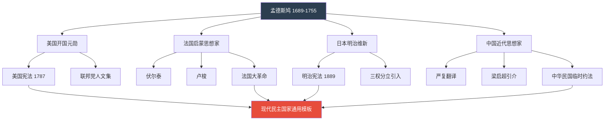
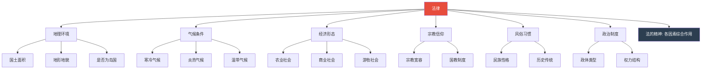
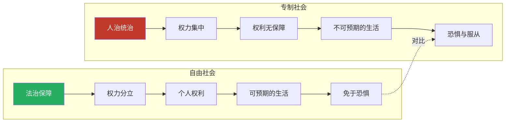

# 知识图谱图片描述：《论法的精神》

> 本文档用于生成知识图谱相关配图，包含 Mermaid 图表定义及图片说明。

---

## 图表一：政体分类树

**用途**：展示孟德斯鸠的三种政体及其核心原则

**图片说明**：
此图为垂直层级分类树，顶部为总分类节点，向下分为三大政体分支。共和政体进一步细分为民主共和与贵族共和。每个政体节点下方标注其核心维系原则。配色方案以深色总节点、绿色共和、蓝色君主、红色专制区分。

---

## 图表二：三权分立架构图

**用途**：展示立法、行政、司法三权的关系与制衡机制

**图片说明**：
此图为横向循环关系图，展示三权之间的相互作用。实线箭头表示权力分工：立法制定法律、行政执行法律、司法裁决争端。虚线箭头表示制衡机制：相互监督、弹劾、否决和违宪审查。底部"人民"节点表示三权最终来源于人民授权。

---

## 图表三：思想传承路径图

**用途**：展示《论法的精神》对后世的影响脉络

**图片说明**：
此图为从上到下的思想传承路径图。顶部为孟德斯鸠本人，向四个方向辐射其思想影响：美国建国、法国启蒙运动、日本明治维新、中国近代思想。各分支进一步展开具体成果，最终汇聚为"现代民主国家通用模板"。展示《论法的精神》的全球性影响。

---

## 图表四：法的本质网络图

**用途**：展示影响法律形成的多重因素及其关系

**图片说明**：
此图为网络关系图，中心节点为"法律"，向外辐射六个维度的影响因素：地理环境、气候条件、经济形态、宗教信仰、风俗习惯、政治制度。每个维度进一步细分具体要素。最终所有因素汇聚为"法的精神"——即法律是多种因素综合作用的产物。

---

## 图表五：自由与专制对比图

**用途**：对比不同制度下公民自由的状态

**图片说明**：
此图为左右对比结构图。左侧为自由社会的正向循环：法治保障导致权力分立，权力分立保护个人权利，个人权利带来可预期的生活，最终实现"免于恐惧"的自由。右侧为专制社会的负向循环：人治导致权力集中，权力集中使权利无保障，最终陷入"恐惧与服从"。中间虚线标注两者的核心差异。

---

## 图表使用说明

1. 所有 Mermaid 图表可直接嵌入 Markdown 渲染器生成 PNG/SVG 图片
2. 建议配色方案参考各图表中的 style 定义
3. 图表尺寸建议：宽度 800px，移动端适配
4. 图表一、二、三为公众号排版文稿_图谱逻辑的主要配图
5. 图表四、五可作为补充配图用于其他文章
