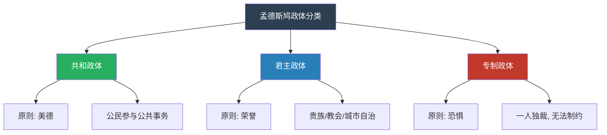
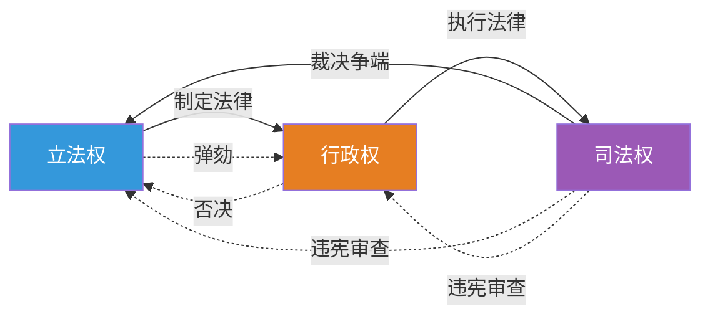
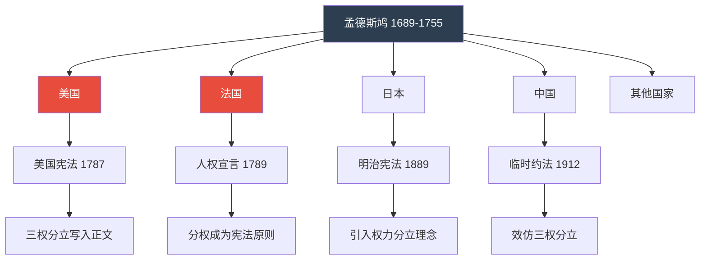
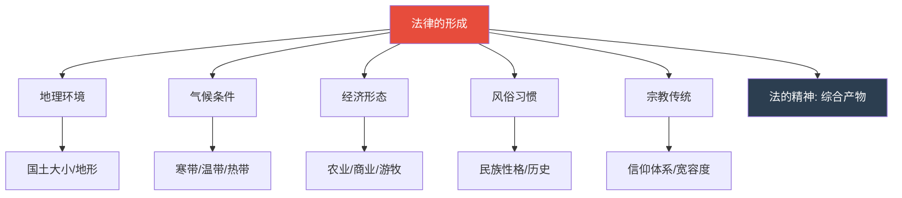
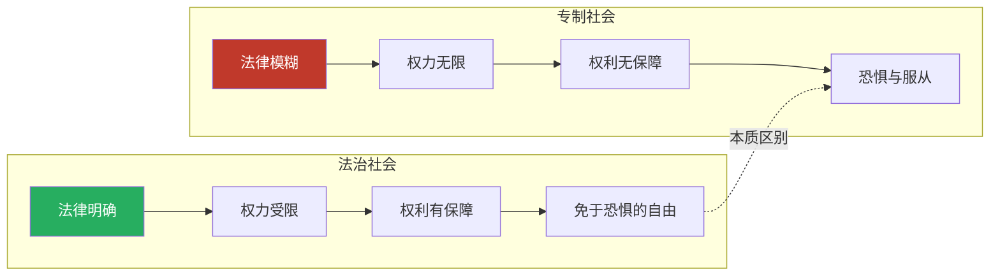

# 一图看懂《论法的精神》：三权分立如何改变世界

> 系列导航：人类文明经典阅读计划 | 西方哲学系列 | 第 16 期《论法的精神》
> 核心标签：#法治觉醒 #分权制衡 #政体分析 #制度设计

---

## 开篇：一幅图的重量

有些书需要读三十万字才能理解，但有些思想，一幅图就能说清楚。

孟德斯鸠的《论法的精神》就是这样一部著作。

它用了三十余万字论证一个核心观点：**权力必须被分割、被制衡、被关进制度的笼子里。**

今天，我们用一组图表，带你快速看懂这部改变世界格局的经典。

---

## 图表一：三种政体，三种灵魂

孟德斯鸠将人类历史上的政治制度归纳为三种类型：

**解读**：

孟德斯鸠不是在简单地说"哪种政体更好"。他在做一件更深刻的事：分析每种政体靠什么运转。

- 共和政体靠"美德"——公民愿意为公共利益牺牲
- 君主政体靠"荣誉"——各阶层在法律框架内维护自身特权
- 专制政体靠"恐惧"——人民害怕统治者的意志

他发现：政体的崩溃，往往不是因为外部攻击，而是因为内在原则的瓦解。

---

## 图表二：三权分立——人类最伟大的制度发明

**解读**：

这张图的核心信息是：**任何一种权力都不能独大。**

立法权制定规则，但不能自己执行规则；行政权执行规则，但不能自己制定规则；司法权监督规则，但不能自己制定或执行规则。

三者互相配合，又互相制约。这就是"制衡"的本质。

孟德斯鸠的原话是：

> "如果同一个人或是由重要人物、贵族或平民组成的同一个机关行使这三种权力，即制定法律权、执行公共决议权和裁判私人犯罪或争讼权，则一切便都完了。"

"一切便都完了"——这不是夸张，而是历史的教训。

---

## 图表三：一部书，改变五个国家

**解读**：

《论法的精神》出版后不到半个世纪，就影响了美国建国。

美国宪法的制定者们——麦迪逊、汉密尔顿、杰斐逊——几乎把孟德斯鸠的三权分立理论直接写入了宪法正文。

此后，法国大革命、日本明治维新、中国辛亥革命，都在不同程度上受到了这部著作的影响。

一部书，塑造了现代世界的政治格局。

---

## 图表四：法律不是凭空产生的

**解读**：

这是《论法的精神》最容易被忽视、却也最深刻的观点之一。

孟德斯鸠认为，法律不是某个天才立法者拍脑袋想出来的，而是由地理、气候、经济、风俗、宗教等多种因素共同塑造的。

好的立法者，不是发明法律，而是发现法律——发现那些早已存在于社会生活内在规律中的规则。

这种思维方式，在今天被称为"制度经济学"或"法律社会学"的先声。

---

## 图表五：自由的两种面貌

**解读**：

孟德斯鸠对"自由"的定义，至今仍是经典：

> "自由是做法律所许可的一切事情的权利。"

这意味着：

- 自由不等于"想做什么就做什么"
- 自由的前提是法律的确定性——你知道什么是被允许的，什么是不被允许的
- 真正的自由，是"免于恐惧"的自由——不必担心某一天突然被专断的权力剥夺一切

而专制社会的问题，不在于没有法律，而在于法律是不确定的、可随意解释的。当法律成为权力的工具而非约束时，自由就不复存在。

---

## 总结：图表之外的深意

五张图，无法穷尽《论法的精神》的全部思想。

但它们足以让你理解一个核心命题：**好的制度，不是寄希望于统治者的道德，而是通过结构设计，让权力无法被滥用。**

这就是孟德斯鸠留给人类最宝贵的遗产。

---

## 互动话题

你认为当前社会中最需要"分权制衡"的领域是什么？为什么？

欢迎在评论区分享你的看法。

---

## 系列导航

| 上一篇 | 下一篇 |
|--------|--------|
| 《社会契约论》：公意与人民主权 | 《纯粹理性批判》：理性的边界 |

> 人类文明经典阅读计划，每期精读一部经典，用现代视角重新解读。
> 关注我们，一起站在巨人的肩膀上思考。
