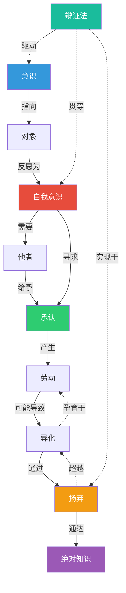
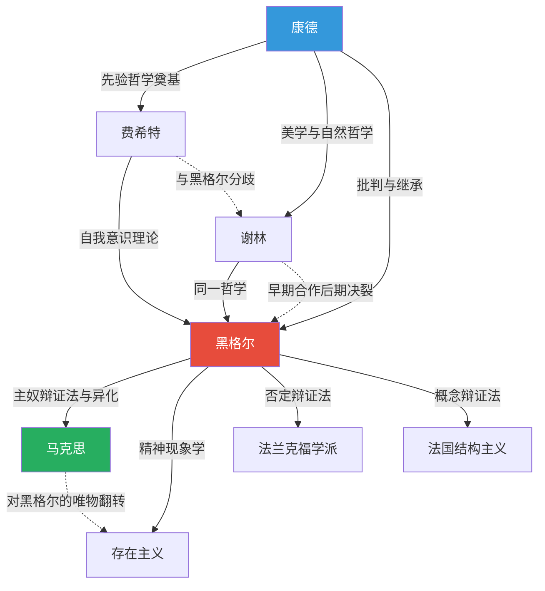

```mermaid
graph TD
    A["精神现象学"]
    A --> B["意识阶段"]
    A --> C["自我意识阶段"]
    A --> D["理性阶段"]
    A --> E["精神阶段"]
    A --> F["宗教阶段"]
    A --> G["绝对知识阶段"]

    B --> B1["感性确定性"]
    B --> B2["知觉"]
    B --> B3["知性"]

    C --> C1["欲望"]
    C --> C2["主奴关系"]
    C --> C3["斯多葛主义"]
    C --> C4["怀疑主义"]
    C --> C5["苦恼意识"]

    D --> D1["观察的理性"]
    D --> D2["实践的理性"]
    D --> D3["立法的理性"]
    D --> D4["审核的理性"]

    E --> E1["真实的精神"]
    E --> E2["自我异化的精神"]
    E --> E3["自我确定的精神"]

    F --> F1["自然宗教"]
    F --> F2["艺术宗教"]
    F --> F3["天启宗教"]

    G --> G1["绝对知识"]

    style A fill:#1a1a2e,color:#fff
    style B fill:#16213e,color:#fff
    style C fill:#0f3460,color:#fff
    style D fill:#533483,color:#fff
    style E fill:#e94560,color:#fff
    style F fill:#2c3e50,color:#fff
    style G fill:#f39c12,color:#fff
```

# 02-知识图谱图片描述.md

---

## 图片一：精神发展总览图（分类树）

**图题：黑格尔精神现象学体系结构图**

**描述：** 这是一张纵向展开的分类树状图，展示了《精神现象学》中精神发展的完整层级结构。

**图表内容（Mermaid）：**

**排版说明：**
- 采用从上到下的层级结构
- 根节点"精神现象学"使用深色背景
- 六大阶段使用不同颜色区分
- 子节点按层级递进排列
- 整体呈现金字塔式的上升态势

---

## 图片二：核心概念关系图（网络图）

**图题：精神现象学核心概念关联网络**

**描述：** 展示《精神现象学》中核心概念之间的辩证关系，概念之间用有方向的箭头连接，箭头上标注关系类型。

**图表内容（Mermaid）：**

**排版说明：**
- 实线箭头表示直接的发展关系
- 虚线箭头表示深层的驱动关系
- 核心概念"自我意识""扬弃""绝对知识"使用高亮色
- 整体呈现网状结构，体现辩证法的复杂性

---

## 图片三：精神发展路径图（时序路径）

**图题：精神自我认识的演进路径**

**描述：** 以从左到右的演进路径展示精神发展的时间序列，每个阶段用圆形节点表示，节点之间有箭头连接，关键转折点用特殊标记。

**图表内容（Mermaid）：**

**排版说明：**
- 水平方向展开，体现时间上的先后顺序
- 主奴关系处分支展开，展示辩证分化
- 用红色边框标记关键转折点
- 奴隶节点用绿色高亮，暗示其历史主动性
- 绝对知识用金色标记终点

---

## 图片四：哲学家思想传承图谱（人物谱系）

**图题：德国古典哲学思想传承关系**

**描述：** 展示从康德到黑格尔再到后世的哲学思想传承脉络，包含直接影响关系和思想分歧关系。

**图表内容（Mermaid）：**

**排版说明：**
- 黑格尔居中放大，体现其承前启后的地位
- 实线表示直接的思想影响
- 虚线表示分歧或批判性继承
- 康德、黑格尔、马克思三人使用不同颜色强调

---

## 图片使用建议

1. **尺寸适配**：所有图片建议宽度1080px，高度根据内容自动适配
2. **配色方案**：深蓝主色调配合金色点缀，体现哲学的深邃感
3. **字体选择**：标题使用思源宋体，正文使用思源黑体
4. **留白处理**：图表周围保留足够的空白区域，避免视觉拥挤

---
