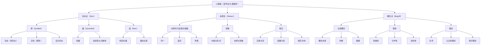
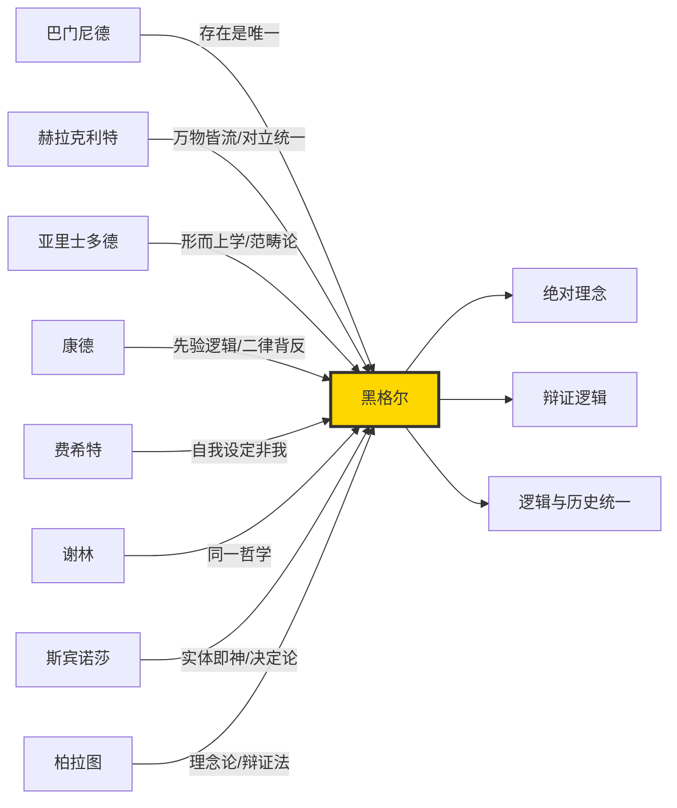
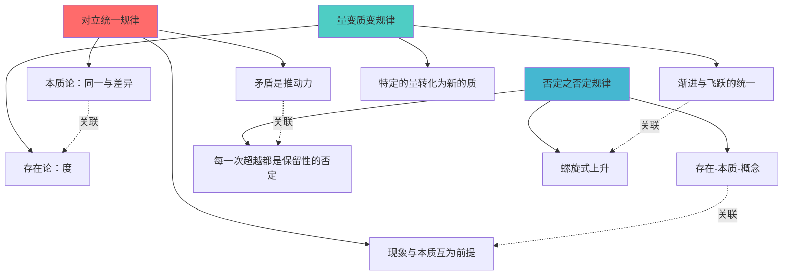

# 黑格尔《小逻辑》知识图谱图片描述

---

## 图一：《小逻辑》整体分类树

### 图表说明

这是一棵展示黑格尔《小逻辑》整体逻辑体系的分类树状图，帮助读者从宏观上把握全书的结构脉络。

### Mermaid 分类树

### 图谱解析

- **存在论**是逻辑学的第一部分，处理最直接、最抽象的概念。"质"规定了某物是什么，"量"规定了某物有多少，"度"则是质与量的统一，标志着量变引发质变的临界点。
- **本质论**进入更深层的反思结构。"同一"、"差异"、"矛盾"构成了本质内部的自我分化，"现象"是本质在外的展现，"现实"则是本质与现象的统一。
- **概念论**是逻辑学的最高阶段。"主观概念"包含概念、判断、推理三个环节，"客体"涵盖机械性、化学性、目的性，最终在"理念"中，主观与客观达成统一，抵达"绝对理念"。

---

## 图二：哲学史人物思想影响图谱

### 图表说明

展示对黑格尔逻辑学产生重要影响的哲学家及其核心贡献，以及黑格尔对他们的批判性继承关系。

### Mermaid 人物关系图

### 图谱解析

- **巴门尼德**的"存在是一"是黑格尔逻辑学的远古典根基，但黑格尔超越了巴门尼德将存在视为静止不变的观点。
- **赫拉克利特**的"万物皆流"和对立统一思想被黑格尔吸收为辩证法的核心灵魂。
- **康德**的先验逻辑揭示了范畴的必然性，其"二律背反"暴露了知性思维的局限，这正是黑格尔辩证法的起点。
- **费希特**的"自我设定非我"启发了黑格尔关于概念自我运动的思考，但黑格尔超越了费希特的主观唯心主义。
- **斯宾诺莎**的实体概念被黑格尔批判地继承，将其从静止的实体转化为自我展开的主体。

---

## 图三：概念演进路径图

### 图表说明

展示《小逻辑》中从"存在"到"绝对理念"的概念演进阶梯，每一个箭头都代表一次概念的自我否定和超越。

### Mermaid 路径图

```mermaid
graph TD
    A["纯存在"] --> B["无"]
    B --> C["变易"]
    C --> D["定在"]
    D --> E["自为存在"]
    E --> F["一与多"]
    F --> G["量"]
    G --> H["度"]
    H --> I["本质"]
    I --> J["同一"]
    J --> K["差异"]
    K --> L["矛盾"]
    L --> M["根据"]
    M --> N["现象"]
    N --> O["现实"]
    O --> P["实体"]
    P --> Q["因果"]
    Q --> R["相互作用"]
    R --> S["概念"]
    S --> T["判断"]
    T --> U["推理"]
    U --> V["目的性"]
    V --> W["生命"]
    W --> X["认识"]
    X --> Y["绝对理念"]

    style A fill:#E8E8E8
    style I fill:#FFE4B5
    style S fill:#98FB98
    style Y fill:#FF69B4,stroke:#333,stroke-width:2px
```

### 图谱解析

- **第一阶段（存在论）**：从"纯存在"的纯粹空无开始，经由"变易"的第一次运动，逐步获得规定性，最终在"度"中达到质与量的统一。
- **第二阶段（本质论）**：进入反思层面，"同一"不是抽象的A=A，而是包含了差异的具体的同一，"矛盾"是推动本质向前发展的内在动力。
- **第三阶段（概念论）**：概念不再是被动的范畴，而是主动的自我规定。最终在"绝对理念"中，思维与存在、主体与客体、自由与必然达成最终统一。

---

## 图四：辩证法三大规律概念网络

### 图表说明

以网络图的形式展示辩证法三大规律在《小逻辑》体系中的具体体现和相互关联。

### Mermaid 网络图

### 图谱解析

- **对立统一规律**在本质论中体现得最为明显：同一与差异、内与外、内容与形式、原因与结果，每一对范畴都不是孤立的，而是相互规定、互为前提。
- **量变质变规律**在存在论的"度"范畴中得到集中展现：量变的渐进过程达到某个节点时，会突然转化为新的质，旧的尺度被新的尺度取代。
- **否定之否定规律**贯穿整个体系：从存在到本质再到概念，每一个阶段都是对前一个阶段的否定，同时又保留了前一个阶段的真理环节，最终在更高的层次上实现综合。

---

## 使用建议

以上四张图谱建议按以下顺序在公众号推文中穿插使用：

1. **分类树**放在文章开头，作为全文的导航地图
2. **人物影响图谱**放在介绍哲学背景的部分
3. **概念演进路径图**放在讲解逻辑推演过程的部分
4. **三大规律网络图**放在总结辩证法核心思想的部分

每张图建议配以简短的文字解读，帮助读者理解图与正文的关联。
