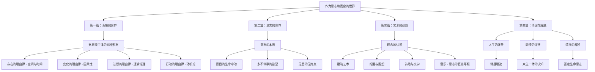
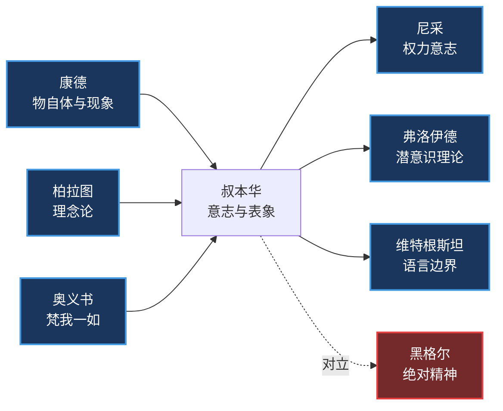
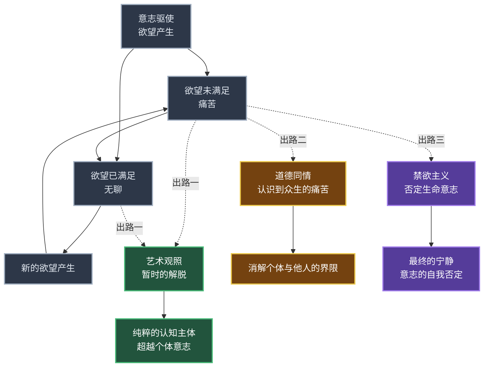
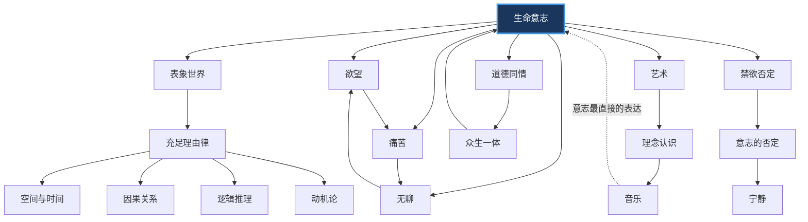

# 知识图谱图片描述：叔本华《作为意志和表象的世界》

---

## 图谱一：哲学体系分类树

> **用途**：展示叔本华哲学体系的整体结构，帮助读者建立全局认知。

### Mermaid 源码

### 排版说明

- **整体色调**：深蓝底色，文字白色，分支用不同深浅的蓝色区分
- **节点样式**：根节点用矩形加粗边框，子节点用圆角矩形
- **连线**：从根到叶用渐变箭头，体现层级递进关系
- **建议尺寸**：宽度 1080px，高度自适应（预计约 1600px）
- **适用场景**：文章开篇的全局概览图

---

## 图谱二：人物思想关系图谱

> **用途**：展示叔本华与前后哲学家的思想传承与对立关系。

### Mermaid 源码

### 排版说明

- **继承关系**：用蓝色实线箭头，表示思想传承
- **对立关系**：用红色虚线，标注"对立"
- **影响关系**：叔本华指向后世哲学家，用蓝色实线
- **节点排列**：左侧为思想来源，中间叔本华放大突出，右侧为后世影响
- **建议尺寸**：宽度 1080px，高度约 600px
- **适用场景**：思想史定位，帮助读者理解叔本华的承前启后地位

---

## 图谱三：从痛苦到解脱的路径图

> **用途**：展示叔本华描述的人生状态及其可能的解脱路径。

### Mermaid 源码

### 排版说明

- **循环部分**（A到D）：用深灰色背景，表示人生的痛苦循环
- **三条出路**：分别用绿色、黄色、紫色区分，体现不同层次
- **路径一（艺术）**：浅绿色，代表暂时的、审美层面的解脱
- **路径二（道德）**：暖黄色，代表伦理层面的超越
- **路径三（禁欲）**：紫色，代表最高层次的精神解脱
- **建议尺寸**：宽度 1080px，高度约 1400px
- **适用场景**：核心逻辑展示，适合作为第三篇文章的配图

---

## 图谱四：核心概念网络图

> **用途**：展示叔本华哲学中核心概念之间的关联网络。

### Mermaid 源码

### 排版说明

- **中心节点**："生命意志"用最大号字体和加粗边框突出，作为整个网络的中心
- **一级概念**：围绕中心的六大概念（表象、欲望、痛苦、无聊、艺术、道德、禁欲）用中等大小
- **二级概念**：最外层的细分概念用较小字号
- **特殊连线**：音乐到意志的虚线，标注"意志最直接的表达"，突出叔本华对音乐的特殊定位
- **颜色方案**：中心深蓝，外围按概念类型使用不同色系
- **建议尺寸**：宽度 1080px，高度约 1200px
- **适用场景**：概念总览图，适合放在知识图谱文章的开篇或结尾

---

## 移动端适配建议

1. **所有图表**宽度不超过 1080px，确保在手机上无需横向滚动
2. **节点文字**字号不小于 12px，保证可读性
3. **复杂图表**（如图谱一、图三）可以考虑分拆为两张图，上下排列
4. **配色方案**建议统一使用深蓝色系为主色调，配合少量亮色区分不同分支
5. **导出格式**建议用 PNG 或 SVG，保证清晰度
6. **图注**放在图表下方，用小字号灰色文字标注图表名称和用途

---

**人类文明经典阅读计划 | 第五期 西方哲学系列**
**核心标签**：意志觉醒 | 表象认知 | 悲观哲学 | 艺术解脱
