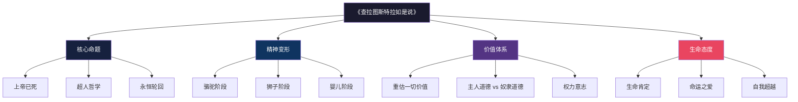
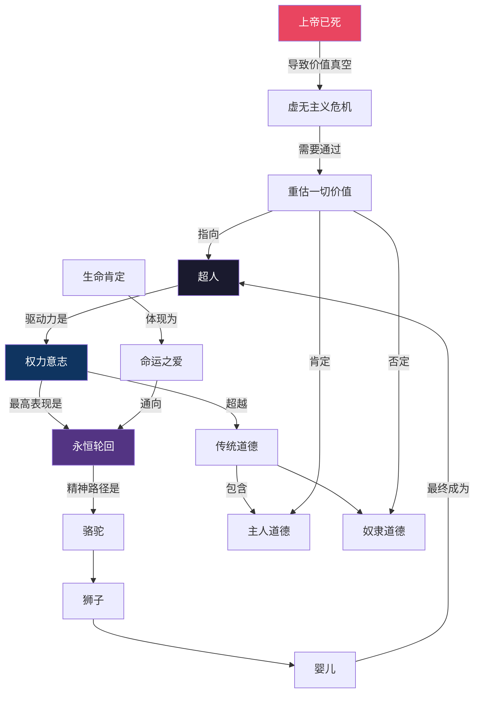
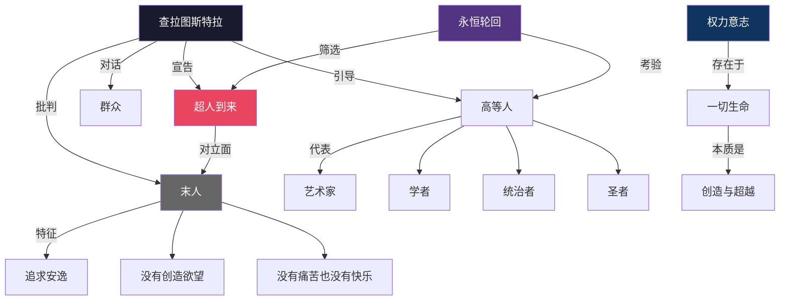
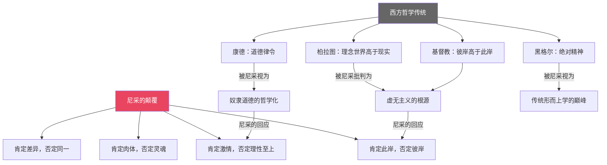
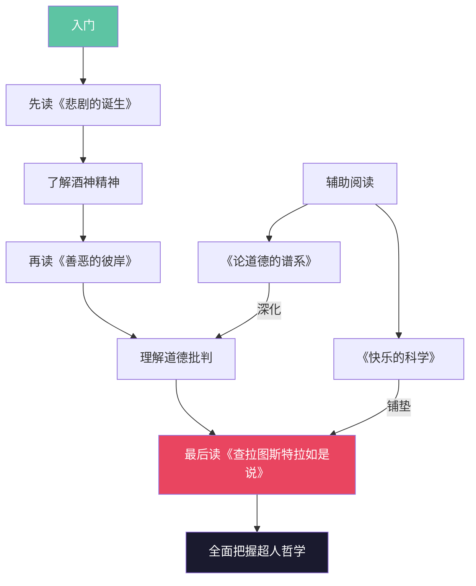

# 知识图谱 | 《查拉图斯特拉如是说》核心概念全景图

> 一张图读懂尼采的思想宇宙

---

## 图一：核心概念分类树

以下树状图展示了《查拉图斯特拉如是说》的核心概念体系：

---

## 图二：核心概念关系网络

以下网络图展示了尼采思想中各核心概念之间的内在关联：

---

## 图三：精神变形路径图

以下流程图展示了从普通人到超人的精神演变路径：

---

## 图四：人物与概念图谱

以下图谱展示了书中关键人物及其代表的思想内涵：

---

## 图五：尼采思想与西方哲学传统的对比

---

## 图六：阅读路径推荐

以下流程图建议了阅读《查拉图斯特拉如是说》的推荐路径：

---

> 系列导航
>
> ◆ 上一篇：《存在与时间》——知识图谱
> ◆ 下一篇：《悲剧的诞生》——知识图谱
> ◆ 合集：人类文明经典阅读计划 · 西方哲学系列
>
> 保存图片，方便随时查阅
