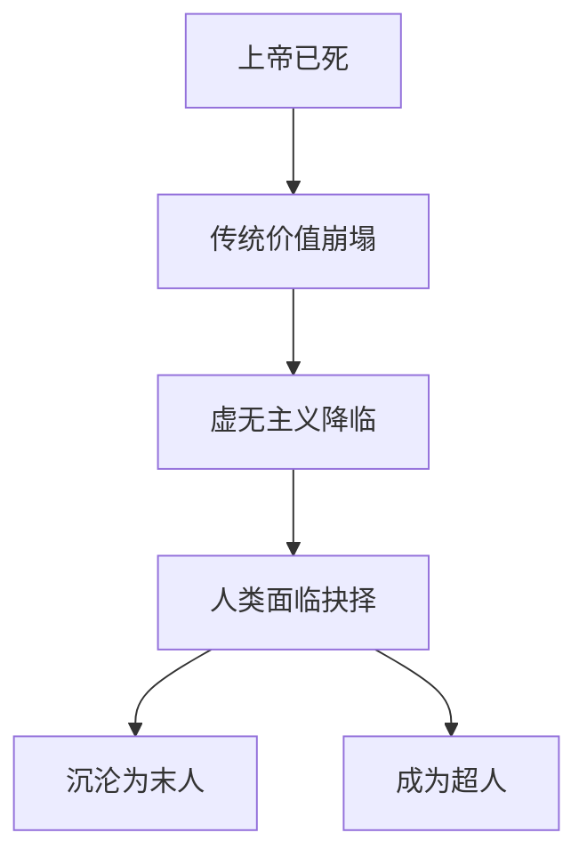
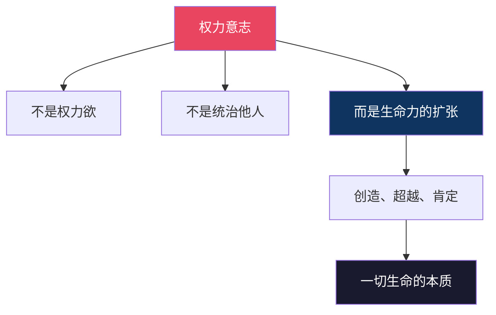
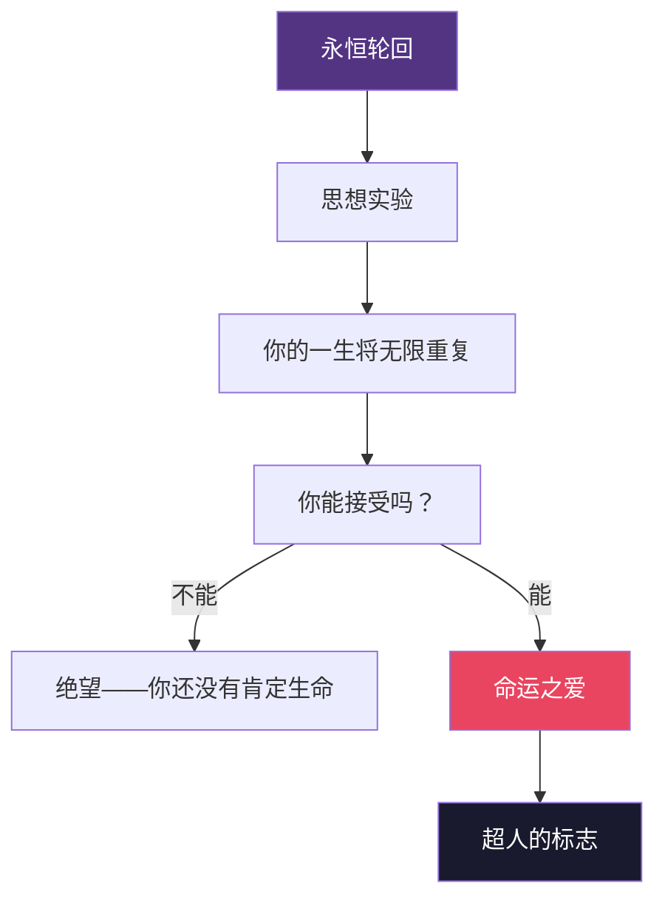
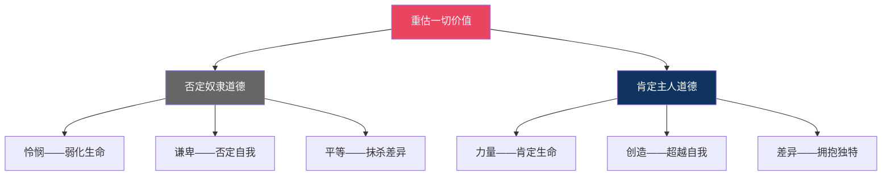
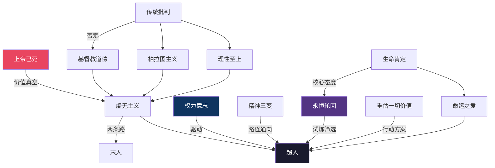

# 图谱逻辑 | 尼采的思想大厦是如何搭建的？

> 理解《查拉图斯特拉如是说》，先理解它的底层逻辑

---

## 一、为什么需要一张知识图谱？

《查拉图斯特拉如是说》不是一本可以线性阅读的书。

尼采用隐喻、诗歌、寓言的方式写作，思想像一张网，互相交织、互相呼应。如果不理清它们之间的逻辑关系，很容易读得云里雾里。

这张知识图谱的目的，就是帮你看到尼采思想的**骨架**——那些隐藏在诗性语言背后的严密逻辑。

---

## 二、图谱的核心逻辑：一个问题，一条路径

整本书可以归结为一个核心问题：

**当上帝已死，人类该如何活下去？**

这个问题衍生出尼采的全部思想体系。让我们沿着逻辑链条一步步展开。

---

### ◇ 起点：上帝已死

"上帝已死"不是终点，而是起点。

尼采看到的不是解放，而是危机。当支撑西方文明两千年的基督教价值体系崩塌，人类将面临一个巨大的空洞。

这个空洞就是**虚无主义**——一切都没有意义，一切都无所谓。

面对虚无主义，人有两条路：

**向下沉沦**，成为"末人"——追求安逸、舒适、平庸，没有创造欲望，也没有痛苦。这是大多数人的选择。

**向上超越**，成为"超人"——自己创造价值，肯定生命，勇敢面对苦难。这是尼采期待的选择。

---

### ◇ 动力：权力意志

"权力意志"是尼采被误解最深的概念。

它不是政治权力，不是控制他人，不是霸道。它是**生命本身的驱动力**——每一个生命都渴望成长、扩张、创造、超越自身。

一棵树努力向上生长，是权力意志。
一个艺术家创作作品，是权力意志。
一个人克服恐惧直面困难，也是权力意志。

权力意志是超人哲学的**引擎**。没有它，超越就无从谈起。

---

### ◇ 路径：精神三变

从普通人到超人，不是一步跨越的。尼采设计了"精神三变"作为过渡路径。

**骆驼**代表被动接受。它承载传统、道德、责任。这是必要的阶段——没有骆驼的忍耐和积累，就没有后来的觉醒。

**狮子**代表主动反抗。它对一切"你应该"说"不"，它要争取自由。但狮子只能破坏，它说"不"却不知该说"什么"。

**婴儿**代表全新创造。它是纯洁的遗忘，是新的开始。婴儿说"我要"，它不再被过去定义，它自己定义未来。

这三变，是一个人的**精神进化史**。

---

### ◇ 试炼：永恒轮回

永恒轮回是尼采最震撼的思想实验。

它不是宇宙学理论，而是一个**测试**——测试你是否真正热爱你的生命。

如果你听到"一切将无限重复"感到绝望，说明你对生命还有怨恨、还有不甘、还有"如果当初"的遗憾。你还没有真正肯定生命。

如果你能热爱到愿意说"再来一次"，甚至"再来无数次"，那你就达到了尼采所说的"命运之爱"——这是超人的标志。

---

### ◇ 行动：重估一切价值

重估一切价值，不是简单的"反对传统"。

尼采区分了两种道德：

**奴隶道德**——源于弱者的怨恨。它把力量视为邪恶，把软弱视为美德。它追求平等，却抹杀了差异和卓越。

**主人道德**——源于强者的自我肯定。它赞美力量、创造、勇气。它不恨别人，它爱自己。

重估一切价值，就是从奴隶道德走向主人道德。

---

## 三、图谱总结：一张逻辑网

现在你可以看到，尼采的思想不是散落的碎片，而是一张严密交织的逻辑网。

**起点**是"上帝已死"带来的价值危机。
**动力**是"权力意志"——生命内在的超越冲动。
**路径**是"精神三变"——从骆驼到狮子到婴儿。
**试炼**是"永恒轮回"——你是否足够热爱生命。
**行动**是"重估一切价值"——从奴隶道德走向主人道德。
**目标**是成为"超人"——自己创造价值的人。

---

> 互动话题
>
> ◆ 这张逻辑图中，哪个环节最触动你？
> ◆ 你觉得"精神三变"的路径在现实中可行吗？
>
> 欢迎在评论区分享你的理解。

---

> 系列导航
>
> ◆ 上一篇：知识图谱——核心概念全景图
> ◆ 下一篇：核心思想——超人哲学深度解读
> ◆ 合集：人类文明经典阅读计划 · 西方哲学系列
