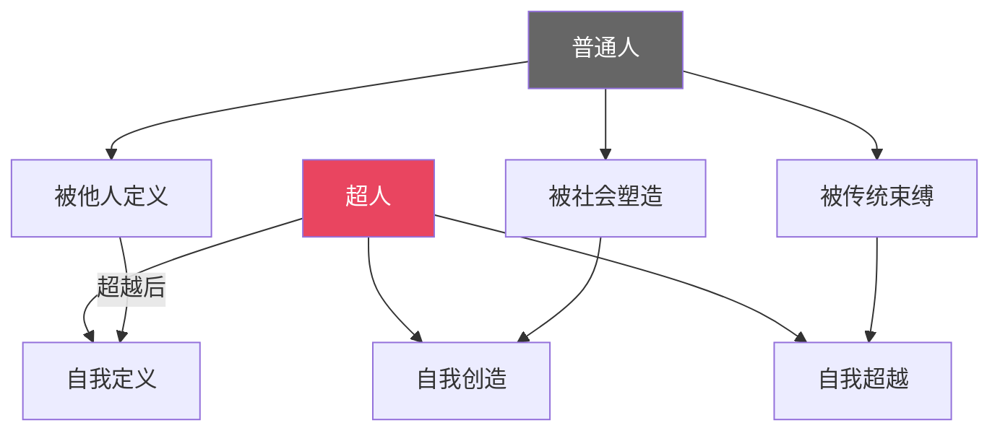
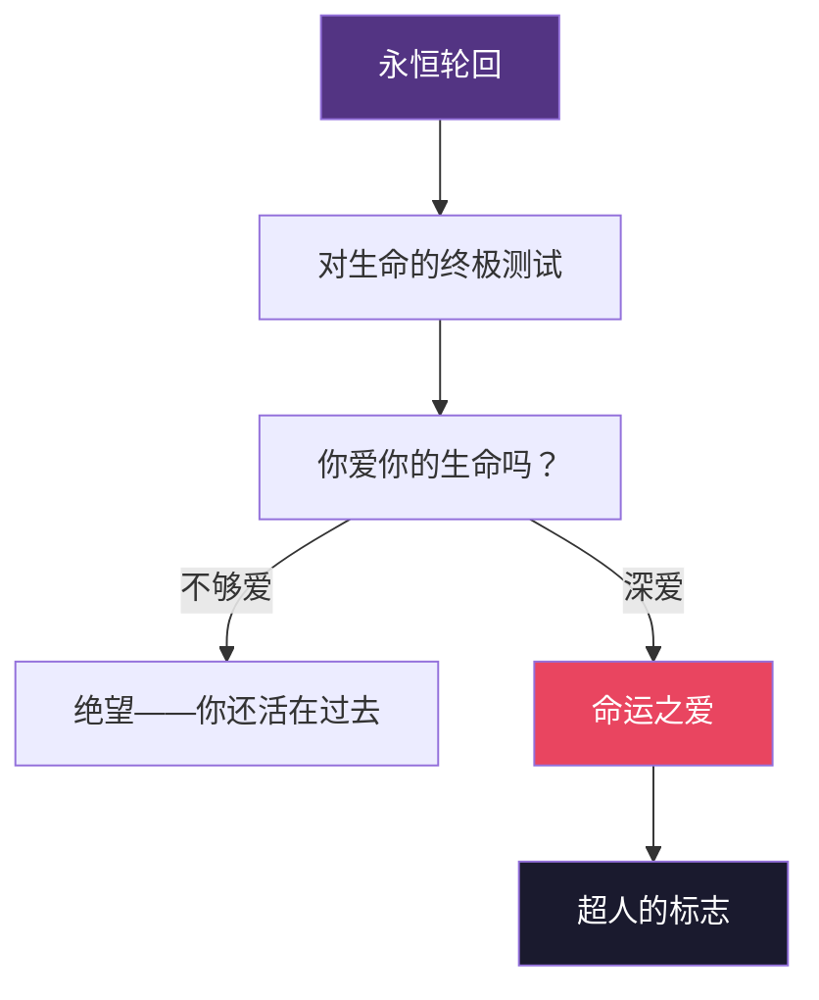
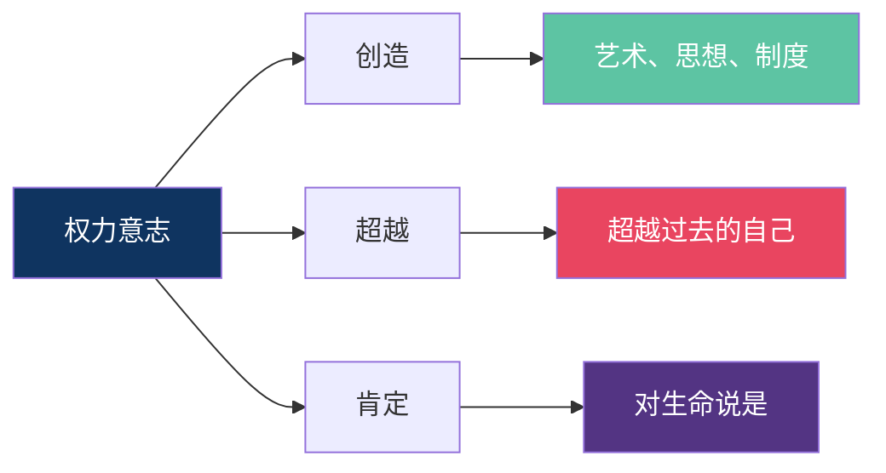
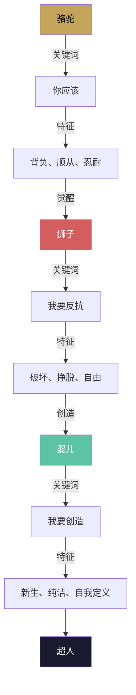

# 核心思想 | 尼采的六大命题，每一句都在重塑你的世界观

> 读懂这六个思想，你就读懂了《查拉图斯特拉如是说》

---

## 一、上帝已死：不是宣言，而是诊断

"上帝已死。上帝真的死了。是我们杀死了他。"

这句话被引用了无数次，但绝大多数人误解了它。

尼采不是在庆祝，他是在**诊断**。就像一个医生告诉病人"你的免疫系统崩溃了"，这不是好消息。

尼采看到的是：西方文明的精神支柱正在崩塌。基督教提供了两千年的意义框架——善恶的标准、人生的目的、死后的归宿。当这个框架瓦解，人类将坠入虚无。

> 虚无主义不是"什么都不信"，而是"什么都不再有意义"。

我们今天依然活在这个诊断的延长线上。

物质丰富了，但空虚感没有减少。选择更多了，但迷茫感没有消退。我们可以购买一切，但似乎没有什么值得追求。

这就是尼采在 1883 年就预见的危机。

---

## 二、超人哲学：成为你自己

超人是尼采给出的答案。

但"超人"这个词被纳粹扭曲了将近一个世纪，至今仍有无数人以为尼采在鼓吹种族优越或暴力统治。

这是彻头彻尾的误解。

尼采的超人，与血统无关，与武力无关，与统治无关。

**超人是一种精神状态：能够自己创造价值的人。**

超人不是比别人强，而是比过去的自己强。

超人不嫉妒别人的成就，他专注于自己的创造。

超人不恨弱者，他也没有兴趣去统治谁。他忙着成为自己。

尼采说：

> "人是一条污浊的泉流。要容纳污浊而仍不被污染，人必须成为大海。"

超人是那片大海。

---

## 三、永恒轮回：最重的思想

如果有一个恶魔在某个孤独的夜晚对你说：

"你现在所经历的一切，你经历过无数次。每一次痛苦、每一次欢乐、每一个念头、每一声叹息——都将以完全相同的顺序再次上演。"

你会怎样？

尼采说，这个回答将决定你是谁。

如果你崩溃了，说明你还被怨恨、遗憾、不甘所束缚。你没有真正接纳你的人生。

如果你说"再来一次"，甚至"再来无数次"，那你就达到了尼采所说的最高境界——**命运之爱**。

永恒轮回不是宇宙学理论。它是一个思想实验，一面镜子。

它逼迫你审视：你现在的生活，是你真正选择的吗？如果是，你会愿意它永远重复。如果不是，你需要改变。

---

## 四、权力意志：生命的本质冲动

这是尼采最具原创性也最被误解的概念。

让我用一句话澄清：

**权力意志不是想要控制别人的意志，而是想要超越自己的意志。**

尼采认为，一切生命的最深层驱动力，不是求生，不是繁殖，而是**扩张、创造、超越**。

一棵树的根向岩石深处扎去，不是因为"想活"，而是因为生命本能的扩张冲动。

一个人深夜苦读，不是因为"被迫"，而是因为内心深处有一种想要理解、想要成长的冲动。

艺术家在创作时那种近乎癫狂的状态，就是权力意志最纯粹的体现。

> 权力意志是尼采对"生命是什么"这个问题的回答：生命就是不断超越自身。

---

## 五、重估一切价值：一场思想的革命

"重估一切价值"是尼采给自己的任务。

他要问一个最简单也最深刻的问题：**我们以为对的东西，真的对吗？**

从小我们被教育：

◆ 谦虚是美德

◆ 平等是正义

◆ 怜悯是善良

◆ 安稳是幸福

尼采说：等等，让我们重新想想。

他区分了两种道德：

**主人道德**——源于强者的自我肯定。它赞美力量、勇气、创造、卓越。它不因自己强大而感到抱歉。

**奴隶道德**——源于弱者的怨恨。它把强者的特质（力量、独立、差异）定义为"恶"，把自己的特质（软弱、依赖、平等）定义为"善"。

尼采认为，基督教道德本质上就是奴隶道德。它用"爱"和"怜悯"包装了弱者对强者的怨恨。

> 这不是说尼采反对善良。他反对的是——以善良之名，否定生命、否定力量、否定卓越。

重估一切价值，就是要看清这一点，然后重新选择。

---

## 六、精神三变：你的蜕变之路

最后，也是我个人最喜欢的部分——精神三变。

尼采用三种动物比喻了人类精神蜕变的三个阶段：

### ◇ 骆驼：你应该

骆驼的特征是背负和顺从。

它背负着"你应该"——你应该好好读书，你应该找份安稳的工作，你应该结婚生子，你应该随大流。

骆驼是必要的。没有骆驼阶段的积累和忍耐，就没有后来的觉醒。但如果停在骆驼阶段，你就永远活在别人的期望里。

### ◇ 狮子：我要反抗

狮子的特征是说"不"。

它要挣脱一切枷锁，对所有的"你应该"说"不"。它要自由。

但狮子有一个致命问题：它只会破坏，不会创造。它知道不要什么，但不知道要什么。

很多处于"叛逆期"的人就是狮子——他们反抗一切，却不知方向。

### ◇ 婴儿：我要创造

婴儿是第三个阶段。

婴儿说"我要"。它不是反抗，而是创造。它不否定过去，它开启未来。

婴儿代表着纯洁的遗忘——忘掉别人给你的定义，重新开始。

对照一下你自己：

你大部分时间是骆驼吗？在别人的期望中生活？

你是否经历过狮子的阶段？反抗却不知方向？

你准备好成为婴儿了吗？忘记一切定义，重新开始创造？

---

## 写在最后

尼采的六大命题，不是六个独立的理论，而是一个完整的思想体系。

从"上帝已死"的诊断，到"超人"的愿景，从"权力意志"的动力，到"永恒轮回"的试炼，从"重估一切价值"的行动，到"精神三变"的路径——这是一条完整的精神进化之路。

这条路不好走。但尼采说过：

> "那些听不见音乐的人，以为跳舞的人疯了。"

也许，成为超人就是学会听见那首别人听不见的音乐。

---

> 互动话题
>
> ◆ 这六个命题中，哪一个最让你震撼？
> ◆ 你认为尼采的思想在当代有哪些新的意义？
>
> 欢迎在评论区写下你的思考。

---

> 系列导航
>
> ◆ 上一篇：图谱逻辑——尼采思想的底层架构
> ◆ 下一篇：职场指南——尼采哲学如何改变你的工作观
> ◆ 合集：人类文明经典阅读计划 · 西方哲学系列
