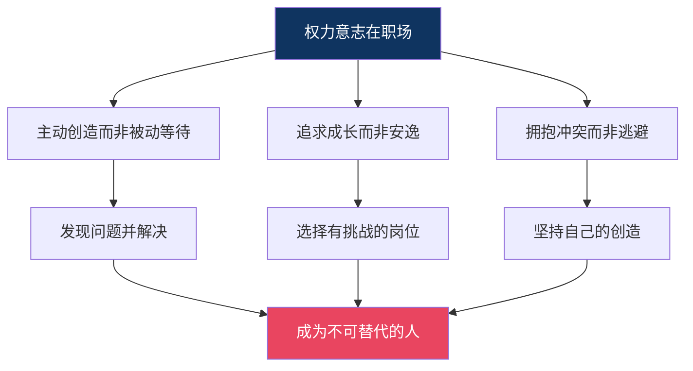
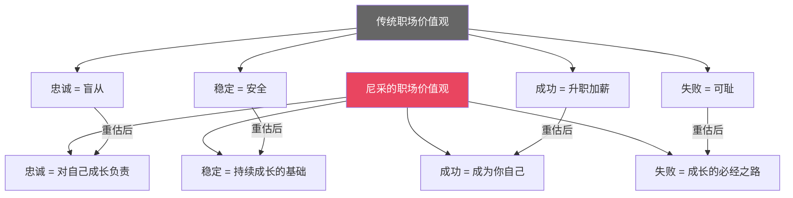

# 职场指南 | 尼采的超人哲学，如何改写你的职场生存法则

> 在职场中，你是骆驼、狮子还是婴儿？

---

## 一、职场中的精神三变

想象一下你的职场轨迹。它几乎完美对应了尼采的精神三变。

### ◇ 骆驼阶段：职场新人

刚入职场时，你是一只骆驼。

你背负着"你应该"：

◆ 你应该听领导的话

◆ 你应该按流程办事

◆ 你应该加班

◆ 你应该忍气吞声

◆ 你应该等到"合适的时机"

这个阶段没有错。骆驼的忍耐和积累是必要的——你在学习规则、积累经验、理解行业。

但如果十年后你还是骆驼，问题就来了。

你变成了那个"什么都会、什么都不精"的老员工。你知道所有流程，但你没有创造任何东西。你安全，但平庸。

### ◇ 狮子阶段：职场反叛者

工作几年后，你开始觉醒。

你发现有些流程是愚蠢的，有些领导是无能的，有些规则是不合理的。

你开始说"不"：

◆ "为什么一定要这样做？"

◆ "这个会议完全没有必要。"

◆ "我不想再加班了。"

这是狮子的阶段。你在反抗、在挣脱、在争取自由。

但狮子有个问题：你知道不要什么，但不知道要什么。

你辞职了，然后呢？你反抗了，然后呢？你拒绝了，然后呢？

很多职场人的困境就在这里——他们成功地摆脱了旧的东西，但没有建立新的东西。

### ◇ 婴儿阶段：职场创造者

婴儿阶段是大多数人从未到达的境界。

婴儿不是说"不"，而是说"我要"。

"我要创造一种新的工作方式。"

"我要建立自己的事业。"

"我要用我的方式解决问题。"

婴儿不是在反抗旧系统，而是在创造新系统。

```mermaid
graph TD
    A["骆驼员工"] -->|"特征"| B["听话、执行、等待"]
    A --> C["风险"| D["永远平庸"]}

    E["狮子员工"] -->|"特征"| F["质疑、反抗、跳槽"]
    E --> G["风险"| H["知道不要什么，不知道要什么"]}

    I["婴儿员工"] -->|"特征"| J["创造、建立、引领"]
    I --> K["结果"| L["成为不可替代的人"]}

    style A fill:#c4a35a,color:#000
    style E fill:#d45d5d,color:#fff
    style I fill:#5dc4a3,color:#fff
```

---

## 二、权力意志：职场进阶的底层动力

尼采说，一切生命的本质是权力意志——不是控制别人的欲望，而是**超越自己**的冲动。

在职场中，这意味着什么？

### ◇ 不要追求安逸，追求成长

末人追求的是舒适：一份稳定的工作、一个可预测的未来、一个不用动脑子的岗位。

超人追求的是成长：挑战性的项目、需要学习新技能的岗位、能让你变得更好的环境。

> 判断一份工作好不好，不要问"舒不舒服"，要问"能不能让我成长"。

### ◇ 不要害怕冲突，害怕平庸

奴隶道德告诉你：要和气，要忍让，不要和别人不一样。

尼采告诉你：如果你因为害怕冲突而选择了平庸，那你就在否定自己的生命。

当然，这不是让你到处树敌。而是说——当你的创造力和规则发生冲突时，选择创造力。

### ◇ 不要等待机会，创造机会

骆驼等待指令。狮子反抗指令。婴儿创造指令。

职场中最稀缺的人，是那些不需要别人告诉他们该做什么，而是自己发现问题、创造解决方案的人。

这就是权力意志在职场中的体现——不是等待被安排，而是主动创造。



---

## 三、重估一切价值：你的职场价值体系

让我们用尼采的方法，重估职场中的"常识"。

### ◇ 重估"忠诚"

传统职场说：要对公司忠诚。

尼采会问：忠诚的目的是什么？如果公司不能让你成长，忠诚是不是在否定你自己？

真正的忠诚应该是对自己成长的忠诚，而不是对某个组织的盲从。

### ◇ 重估"稳定"

传统职场说：要找一份稳定的工作。

尼采会问：稳定是为了什么？如果稳定意味着停止成长，它是不是另一种形式的死亡？

尼采不是反对所有稳定。他反对的是——把稳定当作最高目标，为此牺牲了创造和超越的可能。

### ◇ 重估"成功"

传统职场说：成功就是升职加薪。

尼采会问：那是谁定义的成功？如果你的灵魂在腐烂，再高的职位又有什么意义？

真正的成功，在尼采看来，是**成为你自己**——找到你能创造价值的方式，然后全力以赴。

### ◇ 重估"失败"

传统职场说：失败是可耻的。

尼采说：失败是成长的必经之路。没有经历失败的人，从来没有真正尝试过。

> "那些杀不死我的，会让我更强大。"



---

## 四、永恒轮回：你的职业选择测试

现在，让我们用尼采的"永恒轮回"思想实验，来测试你的职业选择。

想象一下：

你现在的工作内容、你的同事、你的领导、你的加班、你的压力、你的成就感——一切都将无限次地重复。

你会怎么想？

如果这个想法让你绝望，说明你还没有真正选择你的职业。你只是在"混日子"。

如果这个想法让你兴奋，说明你找到了值得燃烧一生的事业。

**这不是玄学，而是一个实用的自我测试工具。**

当你面临职业选择时，问自己：我愿意这个选择无限重复吗？

如果答案是"不"，那就换一个选择。

---

## 五、职场中的"末人"与"超人"

尼采在书中描述了"末人"——那些追求安逸、没有创造欲望、没有激情的人。

职场中到处都是末人：

◆ 每天打卡上班，机械地完成任务

◆ 不思考"为什么要这样做"

◆ 不关心"还能做得更好吗"

◆ 最大的愿望是"别出事"

这不是在贬低任何人。尼采只是在描述一种状态——而且他警告说，如果不自觉，大多数人都会滑向这种状态。

**超人在职场中的样子：**

◆ 不只是完成任务，而是思考"这个任务的意义是什么"

◆ 不满足于"合格"，而是追求"卓越"

◆ 不怕犯错，只怕不尝试

◆ 不嫉妒别人的成就，而是专注于自己的创造

◆ 不需要别人的认可来证明自己

---

## 六、给你的五个行动建议

基于尼采的哲学，这里给你五个职场行动建议：

**1. 从骆驼走向狮子**

如果你一直是听话的执行者，试着问一次"为什么"。试着提出一个不同的方案。试着说一次"我觉得可以这样做"。

**2. 从狮子走向婴儿**

如果你已经在反抗和质疑，试着创造一次。不要只说"这样不对"，而是做出一个"这样更好"的方案。

**3. 用永恒轮回测试你的选择**

面临跳槽、转岗、创业的选择时，问自己：我愿意这个选择无限重复吗？

**4. 重估你的职场价值观**

列出你认为"理所当然"的职场规则，逐一审视：这些规则真的对吗？还是别人灌输给你们的？

**5. 拥抱权力意志**

把"超越自己"作为工作的核心动力。不比别人，只比昨天的自己。

---

> 互动话题
>
> ◆ 你在职场中处于哪个阶段——骆驼、狮子还是婴儿？
> ◆ 用永恒轮回测试一下，你对现在的工作满意吗？
>
> 欢迎在评论区分享你的职场故事。

---

> 系列导航
>
> ◆ 上一篇：核心思想——尼采六大命题深度解读
> ◆ 下一篇：行动挑战——30天超人觉醒计划
> ◆ 合集：人类文明经典阅读计划 · 西方哲学系列
