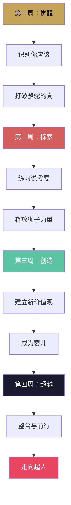

# 行动挑战 | 30天超人觉醒计划：用尼采哲学重塑你的人生

> 读完《查拉图斯特拉如是说》，现在轮到你了。

---

## 前言：这不是一次阅读，而是一场实验

尼采不是让你"理解"他的思想，而是让你**活出**他的思想。

哲学不是知识，是生活方式。

如果你读完这本书，合上书页，然后继续用同样的方式生活，那你就什么都没读懂。

下面这个 30 天的挑战计划，是为你设计的——不是为了让你"变得更厉害"，而是为了让你**成为你自己**。

---

## 第一周：觉醒周——打破骆驼的壳

这一周的目标：识别你身上的"你应该"。

### Day 1 | 列出你的"你应该"

拿出一张纸，写下所有你觉得自己"应该"做的事：

◆ 我应该每天早起

◆ 我应该更努力地工作

◆ 我应该让父母满意

◆ 我应该……

写完后，问自己：这些"应该"是谁给我的？我真的认同它们吗？

### Day 2 | 找出三个"不应该"

从昨天的清单中，选出三个你决定不再接受的"应该"。

对自己说："我不应该因为这个而活。"

### Day 3 | 做一次"说不"的练习

今天，在一件你通常会妥协的事情上说"不"。

不是无理取闹，而是——当这件事违背你的真实意愿时，试着拒绝。

### Day 4 | 记录你的恐惧

写下你最大的三个恐惧：

◆ 我害怕……

◆ 我担心……

◆ 我不敢……

然后问自己：这些恐惧是真的危险，还是我在自我限制？

### Day 5 | 重估一个职场价值观

选一个你深信不疑的职场规则（比如"必须加班才算努力"），用尼采的方式审视它。

问：这个规则服务于谁？它让我成长还是让我平庸？

### Day 6 | 做一次"不解释"的决定

今天做一个决定，不向任何人解释为什么。

不是不负责任，而是——练习相信自己的判断。

### Day 7 | 周末复盘

回顾这一周：

◆ 我发现了哪些"应该"是别人强加给我的？

◆ 我说"不"的感受是什么？

◆ 我对自己的恐惧有了什么新的认识？

---

## 第二周：探索周——释放狮子的力量

这一周的目标：练习说"我要"。

### Day 8 | 写下你的"我要"清单

拿出一张纸，写下你真正想做的事——不是为了别人，不是为了社会期望，而是你内心深处真正渴望的。

◆ 我想要……

◆ 我渴望……

◆ 我梦想……

### Day 9 | 选择一个"我要"付诸行动

从昨天的清单中，选一件最小的事，今天就开始做。

不需要完美，不需要宏大。关键是——开始。

### Day 10 | 直面一个冲突

今天，在一件事上坚持你的观点，即使别人不同意。

不是争吵，而是——练习为自己的立场发声。

### Day 11 | 创造一件小事

做一件你从未做过的事：

◆ 写一段从未写过的文字

◆ 画一幅画

◆ 做一个小项目

◆ 想一个新的解决方案

创造力是权力意志的核心。今天，练习创造。

### Day 12 | 重估一段关系

审视你生活中最重要的一段关系。

问：这段关系让我成长还是让我萎缩？我是在做自己，还是在扮演一个角色？

### Day 13 | 体验一次"孤独的力量"

今天，花一小时独处。不带手机，不带书。只是和自己待在一起。

尼采说："在孤独中，你才能听到自己的声音。"

### Day 14 | 周末复盘

回顾这一周：

◆ 我的"我要"清单中，哪些是真的来自内心？

◆ 我创造的那件小事给我什么感受？

◆ 我在冲突中的表现如何？

---

## 第三周：创造周——成为婴儿

这一周的目标：开始创造新的价值。

### Day 15 | 定义你的个人价值观

拿出一张纸，写下你认为最重要的五个价值观。

不是社会告诉你"应该"重视的，而是你内心深处真正认同的。

### Day 16 | 用你的价值观做一个决定

今天面临选择时，用昨天写下的价值观来做决定。

这是练习——让你的行动与你的价值观一致。

### Day 17 | 永恒轮回测试

想象你的一生将无限重复。

审视你现在的生活方式：你满意吗？如果不满意，你需要改变什么？

### Day 18 | 做一件"让别人不理解"的事

做一件符合你价值观但别人可能不理解的事。

不是叛逆，而是——练习不被他人的看法左右。

### Day 19 | 写一封给未来自己的信

描述你正在成为的人。描述你希望到达的地方。

封存它，一年后打开。

### Day 20 | 帮助一个人

尼采不是教你变得冷酷。超人是强大的，也是慷慨的。

今天，主动帮助一个人。不是为了回报，而是因为你的力量足够分享。

### Day 21 | 周末复盘

回顾这一周：

◆ 我的个人价值观是什么？它们和我的行为一致吗？

◆ 永恒轮回测试给了我什么启发？

◆ 我在帮助他人时感受到了什么？

---

## 第四周：超越周——走向超人

这一周的目标：整合与超越。

### Day 22 | 回顾你的蜕变

回顾前三周的所有笔记和记录。

你发现了什么？你改变了什么？你成为了什么？

### Day 23 | 定义你的"超人版本"

用一句话描述你想成为的人。

不是"比别人优秀"，而是"比过去的自己更好"。

### Day 24 | 制定一个长期计划

基于昨天的定义，制定一个 3 个月的行动计划。

要具体、可行、有挑战性。

### Day 25 | 重估你的重估

审视你这 24 天建立的新价值观。

它们真的属于你吗？还是你在用新的"应该"替代旧的"应该"？

保持怀疑。保持清醒。

### Day 26 | 做一次"命运的肯定"

找一件你曾经认为"不幸"的事，试着从另一个角度看待它。

不是美化苦难，而是——找到它带给你的力量。

尼采说："那些杀不死我的，会让我更强大。"

### Day 27 | 写一段给你的"查拉图斯特拉"

查拉图斯特拉走下山来，向世人宣告超人的到来。

如果你是你的查拉图斯特拉，你会宣告什么？

写下来。

### Day 28 | 分享你的故事

把你的 30 天经历分享给一个人。

不是为了炫耀，而是——通过分享，巩固你的蜕变。

### Day 29 | 预留空白

今天不做任何计划。给自己留白。

创造需要空间。成长需要呼吸。

### Day 30 | 终极复盘

回答以下问题：

◆ 30 天前的我和现在的我，有什么不同？

◆ 我是否更接近"成为我自己"？

◆ 我愿意继续这条路吗？

---

---

## 写在最后

30 天不会让你变成超人。

但 30 天可以启动一场蜕变。

尼采说：

> "人是一根系在动物和超人之间的绳索——一根悬在深渊之上的绳索。"

你已经在绳索上了。问题是——你敢往前走吗？

这个挑战计划不是终点，而是起点。

完成之后，真正的挑战才开始：在每一天、每一个选择中，活出你新建立的价值。

---

> 互动话题
>
> ◆ 30 天挑战中，你最有兴趣尝试哪一周？
> ◆ 完成挑战后，欢迎回来分享你的改变。
>
> 如果你觉得这个挑战有价值，请转发给你的朋友。让我们一起觉醒。

---

> 系列导航
>
> ◆ 上一篇：职场指南——尼采哲学如何改变你的工作观
> ◆ 下一篇：《悲剧的诞生》——尼采的美学革命
> ◆ 合集：人类文明经典阅读计划 · 西方哲学系列
>
> 关注公众号，获取更多经典解读与挑战计划
