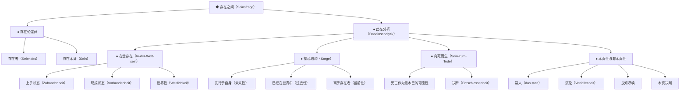
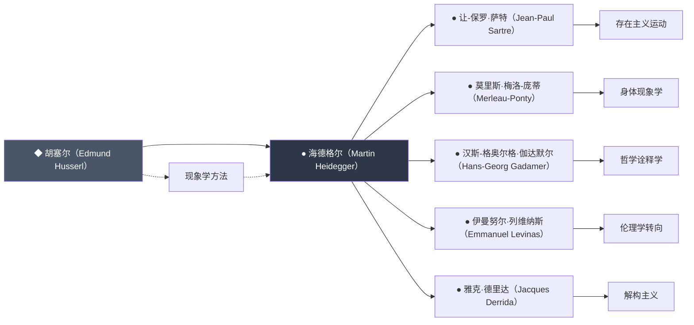
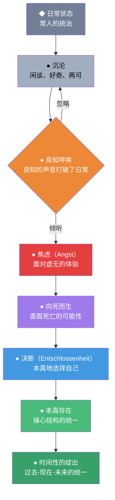
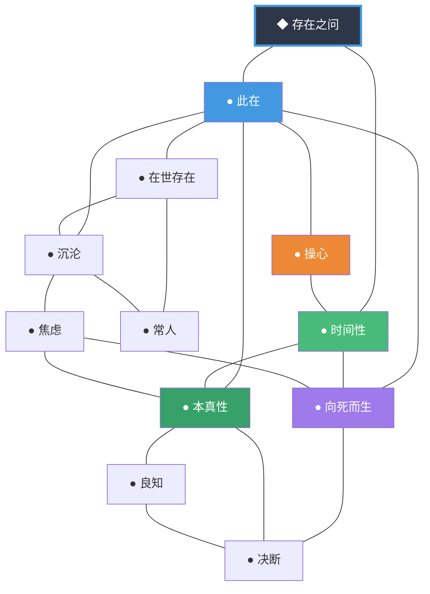

# 存在与时间 | 知识图谱图片描述

---

## 图片一：海德格尔思想分类树

### 图表说明

本图以分类树的形式，全景展示海德格尔哲学的核心概念层级结构，帮助读者建立对《存在与时间》思想体系的整体认知。

### Mermaid 代码

### 视觉描述

根节点为"存在之问"，向下分为两大分支："此在分析"与"存在论差异"。此在分析进一步展开为四个子分支：在世存在、操心结构、向死而生、本真性与非本真性。每个子分支继续向下细分，形成完整的概念谱系。

图表整体呈现为自上而下的树状结构，建议用深蓝或深灰色作为主色调，体现哲学的深邃感。

---

## 图片二：现象学影响人物图谱

### 图表说明

本图展示海德格尔哲学的思想渊源与后世影响，呈现其在现象学传统中的承前启后地位。

### Mermaid 代码

### 视觉描述

图表从左到右展开。左侧为思想源头胡塞尔，中间为核心人物海德格尔（以深色高亮），右侧为受其影响的后世哲学家及其开创的思想流派。虚线箭头表示方法论的传承，实线箭头表示直接影响。

建议以海德格尔节点为中心视觉焦点，使用深色背景高亮，其他节点使用较浅色调。

---

## 图片三：从沉沦到本真的路径图

### 图表说明

本图展示此在从日常沉沦状态走向本真存在的路径，揭示《存在与时间》中关于存在觉醒的动态过程。

### Mermaid 代码

### 视觉描述

图表为从上到下的路径流程图，起点为"日常状态"，终点为"时间性的绽出"。中间经过沉沦、良知呼唤、焦虑、向死而生、决断、本真存在等阶段。

在"良知呼唤"节点处分叉：选择忽略则回到沉沦，选择倾听则继续向下走向本真。

建议用暖色到冷色的渐变来表示从非本真到本真的转变，颜色由灰暗逐渐过渡到明亮。

---

## 图片四：核心概念关系网络图

### 图表说明

本图以网络图的形式，展示《存在与时间》中核心概念之间的相互关联，帮助读者理解海德格尔思想的整体性与内在统一性。

### Mermaid 代码

### 视觉描述

图表为网络关系图。"存在之问"位于中心位置，使用深色高亮和加粗边框。"此在"、"时间性"、"操心"三个核心概念围绕中心分布，使用不同的颜色。其他概念如"向死而生"、"本真性"、"沉沦"、"常人"、"良知"、"决断"、"焦虑"等分布在外围，通过连线与核心概念相连。

连线没有方向箭头，表示概念之间的相互关联而非单向推导。

建议使用深色背景，概念节点使用不同颜色的圆形或圆角矩形，连线使用浅灰色。

---

## 使用建议

1. **图片一** 适合作为"知识体系全景"放在文章开头，帮助读者建立整体框架感
2. **图片二** 适合放在"思想背景"部分，展示海德格尔在哲学史上的位置
3. **图片三** 适合作为"核心路径"的视觉化表达，放在关于本真性讨论的部分
4. **图片四** 适合作为"概念关系速览"，帮助读者在深度阅读前建立概念之间的联系直觉

所有图表建议在渲染时保持统一的配色方案，主色调建议使用深蓝、深灰、墨绿等沉稳色调，符合哲学主题的深邃感。

---

**核心标签**：存在追问 | 向死而生 | 本真觉醒 | 时间领悟
