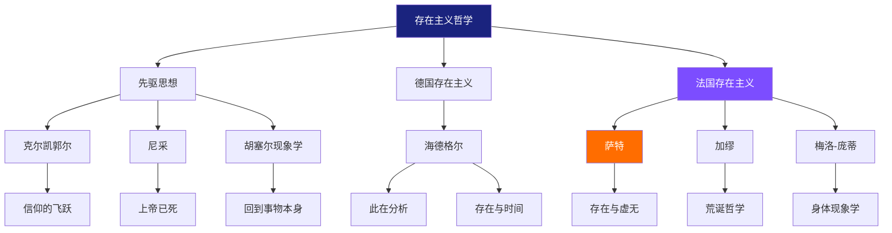
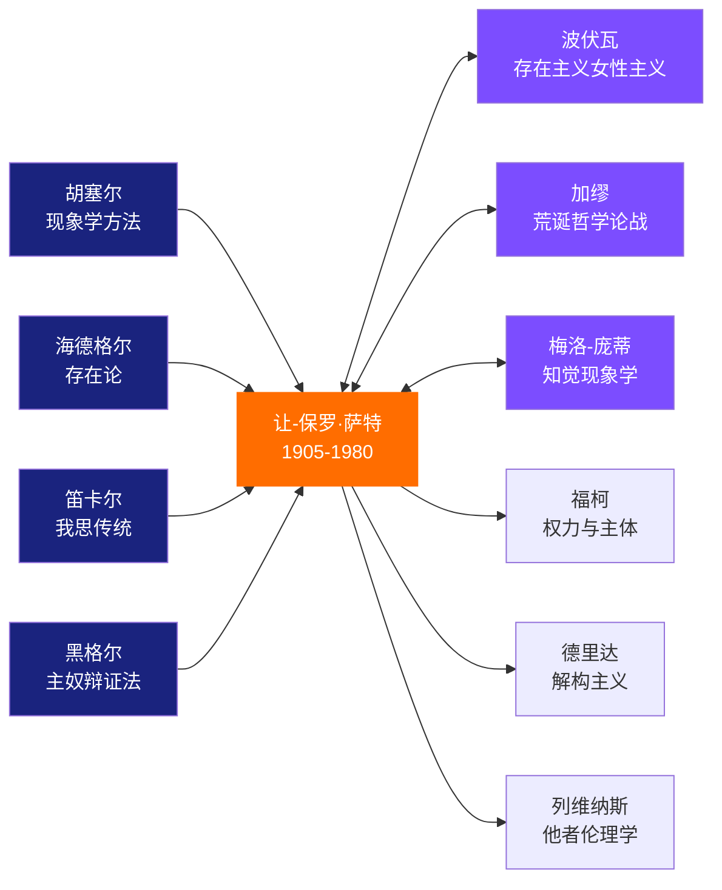
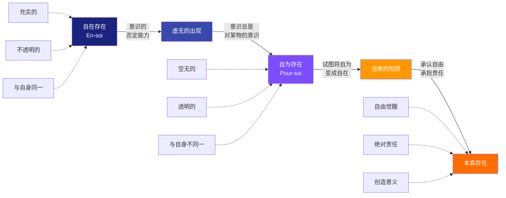
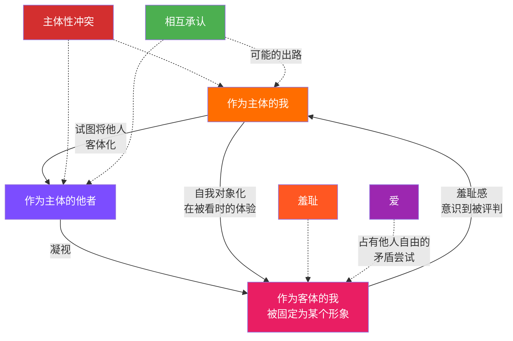

# 《存在与虚无》图谱逻辑：一张图读懂萨特的哲学宇宙

> "存在是其所是，自为存在不是其所是而是其所不是。" —— 萨特

---

## ◇ 引子：为什么需要图谱？

萨特的《存在与虚无》有七百多页，充满了艰涩的现象学术语和严密的逻辑推演。很多人读了三分之一就放弃了。

但如果我们把这本书的核心逻辑抽丝剥茧，会发现它其实围绕着一个简单的问题：**人是什么？**

今天，我们用四张知识图谱，帮你一次性看懂萨特的哲学宇宙。

---

## ◆ 图谱一：存在主义的家族树

要理解萨特，先要知道他从哪里来。存在主义不是凭空出现的，它有一条清晰的传承脉络。

### Mermaid 分类树



**读懂这张图的要点：**

萨特的思想有三个源头。克尔凯郭尔让他看到个体选择的重要性，尼采让他直面上帝死后意义的真空，胡塞尔给了他分析意识的工具。

而海德格尔的《存在与时间》，直接为《存在与虚无》奠定了方法论基础。萨特沿着海德格尔的问题继续追问，但给出了完全不同的答案。

---

## ◇ 图谱二：思想人物的关系网络

萨特不是孤立的哲学家，他身处一个群星璀璨的时代。理解他与周围人的关系，能更好地把握他思想的独特性。

### Mermaid 人物图谱



**读懂这张图的要点：**

左边的四个箭头指向萨特，代表他的思想来源。胡塞尔教会他如何分析意识，海德格尔让他重新思考"存在"的意义，笛卡尔给了他意识哲学的传统，黑格尔的主奴辩证法则启发了他关于他者的思考。

中间的双向箭头，代表同时代的对话与论争。特别是萨特与加缪，从盟友到决裂，是二十世纪思想史上的重要事件。

右边的箭头指向后继者，萨特的思想影响了整个后现代思潮的走向。

---

## ◆ 图谱三：从"自在"到"自为"的存在之路

这是理解《存在与虚无》最关键的一张图。萨特对"存在"做出了根本性的区分，整本书的逻辑都建立在这个区分之上。

### Mermaid 路径图



**读懂这张图的要点：**

**自在存在**，就是物体的存在方式。一块石头就是那块石头，它完全充实于自身，没有别的可能性。它不自由，也不痛苦。

**自为存在**，就是人的存在方式。人是空无的，因为人永远不是他已经是的，也不是他将要是的。你此刻在读这段文字，但你已经不完全在读之前的那个你了。

**从自在到自为的跳跃**，关键在于"虚无"——意识的否定能力。你能想象不存在的东西，你能对现实说"不"，你能否定你自己。这种虚无化的能力，就是自由。

**自欺**是人最常见的状态。我们试图把自己变成自在的存在，用角色、身份、标签把自己固定下来，以此逃避自由的眩晕。

**本真存在**是最终的出口。承认自己是自由的，承担起绝对的责任，在没有先天意义的世界里，用自己的选择创造出属于自己的意义。

---

## ◇ 图谱四：他者凝视的关系网络

"他人即地狱"是萨特最著名的论断。但这句话的真正含义，需要通过"凝视"的结构来理解。

### Mermaid 网络图



**读懂这张图的要点：**

当你独自一人在房间里时，你是纯粹的主体。你的意识自由地展开，世界围绕你的体验呈现。

然后，门被推开了，有人走了进来，看向你。

在那一瞬间，你从主体变成了客体。你被"看见"了，被固定为某种形象。你可能感到尴尬、羞耻、不适——这就是"凝视"的力量。

他者的凝视剥夺了你的主体性，把你变成了一个物。而你也会本能地想要反过来凝视他者，把他者变成客体。这就是萨特说的"他人即地狱"的真正含义：**主体性争夺的永恒冲突**。

但这不是无解的。萨特在后期思想中，通过马克思主义和介入实践，试图找到一条从冲突走向团结的道路。

---

## ◆ 四张图谱的内在逻辑

这四张图谱不是孤立的，它们之间存在清晰的逻辑递进关系：

```
分类树 ──> 人物图 ──> 路径图 ──> 网络图
  │          │          │          │
  宏观       历史       核心       应用
  格局       坐标       概念       场景
```

1. **分类树**帮你建立宏观认知框架，知道存在主义的全貌
2. **人物图**帮你理解萨特思想的历史坐标和传承脉络
3. **路径图**帮你掌握《存在与虚无》的核心概念体系
4. **网络图**帮你将哲学理论应用到理解人际关系的场景中

---

## ◇ 系列导航

```
┌─────────────────────────────────────────┐
│        人类文明经典阅读计划             │
│           西方哲学系列                   │
├─────────────────────────────────────────┤
│ 上一篇：《理想国》—— 洞穴中的火光      │
│ 当前：《存在与虚无》—— 图谱逻辑        │
│ 下一篇：《查拉图斯特拉如是说》—— 超人  │
├─────────────────────────────────────────┤
│ 本系列共 6 篇，本篇为第 3 篇            │
│ 关注公众号，不错过每一期更新            │
└─────────────────────────────────────────┘
```

**核心标签：** #自由觉醒 #选择责任 #存在主义 #他者认知

---

*本文是「人类文明经典阅读计划」系列第 22 期，专注解读影响人类思想的经典著作。*
