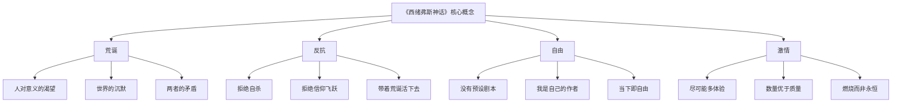
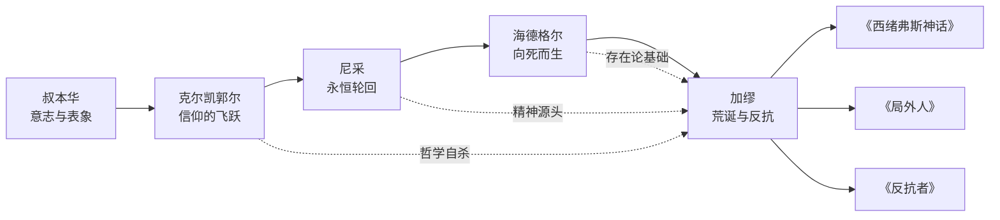
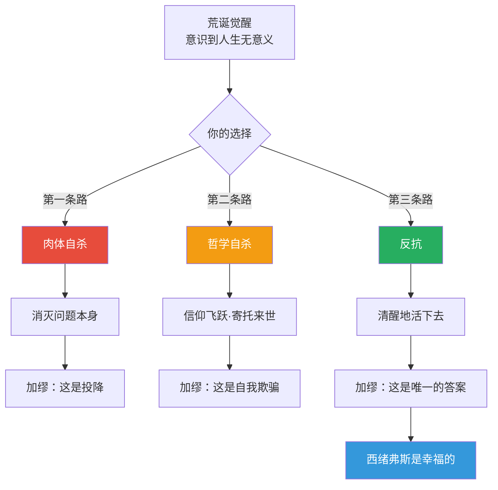
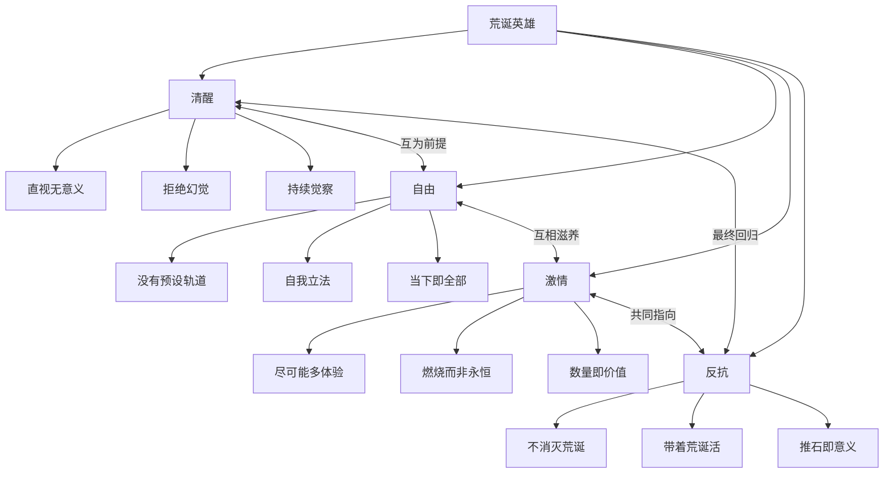

# 知识图谱图片描述

## 图一：《西绪弗斯神话》核心概念分类树

**图片描述：**
这是一张概念分类树图，根节点为"《西绪弗斯神话》核心概念"，向下展开四个一级分支：荒诞、反抗、自由、激情。每个一级分支再展开为三个二级子节点，形成完整的四层概念体系。整体呈树状结构，从顶部根节点向下发散，层级分明，配色建议使用深蓝为主色调，节点用圆角矩形，连线用细实线。

---

## 图二：荒诞哲学人物思想谱系图

**图片描述：**
这是一张从左到右的人物思想传承谱系图。五位哲学家按时间顺序排列：叔本华、克尔凯郭尔、尼采、海德格尔、加缪。实线箭头表示思想传承关系，虚线箭头表示与加缪的特定关联。加缪节点下方引出三部代表作品。建议使用横向布局，每位哲学家用一个卡片节点，包含人名和核心思想标签。传承线用实线，特定关联用虚线并标注关系类型。

---

## 图三：面对荒诞的三条路径图

**图片描述：**
这是一张流程决策图，顶部起始节点为"荒诞觉醒"，中间分出三个分支代表三条路径。三条路径分别用不同颜色标识：红色代表肉体自杀（被加缪否定），橙色代表哲学自杀/信仰飞跃（被加缪否定），绿色代表反抗（加缪的肯定答案）。最终绿色路径汇聚到底部结论节点"西绪弗斯是幸福的"。每条路径包含两到三个子节点说明其含义和加缪的评价。

---

## 图四：荒诞英雄特质网络图

**图片描述：**
这是一张以"荒诞英雄"为中心的网络关系图。中心节点向外辐射四个核心特质：清醒、自由、激情、反抗，每个特质再展开三个子特征。四个核心特质之间用双向箭头连接，形成循环：清醒与自由互为前提，自由与激情互相滋养，激情与反抗共同指向，反抗最终回归清醒。整体呈现网状结构，建议使用圆形节点表示核心特质，方形节点表示子特征，双向箭头用曲线表示循环关系。
