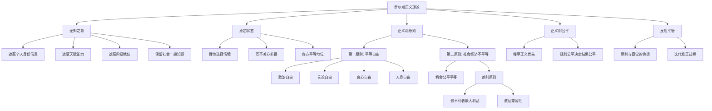
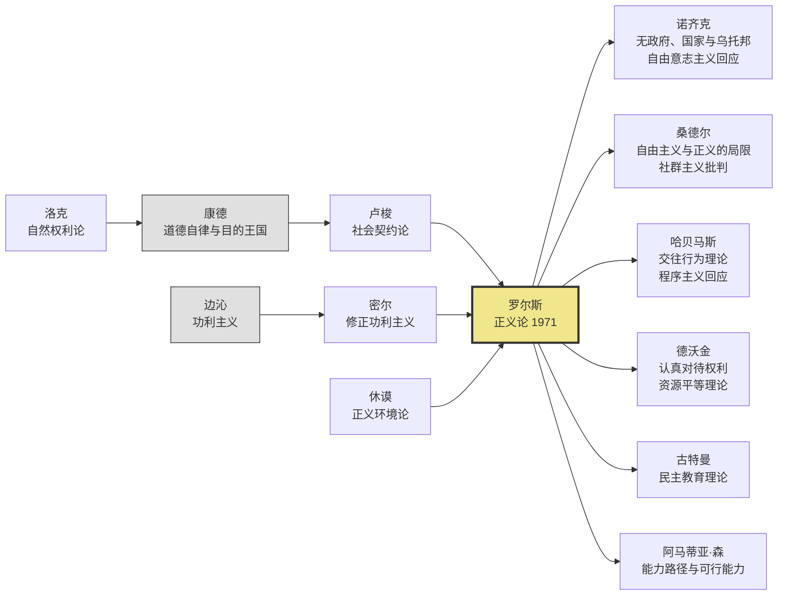
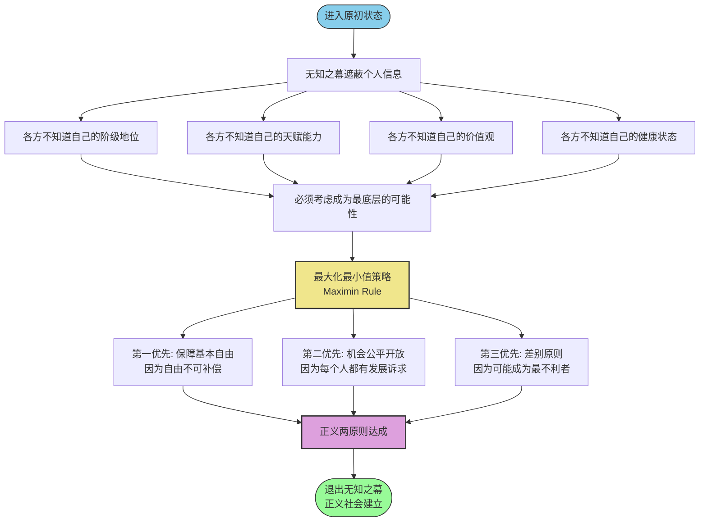
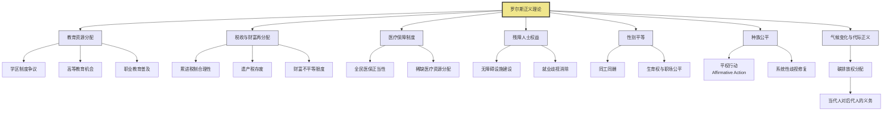

# 《正义论》知识图谱图片描述

---

## ◆ 图谱一：罗尔斯正义理论核心概念分类树

**图注说明**：本图展示了罗尔斯正义理论的核心概念体系。从"正义即公平"这一中心理念出发，向下分解为无知之幕、原初状态、正义两原则等关键要素。其中，正义两原则进一步细分为平等自由原则和社会经济不平等原则，后者又包含机会公平平等与差别原则两个子条件。

---

## ◆ 图谱二：正义理论发展人物与学派关联图谱

**图注说明**：本图展示了正义理论的思想传承脉络。罗尔斯的理论综合了洛克的权利传统、康德的道德哲学和卢梭的社会契约论，同时对功利主义进行了系统批判。在《正义论》出版后，诺齐克从自由意志主义角度、桑德尔从社群主义角度分别提出了重要批判，形成了当代政治哲学的核心辩论格局。

---

## ◆ 图谱三：无知之幕推理路径图

**图注说明**：本图展示了罗尔斯著名的"无知之幕"推理过程。从原初状态出发，各方在不知道自己未来社会地位的情况下，基于最大化最小值策略（Maximin Rule），推导出正义的两个原则。这一推理的核心在于：当你不知道自己会是谁时，你最关心的是"最坏的情况下我能得到什么保障"。

---

## ◆ 图谱四：罗尔斯正义理论与当代社会议题关联网络图

**图注说明**：本图展示了罗尔斯正义理论在当代社会各领域的具体应用。从教育资源分配到税收制度设计，从医疗保障到残障人士权益，从性别平权到气候变化的代际正义，罗尔斯的差别原则和机会公平原则为这些议题提供了一个统一的评判框架：任何制度安排都必须考虑"如果我是这个领域中最弱势的人，我会接受这样的安排吗？"

---

## ◆ 图谱使用说明

以上四张知识图谱从不同维度呈现了罗尔斯《正义论》的理论体系：

- **分类树**：概念层级结构，帮助读者把握理论的内在逻辑
- **人物图谱**：思想传承脉络，理解理论的历史定位与学术影响
- **路径图**：推理过程展示，揭示无知之幕如何推导出正义原则
- **网络图**：现实应用连接，将抽象理论与当代社会议题对接

建议在公众号排版中，将每张图谱单独作为一张配图插入对应的正文段落中，以达到最佳阅读效果。

---

**标签**：#知识图谱 #正义论 #罗尔斯 #哲学可视化
