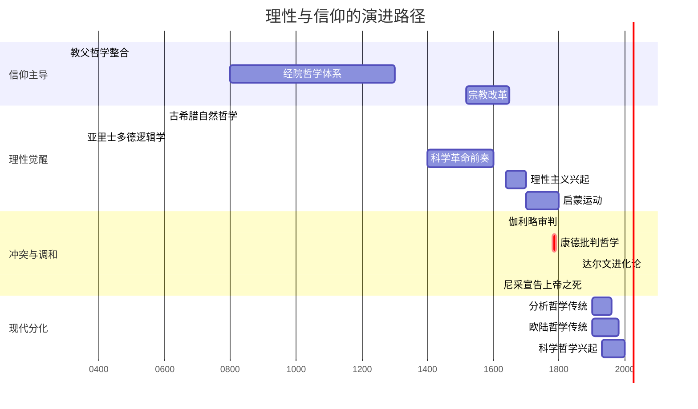
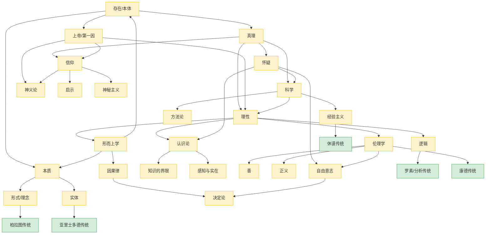

```mermaid
graph TD
    Root["西方哲学史"]
    
    Root --> Ancient["古希腊哲学<br/>前6世纪-公元5世纪"]
    Root --> Medieval["中世纪哲学<br/>5世纪-15世纪"]
    Root --> Renaissance["文艺复兴哲学<br/>14世纪-17世纪"]
    Root --> Modern["近代哲学<br/>17世纪-19世纪"]
    Root --> Analytic["分析哲学<br/>20世纪至今"]
    Root --> Continental["欧陆哲学<br/>20世纪至今"]
    
    Ancient --> Ancient1["自然哲学<br/>泰勒斯/赫拉克利特"]
    Ancient --> Ancient2["古典哲学<br/>苏格拉底/柏拉图/亚里士多德"]
    Ancient --> Ancient3["希腊化哲学<br/>斯多葛/伊壁鸠鲁/怀疑派"]
    
    Medieval --> Medieval1["教父哲学<br/>奥古斯丁"]
    Medieval --> Medieval2["经院哲学<br/>阿奎那/奥卡姆"]
    
    Renaissance --> Renaissance1["人文主义<br/>彼特拉克/伊拉斯谟"]
    Renaissance --> Renaissance2["科学革命<br/>培根/伽利略"]
    
    Modern --> Modern1["理性主义<br/>笛卡尔/斯宾诺莎/莱布尼茨"]
    Modern --> Modern2["经验主义<br/>洛克/贝克莱/休谟"]
    Modern --> Modern3["德国古典哲学<br/>康德/黑格尔"]
    
    Analytic --> Analytic1["逻辑实证主义<br/>罗素/维特根斯坦"]
    Analytic --> Analytic2["语言哲学<br/>奥斯汀/奎因"]
    
    Continental --> Continental1["存在主义<br/>海德格尔/萨特"]
    Continental --> Continental2["现象学<br/>胡塞尔/梅洛-庞蒂"]
    
    classDef rootStyle fill:#2c3e50,color:#fff,stroke:#34495e
    classDef periodStyle fill:#3498db,color:#fff,stroke:#2980b9
    classDef subStyle fill:#ecf0f1,color:#2c3e50,stroke:#bdc3c7
    
    class Root rootStyle
    class Ancient,Medieval,Renaissance,Modern,Analytic,Continental periodStyle
    class Ancient1,Ancient2,Ancient3,Medieval1,Medieval2,Renaissance1,Renaissance2,Modern1,Modern2,Modern3,Analytic1,Analytic2,Continental1,Continental2 subStyle
```

# 《西方哲学史》知识图谱图片描述

> 本文包含多幅知识图谱，帮助读者直观理解西方哲学的思想脉络。以下为各图的 Mermaid 源码及排版说明。

---

## ◇ 图一：西方哲学时期分类树

### 排版说明

此图为垂直树状图，展示西方哲学从古希腊到现代的六大时期划分。适合放置在文章开头，作为全文的框架索引。

### Mermaid 源码



### 视觉要点

- 根节点使用深色背景，突出"西方哲学史"总主题
- 六大时期使用蓝色系，形成视觉层级
- 具体学派和代表人物使用浅色背景，形成对比
- 整体呈自上而下的瀑布式布局，便于移动端纵向滑动阅读

---

## ◇ 图二：核心人物关系图谱

### 排版说明

此图以"师承关系"和"思想对立"为纽带，展示哲学家之间的关联网络。适合放置在"思想史脉络"章节之后，帮助读者理解哲学不是孤立的思想，而是代际传承与论辩的产物。

### Mermaid 源码

```mermaid
graph LR
    Socrates["苏格拉底<br/>前469-前399"] --> Plato["柏拉图<br/>前427-前347"]
    Plato --> Aristotle["亚里士多德<br/>前384-前322"]
    
    Plato -. 理念论传承 .-> Augustine["奥古斯丁<br/>354-430"]
    Augustine --> Aquinas["阿奎那<br/>1225-1274"]
    
    Aristotle -. 经验传统 .-> Bacon["培根<br/>1561-1626"]
    Bacon --> Locke["洛克<br/>1632-1704"]
    Locke --> Hume["休谟<br/>1711-1776"]
    Hume --> Kant["康德<br/>1724-1804"]
    
    Aristotle -. 理性传统 .-> Descartes["笛卡尔<br/>1596-1650"]
    Descartes --> Spinoza["斯宾诺莎<br/>1632-1677"]
    Descartes --> Leibniz["莱布尼茨<br/>1646-1716"]
    
    Kant --> Hegel["黑格尔<br/>1770-1831"]
    Hegel --> Marx["马克思<br/>1818-1883"]
    Hegel --> Kierkegaard["克尔凯郭尔<br/>1813-1855"]
    
    Kant -. 批判对象 .-> Hume
    
    Russell["罗素<br/>1872-1970"] -. 分析哲学 .-> Wittgenstein["维特根斯坦<br/>1889-1951"]
    Russell -. 批判对象 .-> Hegel
    
    Sartre["萨特<br/>1905-1980"] -. 存在主义 .-> Heidegger["海德格尔<br/>1889-1976"]
    Kierkegaard -. 思想先驱 .-> Sartre
    Kierkegaard -. 思想先驱 .-> Heidegger
    
    classDef person fill:#f8f9fa,stroke:#6c757d,stroke-width:2px
    classDef linkStyle stroke:#999,stroke-dasharray:5,5
    
    class Socrates,Plato,Aristotle,Augustine,Aquinas,Bacon,Locke,Hume,Kant,Descartes,Spinoza,Leibniz,Hegel,Marx,Kierkegaard,Russell,Wittgenstein,Sartre,Heidegger person
```

### 视觉要点

- 实线箭头表示师承或直接传承关系
- 虚线箭头表示思想影响或批判关系
- 人物节点按时间顺序从左到右排列
- 标注了关键的思想流派转折点

---

## ◇ 图三：理性与信仰的演进路径

### 排版说明

此图为时间轴式路径图，展示"理性"与"信仰"两条主线在西方哲学史上的交织与分化。适合放置在"理性与信仰"主题章节中。

### Mermaid 源码



### 视觉要点

- 使用甘特图展示不同时期的时间跨度
- 信仰主导与理性觉醒并行对比
- 红色标记点标注关键冲突事件
- 现代分化部分展示两条传统的分道扬镳

---

## ◇ 图四：哲学思想网络图

### 排版说明

此图为网络关系图，展示哲学核心概念之间的交叉关联。适合放置在文章结尾，作为全文概念的"总结地图"。

### Mermaid 源码



### 视觉要点

- 黄色节点表示哲学核心概念
- 绿色节点表示哲学家及其传统
- 箭头表示概念之间的推导或关联关系
- 整体呈现放射状网络结构，体现哲学的系统性

---

## ◆ 使用说明

以上四幅图谱可根据公众号排版需要分别嵌入到对应章节中。建议：

1. 图一放置在文章开头，作为框架总览
2. 图二放置在"哲学家与时代"章节后
3. 图三放置在"理性与信仰"章节中
4. 图四放置在文章结尾，作为概念总结

所有 Mermaid 图表建议在渲染时设置为移动端适配宽度，字体大小不低于 12px，以确保在手机屏幕上的可读性。

---

**标签：** #哲学通识 #思想脉络 #历史洞察 #批判思维
