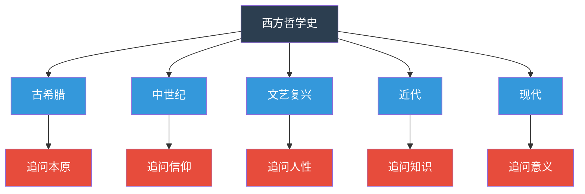
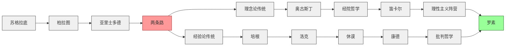
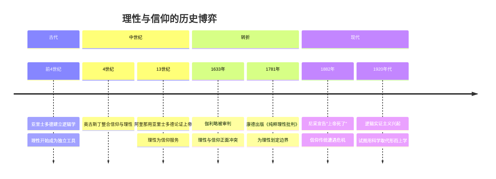
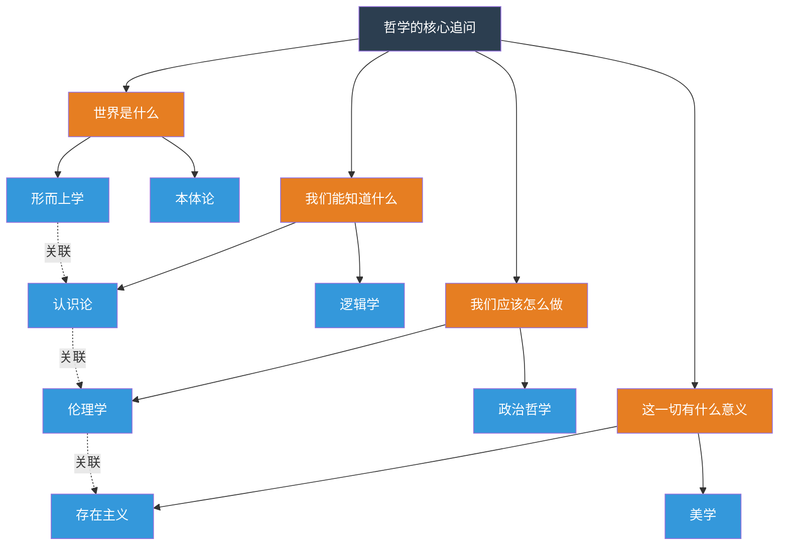

# 《西方哲学史》图谱逻辑：一张图看懂两千年的思想演变

> 如果说哲学是"介乎神学与科学之间的东西"，那么哲学史就是这两者不断拉锯的战场。本文用四张图，带你理清这场拉锯的来龙去脉。

---

## ◇ 先问一个问题

你有没有想过，为什么我们今天相信科学？

不是因为你读过量子力学论文，也不是因为你亲手做过双缝实验。你相信科学，很大程度上是因为你生活在一个**科学已经被社会普遍接受的时代**。

这就是哲学要追问的事情：**我们的信念，到底建立在什么基础之上？**

理解西方哲学史，就是在理解这个问题被反复追问的两千年历程。

---

## ◇ 第一张图：时间的骨架

这张图看似简单，但它揭示了一个重要规律：

**每个时代的哲学，都在回答那个时代最焦虑的问题。**

古希腊人焦虑的是"世界到底是什么"，所以他们追问本原。

中世纪人焦虑的是"灵魂如何得救"，所以他们追问信仰。

文艺复兴的人焦虑的是"人究竟是什么"，所以他们追问人性。

近代人焦虑的是"我们能知道什么"，所以他们追问知识。

现代人焦虑的是"这一切有什么意义"，所以他们追问意义。

哲学从来不是闲人的游戏，它是时代焦虑的理性表达。

---

## ◇ 第二张图：传承的脉络

哲学史上有一条被反复提及的传承线索，罗素在书中用了几百页来铺陈：

理解这张图的关键在于：

**从亚里士多德开始，西方哲学就分成了两条路。**

一条路相信理性可以直达真理，从柏拉图的理念论，到奥古斯丁的神学整合，再到笛卡尔的理性主义，一脉相承。

另一条路相信知识必须来自经验，从亚里士多德的观察传统，到培根的实验科学，再到洛克和休谟的经验主义，同样源远流长。

康德的出现，是一个关键的转折点。他试图调和这两条路，结果反而把它们推向了更深的对立。

罗素作为分析哲学的奠基人，站在了这场两千年辩论的下游。他写《西方哲学史》，某种程度上是在追溯自己思想传统的家谱。

---

## ◇ 第三张图：理性与信仰的拉锯

罗素说哲学介乎神学与科学之间，这个判断最直观地体现在"理性"与"信仰"的关系上。

这张时间轴的核心观点是：

**理性与信仰从来不是你死我活的关系。**

中世纪的哲学家并不是"不理性"。恰恰相反，阿奎那等人把亚里士多德的逻辑学运用到了极致，试图在信仰的框架内建立一套完全自洽的理性体系。

问题是，当理性的工具越来越锋利，它迟早会回过头来审视信仰本身。伽利略的审判不是科学与宗教的简单对立，而是两种知识权威之间的权力争夺。

康德的伟大之处在于，他既没有抛弃信仰，也没有放任理性。他做的是给理性"划边界"——告诉你什么是理性可以认识的，什么是理性不该僭越的。

---

## ◇ 第四张图：概念的星空

最后这张图，展示的是哲学概念之间的网络关系。它不像前几张图那样有明确的时间线索，而是呈现出一种"星空"式的结构：

这张图的意义在于：

**哲学不是一堆散乱的"观点"，而是一个有结构的"问题域"。**

四个核心问题对应四大学科分支。它们之间有内在的关联——你对"世界是什么"的回答，会影响你对"我们能知道什么"的判断；你的认识论立场，会塑造你的伦理学取向。

这就是为什么读哲学不能"挑着读"。你不能只读伦理学而不关心形而上学，因为伦理学的地基，恰恰藏在那些看起来最抽象的形而上学争论里。

---

## ◆ 总结：为什么需要"图谱思维"

读哲学史最容易犯的错误是什么？

**把哲学家当成一个个孤立的"知识点"去记忆。**

"泰勒斯说万物皆水，赫拉克利特说万物皆火，巴门尼德说存在是一......"——这不是在读哲学，这是在背电话簿。

哲学的生命力在于**论证**，不在于**结论**。

真正有价值的是理解：

- 泰勒斯为什么觉得需要用"自然本原"来解释世界，而不是用神话
- 赫拉克利特和巴门尼德的分歧，如何预示了后来经验主义与理性主义的对立
- 康德为什么要写三大批判，他在回应什么问题

这四张图谱，提供的正是这种"关系视角"。它们不告诉你答案，但它们帮你提出更好的问题。

而这，恰恰是哲学教给我们最重要的能力。

---

## ◇ 互动话题

如果让你用一个词概括你所在的这个时代的"哲学焦虑"，你会选什么词？为什么？

---

## ◆ 系列导航

| 上一篇 | 当前篇 | 下一篇 |
|:---:|:---:|:---:|
| [《西方哲学史》读后感](#) | **图谱逻辑：两千年思想演变** | [核心思想精读](#) |

> 本文是「人类文明经典阅读计划」系列第 25 期，聚焦西方哲学通识与思想脉络梳理。

---

**标签：** #哲学通识 #思想脉络 #历史洞察 #批判思维
