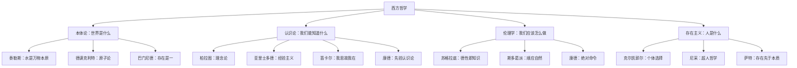
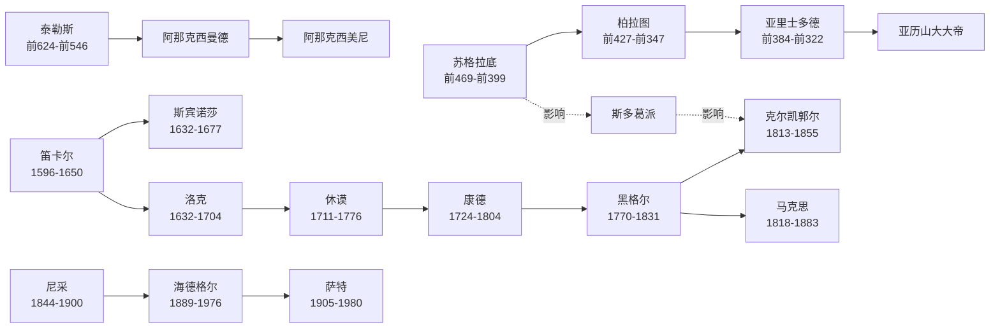
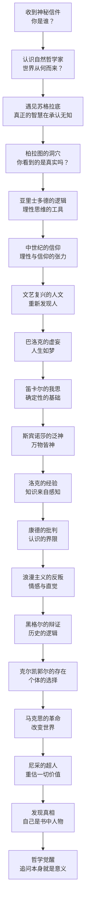
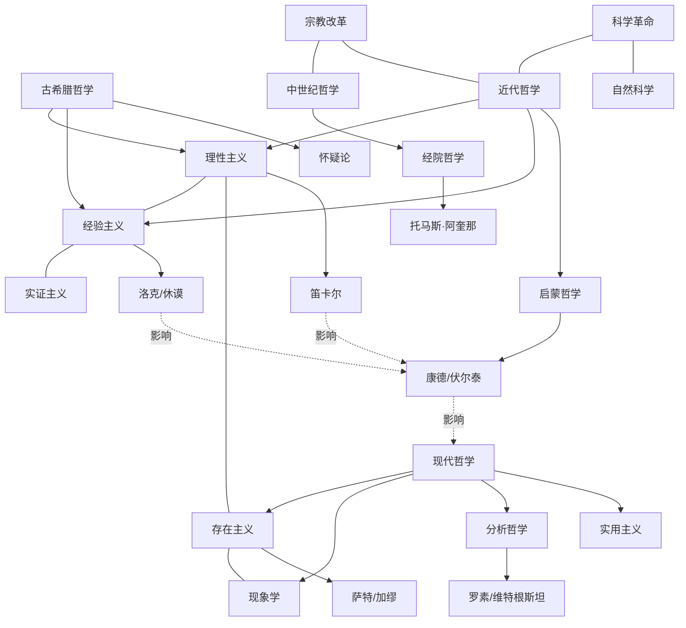

# 《苏菲的世界》知识图谱：一张图看懂西方哲学史

> 用视觉化的方式，梳理从古希腊到现代的哲学思想脉络

---

## ◆ 图谱一：哲学思想分类树

---

## ◇ 图谱二：哲学家人物关系图谱

---

## ● 图谱三：苏菲的哲学觉醒路径

---

## ◆ 图谱四：哲学思想网络图

---

## ◇ 图谱使用说明

**分类树**：帮助你理解哲学的三大核心问题——本体论、认识论、伦理学，以及它们各自的发展脉络。

**人物图谱**：展示哲学家之间的师承关系和思想影响，理解哲学史不是孤立的思想，而是传承与对话。

**觉醒路径**：跟随苏菲的脚步，体验从懵懂到觉醒的完整哲学旅程。

**网络图**：揭示不同哲学流派之间的复杂关联，理解思想的交叉与融合。

---

## ● 互动思考

> **如果让你给今天的哲学家写一封信，你会问什么问题？**

在评论区分享你的"哲学之问"，我们一起用思想的力量，探索这个神秘的世界。

---

## 系列导航

| 上一篇 | 下一篇 |
|:---:|:---:|
| [《苏菲的世界》读后感](01-公众号排版文稿_读后感.md) | [《苏菲的世界》图谱逻辑](03-公众号排版文稿_图谱逻辑.md) |

---

**核心标签**：#哲学启蒙 #知识图谱 #思想地图 #西方哲学史 #苏菲的世界 #可视化学习
