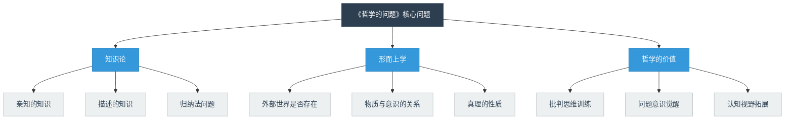
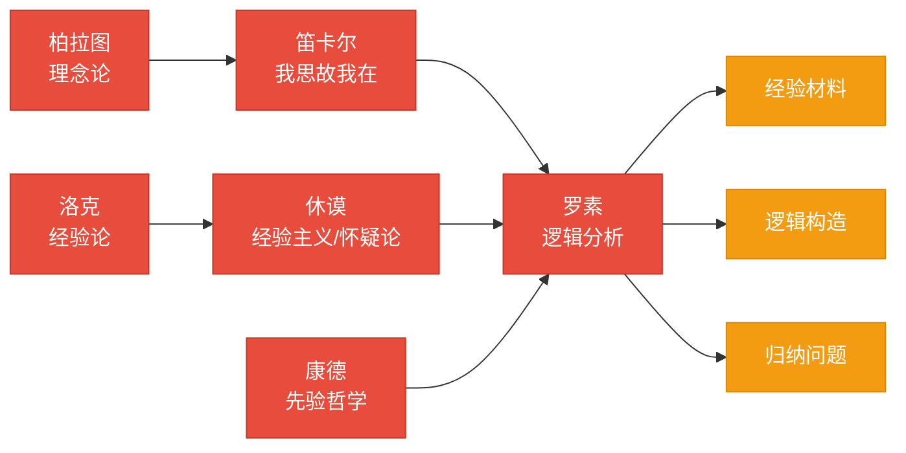
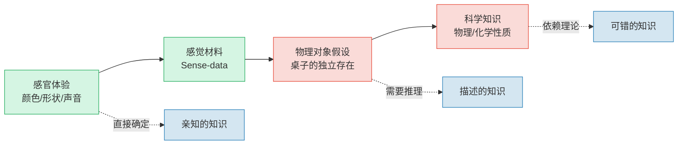
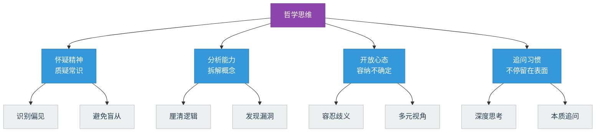

# 知识图谱图片描述：《哲学的问题》

## 图片一：哲学核心问题分类树

### 使用场景
用于文章开头，帮助读者快速了解《哲学的问题》涵盖的核心问题及其层次结构。

### Mermaid 图表代码

### 视觉说明
- 根节点为深色背景，表示总领全书
- 三大分支用蓝色区分，对应知识论、形而上学、价值论
- 叶子节点用浅色，表示具体问题
- 整体呈自上而下的树状结构，逻辑清晰

### 排版建议
- 图片宽度适配移动端，建议 690px
- 下方可加简短说明文字："罗素将哲学问题分为三大领域，上图展示了本书的核心问题框架"

---

## 图片二：重要人物思想关系图谱

### 使用场景
用于介绍罗素思想渊源的段落，展示哲学家之间的继承与批判关系。

### Mermaid 图表代码

### 视觉说明
- 左侧为历史上的哲学家，用红色系标识
- 右侧为罗素的核心概念，用橙色系标识
- 箭头表示思想的继承和发展关系
- 罗素处于中心位置，汇聚多位哲学家的思想

### 排版建议
- 此图为横向布局，移动端可能需要左右滑动
- 可考虑将图片分段展示，或改为竖向排列

---

## 图片三：从感知到知识的推理路径

### 使用场景
用于解释"亲知的知识"与"描述的知识"之间关系的段落。

### Mermaid 图表代码

### 视觉说明
- 左侧绿色系表示直接经验，确定性高
- 中间红色系表示推论假设，确定性降低
- 右侧蓝色系表示知识分类
- 实线箭头表示推理过程，虚线表示知识类型归属

### 排版建议
- 此图适合配合"确定性阶梯"的正文内容
- 可在图片下方添加说明："从感官体验到科学知识，确定性逐级递减"

---

## 图片四：哲学思维网络图

### 使用场景
用于文章结尾，总结哲学思考的多维度价值。

### Mermaid 图表代码

### 视觉说明
- 中心节点为紫色，表示核心主题
- 第一层能力节点为蓝色，表示四大思维技能
- 第二层应用节点为浅色，表示具体行为表现
- 整体呈放射状，体现哲学的多维度价值

### 排版建议
- 此图信息量较大，适合放在文章后半部分
- 可配合"哲学的三个层面价值"的正文
- 建议在图片上方留出足够间距，避免拥挤

---

## 通用排版规范

### 图片样式
- 背景色：纯白或极浅灰 #fafafa
- 字体：系统默认无衬线字体
- 字号：节点文字 12-14px，标题 16-18px
- 线条：圆角矩形节点，曲线连接

### 移动端适配
- 图片最大宽度：690px
- 复杂图表建议拆分或使用横向滑动
- 每个图表下方保留 20px 间距

### 配色方案
- 主色：#2c3e50（深蓝灰）
- 辅色：#3498db（蓝）、#e74c3c（红）、#f39c12（橙）
- 背景：#ecf0f1（浅灰）、#fafafa（白）
- 强调：#8e44ad（紫）
