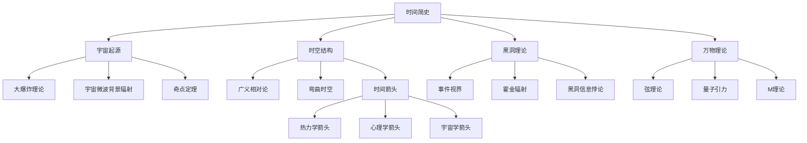
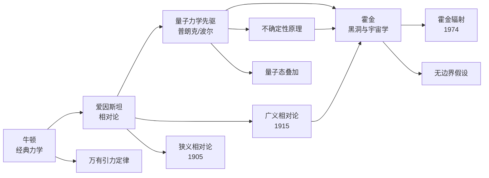

# 《时间简史》知识图谱图片描述

> 本文档为《时间简史》系列公众号文章中使用的知识图谱提供详细的Mermaid图表描述与渲染说明，便于后续视觉还原与设计排版。

---

## ○ 图谱一：宇宙学核心概念分类树

### 图表类型

垂直分类树状图，展示《时间简史》中核心概念的层级关系。

### Mermaid 代码



### 视觉描述

- 顶层节点"时间简史"使用醒目的圆形节点
- 四大主干分支：宇宙起源、时空结构、黑洞理论、万物理论
- 每个主干分支向下延伸3个子概念
- "时间箭头"进一步展开为三个具体箭头类型
- 配色建议：深蓝色为主色调，象征宇宙的深邃

---

## ◇ 图谱二：物理学人物关系图谱

### 图表类型

横向人物关系图，展示从牛顿到霍金的物理学传承脉络。

### Mermaid 代码



### 视觉描述

- 时间轴从左到右，17世纪到21世纪
- 四个核心人物节点：牛顿、爱因斯坦、量子力学先驱群体、霍金
- 每位人物节点下方连接其主要贡献
- 广义相对论与量子力学共同指向霍金，体现其统一两者的学术追求
- 配色建议：使用渐进色调，从古典的深蓝过渡到现代的青蓝

---

## ◆ 图谱三：从大爆炸到人类文明的路径图

### 图表类型

时间线路径图，展示宇宙138亿年演化中的关键节点。

### Mermaid 代码


### 视觉描述

- 从左到右的线性时间轴
- 九个关键节点，从大爆炸到《时间简史》出版
- 每个节点标注事件名称和时间跨度
- 节点颜色从深紫逐渐过渡到浅蓝，象征从混沌到文明
- 时间跨度非线性，重点突出生命和文明的节点

---

## ○ 图谱四：理论物理学概念网络图

### 图表类型

网络关系图，展示《时间简史》中涉及的主要理论之间的关联。

### Mermaid 代码

```mermaid
graph TD
    GR[广义相对论] --> SP[弯曲时空]
    GR --> BH[黑洞预言]
    QM[量子力学] --> UN[不确定性原理]
    QM --> EN[量子纠缠]

    SP --> BB[大爆炸理论]
    SP --> GW[引力波]
    BH --> HR[霍金辐射]
    BH --> EH[事件视界]

    HR --> IP[信息悖论]
    IP --> ST[弦理论]
    BB --> CB[宇宙微波背景]
    CB --> UE[宇宙膨胀]

    GR -.矛盾.-> QM
    ST --> MT[M理论]
    MT --> UT[万物理论]

    BB -.-. UE
    UE -.-. SP
```

### 视觉描述

- 以广义相对论和量子力学为两大核心节点
- 每个理论向四周辐射其推论和应用
- 广义相对论与量子力学之间用特殊连线标注"矛盾"关系
- 弦理论和M理论作为可能的统一方案出现在图的中心区域
- 虚线表示间接关联，实线表示直接推导关系
- 配色建议：广义相对论相关节点用蓝色系，量子力学用紫色系，统一理论用金色

---

## ◇ 图谱使用指南

### 排版建议

1. 每张图谱在公众号中占据整屏宽度，高度自适应
2. 图谱上下各留出20px的留白空间
3. 在图谱下方添加简短的文字说明，解释图谱的核心含义

### 配色方案

| 用途 | 色值 |
|------|------|
| 背景色 | #0a0a2e 深空蓝 |
| 节点底色 | #1a1a4e 宇宙紫蓝 |
| 节点边框 | #4a4a8e 星空蓝 |
| 连线颜色 | #6a6aae 银河灰蓝 |
| 强调色 | #ffd700 星光金 |
| 文字颜色 | #e8e8f0 月光白 |

### 移动端适配

- 所有Mermaid图表在移动端自动缩放至屏幕宽度
- 字体大小不小于12px以保证可读性
- 复杂网络图可考虑横向滚动或拆分展示
